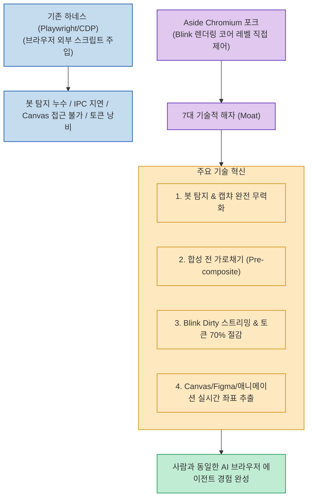

브라우저 밖에서 스크립트를 주입하는 일반적인 브라우저 자동화 도구(Playwright, Puppeteer, Chrome DevTools Protocol/CDP)는 봇 탐지 회피, 백그라운드 포커스 간섭 방지, 캔버스 렌더링 인식 등에서 구조적 한계에 부딪힙니다.

차세대 AI 브라우저 **`Aside`**는 크로미움(Chromium)과 Blink 렌더링 엔진을 포크하여 직접 수정함으로써, **기존 하네스 방식으로는 절대 도달할 수 없는 7가지 핵심 기술적 해자(Moat)**를 구축했습니다. (Aside 개발사 공동창업자도 직접 공인한 분석입니다)

<!--more-->

## Sources

- [원문 Threads 심층 기술 분석 (lilmgenius)](https://www.threads.com/@lilmgenius/post/DcleGk7iVgW)
- [Aside 공식 기술 아키텍처 가이드]

---

## 1. 하네스 방식 vs Aside 엔진 포크 아키텍처

---

## 2. Aside가 Chromium 엔진 수정으로 확보한 7대 기술적 해자

1. **봇 탐지(Bot Detection) 및 캡챠(CAPTCHA) 완전 무력화**:
   * `navigator.webdriver`, `Runtime.enable`, 콘솔 누수 신호는 CDP가 연결되는 순간 브라우저가 스스로 내보내는 고유 신호입니다. Aside는 Blink 내부에서 이를 수정하여 캡챠나 Cloudflare 봇 탐지에 걸리지 않습니다.
2. **합성 전 가로채기 (Pre-composite Interception)**:
   * Playwright는 페이지에 JS를 주입해 요소를 확인하므로 IPC 왕복 지연으로 인해 빠른 호버(Hover) 효과나 마이크로 인터랙션을 놓치기 쉽습니다. Aside는 브라우저가 화면을 그리는 렌더링 파이프라인(레이아웃, 페인트 순서, 히트테스트)에서 즉시 요소를 읽고 같은 메인 스레드 태스크에서 입력을 디스패치합니다.
3. **Blink Dirty 트래킹 기반 증분 스트리밍**:
   * 전체 DOM 스냅샷을 통째로 다시 찍는 대신, Blink 엔진이 이미 추적하는 '변경된 부분(Dirty UI)'만 에이전트에게 스트리밍합니다. 팝업, 다운로드, 탭 닫힘도 폴링 없이 조향 메시지로 즉시 푸시됩니다.
4. **비-DOM UI(Canvas, Figma, Flutter Web) 및 CSS 애니메이션 좌표 추출**:
   * 메인 스레드 밖에서 도는 CSS 애니메이션의 실시간 좌표와 DOM 트리가 없는 Canvas 기반 웹 앱(Figma, Flutter Web)도 페인트 단계에서 텍스트와 좌표를 직접 추출합니다.
5. **백그라운드 에이전트의 사용자 방해 원천 차단**:
   * 에이전트가 백그라운드 탭에서 작업할 때 팝업이 뜨거나 포커스를 빼앗아 사용자의 작업을 방해하지 않도록 Blink 레벨에서 포커스와 뷰포트(1440x900)를 고정 격리합니다.
6. **비밀번호·패스키(Passkey/FIDO2/TOTP)의 LLM 유출 차단**:
   * 프롬프트나 LLM에 비밀번호 raw 텍스트를 전달하지 않고, 브라우저 자체 보안 금고(Vault)가 로그인 액션을 직접 수행합니다.
7. **페이지 스냅샷 토큰 70% 절감**:
   * 불필요한 DOM 노이즈를 걷어내고 포커스, iframe, 클릭 가능 여부 등 정작 필요한 정보만 압축 전달하여 토큰 소모를 70% 줄였습니다.

---

## 3. 시사점

브라우저 밖에서 스크립트를 얹는 하네스 방식으로는 봇 차단, 포커스 탈취, 보안 문제를 완벽히 해결할 수 없으며, **브라우저 엔진 내부(Chromium/Blink)를 직접 제어하는 아키텍처가 차세대 AI 브라우저 에이전트의 진정한 경쟁력**임을 증명합니다.
