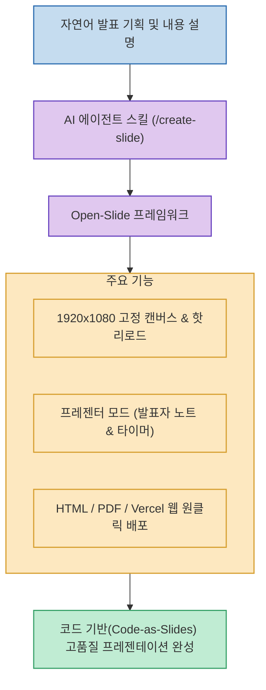

발표 슬라이드를 만들 때 레이아웃 배치, 폰트 조절, 다이어그램 그리기에 수 시간을 소모하는 작업은 개발자와 기획자 모두에게 큰 피로감을 줍니다.

**`Open-Slide`**(`1weiho/open-slide`)는 디자인 툴에서 마우스로 씨름하는 대신, 발표 내용을 말로 설명하면 **Claude Code나 Cursor 같은 AI 에이전트가 내장 스킬(`/create-slide`)을 호출해 코드로 1920×1080 슬라이드를 즉시 생성하고 핫리로드 및 웹 배포까지 지원하는 오픈소스 프로젝트**입니다. (공개 4달 만에 GitHub 7,000+ Stars)

<!--more-->

## Sources

- [원문 Threads 게시물 (think.5x)](https://www.threads.com/@think.5x/post/Dck_XTkn1BT)
- [Open-Slide GitHub 공식 저장소 (1weiho/open-slide)](https://github.com/1weiho/open-slide)

---

## 1. Open-Slide 슬라이드 생성 파이프라인



---

## 2. 주요 핵심 기능 및 차별점

1. **에이전트 네이티브 스킬 연동 (`/create-slide`)**:
   * AI 에이전트가 `/create-slide` 명령어를 직접 호출하여 슬라이드 마크다운 및 리액트/HTML 컴포넌트 코드를 자동으로 작성하고 수정합니다.
2. **1920×1080 고정 캔버스 & 실시간 핫리로드**:
   * 표준 16:9 FHD 해상도로 고정되어 기기별 비율 왜곡이 없으며, 코드 수정 즉시 브라우저 화면에 실시간 핫리로드됩니다.
3. **전문 프레젠터 모드(Presenter Mode) 지원**:
   * 발표자 전용 스피커 노트(Notes), 진행 타이머, 다음 슬라이드 미리보기 뷰를 기본 내장하여 실제 무대 발표에 최적화되어 있습니다.
4. **다양한 포맷 출력 및 원클릭 웹 배포**:
   * 정적 HTML, 고해상도 PDF 출력은 물론 Vercel이나 Cloudflare Pages에 웹 슬라이드로 즉시 배포하여 청중과 URL을 공유할 수 있습니다.

```bash
# 빠른 시작
npx @open-slide/cli init my-slide
cd my-slide && pnpm dev
```

---

## 3. 시사점

슬라이드를 디자인 파일이 아닌 **코드와 텍스트(Code-as-Slides)**로 관리함으로써, Git 버전 관리, PR 코드 리뷰, 그리고 AI 에이전트와의 협업을 극대화할 수 있는 현대적인 프레젠테이션 솔루션입니다.
