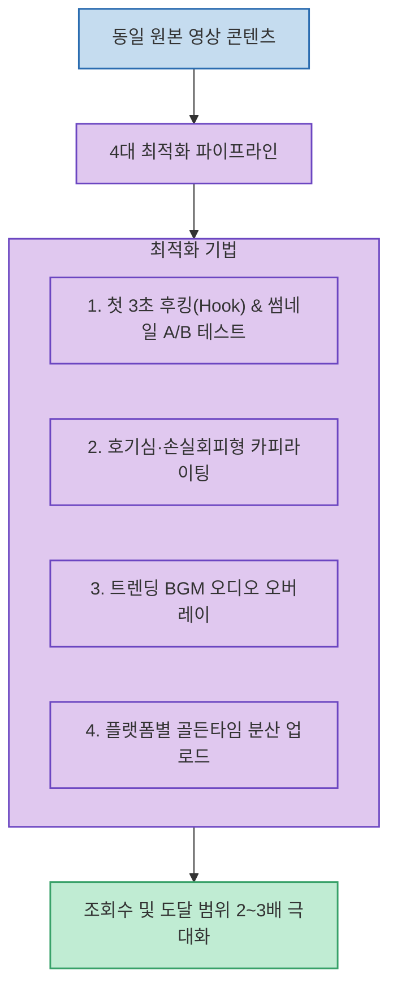

유튜브 쇼츠, 인스타그램 릴스, 틱톡 등 숏폼 플랫폼에서 동일한 주제의 영상을 게시하더라도, 어떤 영상은 수백 회에 그치고 어떤 영상은 수십만 회 이상의 알고리즘 추천을 받는 격차가 발생합니다.

이는 영상의 본문 내용 자체보다 **"초반 1~3초의 시청자 이탈 방지(Hooking), 호기심을 유발하는 카피라이팅, 트렌딩 오디오와 업로드 타이밍"**이라는 숏폼 알고리즘 최적화 요소를 어떻게 설계하느냐에 달려 있습니다.

<!--more-->

## Sources

- [원문 유튜브 쇼츠: 같은 영상도 조회수가 더 많이 나오게 하는 비밀](https://youtube.com/shorts/jwXVp0S5XOk)
- [유튜브 숏폼 알고리즘 최적화 및 리퍼포징 전략]

---

## 1. 숏폼 리퍼포징 최적화 파이프라인

---

## 2. 조회수를 극대화하는 4대 핵심 전략

1. **첫 3초 후킹(Hooking)과 썸네일 A/B 테스트**:
   * 시청자가 스크롤을 멈추고 시청을 지속할지 결정하는 골든타임은 첫 1~3초입니다. 동일한 본문 영상이라도 시작 도입부의 질문 멘트나 화면 텍스트를 다르게 2~3가지 버전으로 변형하여 가장 반응이 좋은 버전을 테스트합니다.
2. **호기심 및 손실 회피형 카피라이팅**:
   * 단순 설명형 제목(*"~하는 방법"*) 대신, 시청자의 궁금증이나 손실 회피 심리를 자극하는 카피(*"대부분 모르는 ~의 비밀"*, *"아직도 ~하고 계신가요?"*)를 전면에 배치합니다.
3. **트렌딩 사운드(Trending BGM) 활용**:
   * 알고리즘 탐색 탭 노출 확률을 높이기 위해, 릴스와 쇼츠에서 현재 유행 중인 배경음악을 볼륨을 낮춰 오버레이하여 알고리즘 가중치를 획득합니다.
4. **플랫폼별 골든타임 분산 업로드**:
   * 타겟 시청자가 가장 활발하게 활동하는 시간대(출퇴근 시간, 밤 9시~11시 등)에 맞춰 유튜브 쇼츠, 인스타그램 릴스, 틱톡 등에 분산 게시합니다.

---

## 3. 시사점

매번 영상을 새로 제작하는 리소스 부담을 줄이고, **검증된 핵심 콘텐츠를 '후킹 멘트 + 트렌드 BGM + 썸네일 카피' 조합으로 다변화하여 리퍼포징(Repurposing)**하는 것이 숏폼 크리에이터와 마케터의 필수 생산성 워크플로우입니다.
