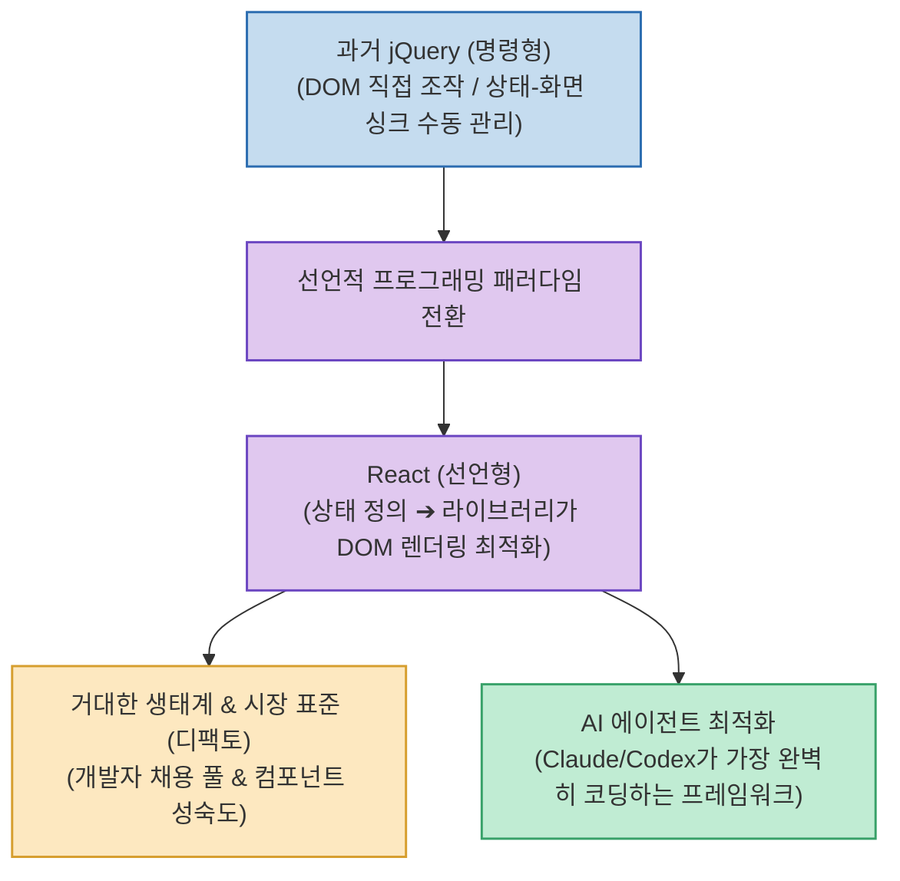

프론트엔드 개발자 기술 면접에서 가장 흔하게 등장하면서도 답변하기 까다로운 질문 중 하나가 바로 **"수많은 프레임워크 중 왜 리액트(React)를 사용하는가?"**입니다.

과거 jQuery 시절 명령형 DOM 조작과의 비교를 통한 기술적 답변부터, 거대한 채용 시장과 생태계 성숙도, 그리고 **"AI 코딩 에이전트(Claude Code 등)가 가장 완벽하게 코드를 생성해 주는 표준"**이라는 현대적 관점까지 실전 인사이트를 정리합니다.

<!--more-->

## Sources

- [원문 Threads 게시물 (dark_frontend)](https://www.threads.com/@dark_frontend/post/DcktPtLmuxj)
- [React 공식 문서 및 프론트엔드 아키텍처 생태계]

---

## 1. 리액트 선택의 3단계 관점

---

## 2. 핵심 관점별 답변 전략

1. **기술적 관점: 선언적 바인딩(Declarative)과 단방향 데이터 흐름**:
   * jQuery 시절에는 DOM 엘리먼트를 수동으로 탐색하고 상태 변화에 따른 UI 싱크를 직접 코드로 맞춰야 해 버그가 빈번했습니다.
   * 리액트는 **"상태(State)를 정의하고 화면과 연결(선언적 바인딩)"**해 두면, 가상 DOM과 렌더링 최적화를 라이브러리가 대신 처리해 개발 생산성과 유지보수성이 극대화됩니다.
2. **비즈니스 & 생태계 관점: 웹 프론트엔드의 디팩토(De-facto) 표준**:
   * 백엔드의 스프링(Spring)처럼, 리액트는 국내외 기업의 구인/구직 시장 풀이 가장 넓고 오픈소스 라이브러리와 디자인 시스템(shadcn/ui, MUI 등)의 성숙도가 가장 높습니다.
3. **현대 AI 시대의 관점: AI 에이전트의 압도적 코드 생성 품질**:
   * Claude Code, Codex 등 최신 AI 코딩 에이전트가 전 세계에서 가장 방대한 오픈소스 데이터셋을 학습한 대상이 React와 Next.js 생태계이므로, **AI 페어 프로그래밍 시 오류 없는 고품질 코드를 가장 빠르게 얻을 수 있는 프레임워크**입니다.

---

## 3. 시사점

면접에서 단순한 기능 나열(*"가상 돔이 빨라서요"*)을 피하고, **과거 명령형 DOM 조작 대비 선언형이 주는 가치 + 엔지니어링 생산성 + 생태계 안정성**을 나의 개발 경험과 연결 짓는 것이 가장 설득력 있는 답변입니다.
