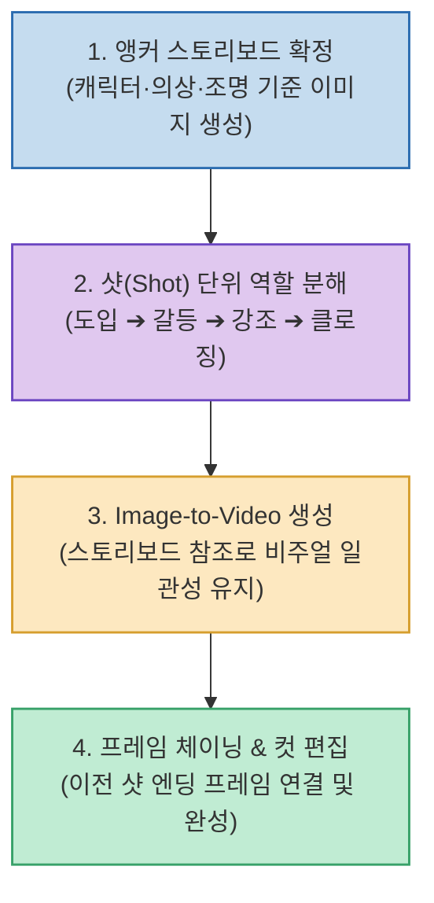

텍스트 프롬프트만으로 비디오 생성 AI(Sora, Kling, Runway 등)를 돌리면 매 컷마다 주인공의 얼굴, 옷 스타일, 조명이 달라지는 **비주얼 일관성 붕괴(Visual Inconsistency)** 현상과 막대한 크레딧 낭비가 발생합니다.

모션그래픽 및 영상 크리에이터 존코바(JohnKOBA) 님이 제시하는 **`스토리보드 기반 AI 영상 제작 워크플로우`**는 단순히 툴을 많이 다루는 차원을 넘어, **기준이 되는 대표 스토리보드 한 장을 '시각적 앵커(Anchor)'로 고정하고 샷(Shot) 단위로 역할을 쪼개어 일관성 높은 영상을 초고속으로 제작하는 실전 디렉팅 방법론**입니다.

<!--more-->

## Sources

- [존코바 AI 영상 기획 및 스토리보드 가이드 (Notion)](https://warm-outrigger-c27.notion.site/_-3cac9a1d3142803eb6a2f895d30f5818)
- [JohnKOBA Design 공식 유튜브 채널](https://www.youtube.com/@JohnKOBADesign)

---

## 1. 스토리보드 기반 AI 영상 디렉팅 파이프라인

---

## 2. 왜 프롬프트보다 '스토리보드 앵커'인가?

1. **영상 제작 패러다임의 전환**:
   * **과거**: 툴 다루기/렌더링(90%) + 기획(10%)
   * **AI 시대**: **기획 및 스토리보드 디렉팅(80%)** + AI 생성 및 편집(20%)
   * 제작자가 아니라 **"무엇을 어떻게 연출할 것인가를 결정하는 디렉터"**로서의 기획력이 결과물의 퀄리티를 결정합니다.
2. **비주얼 일관성을 보장하는 앵커(Anchor) 이미지**:
   * 캐릭터의 얼굴 특징, 의상 디테일, 배경의 조명 톤이 명확히 담긴 스토리보드 컷을 먼저 확정하고 이를 참조(Image-to-Video)하여 샷을 생성함으로써 형태 붕괴를 원천 차단합니다.
3. **한 샷에 하나의 역할 부여**:
   * 한 번의 프롬프트 생성으로 복잡한 스토리를 모두 해결하려 하지 않고, 컷 단위(도입 ➔ 핵심 강조 ➔ 클라이맥스 ➔ 클로징)로 명확한 역할을 분리해 연출합니다.
4. **프레임 체이닝(Frame Chaining)과 올인원 편집**:
   * 이전 샷의 마지막 프레임을 다음 샷의 시작 프레임으로 연결하거나, Canva/Newtake 같은 올인원 워크스페이스를 활용해 신속하게 최종 컷을 완성합니다.

---

## 3. 시사점

화려한 AI 툴을 무작정 돌리기 전에, **스토리보드 한 장으로 시각적 앵커와 연출 뼈대를 먼저 잡는 기획 파이프라인**이 고품질 AI 영상 제작의 핵심 경쟁력입니다.
