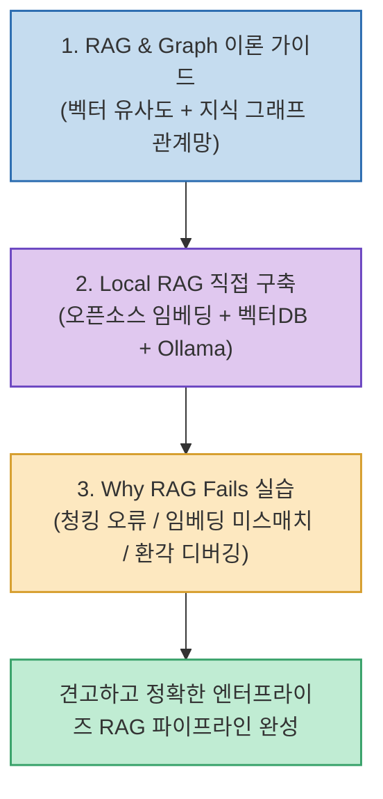

단순히 사내 문서를 벡터 데이터베이스에 넣고 유사도 검색을 수행하는 전통적인 RAG(Retrieval-Augmented Generation) 시스템은 문서 간의 복잡한 다자간 관계망을 파악하지 못하거나, 부정확한 청킹 및 검색 노이즈로 인해 엉뚱한 환각(Hallucination) 답변을 생성하기 쉽습니다.

오픈소스 교육 프로젝트 **`learnstead (kyungseo/learnstead)`**의 RAG 시리즈는 **RAG와 지식 그래프(GraphRAG)의 기본 원리 이해, 내 PC에서 100% 로컬로 구축하는 Local RAG 튜토리얼, 그리고 RAG가 왜 오답을 내는지 4대 실패 원인을 역추적하는 디버깅 랩(Why RAG Fails)**으로 구성된 체계적인 실전 가이드입니다.

<!--more-->

## Sources

- [원문 Threads 게시물 (cold.nov.rain)](https://www.threads.com/@cold.nov.rain/post/DcqqENRExf1)
- [가이드: RAG와 Graph 이해하기](https://github.com/kyungseo/learnstead/blob/main/guides/local-rag/README.md)
- [튜토리얼: Local RAG 직접 만들기](https://github.com/kyungseo/learnstead/blob/main/tutorials/local-rag-build/README.md)
- [실습: RAG는 왜 틀리는가 (Why RAG Fails)](https://github.com/kyungseo/learnstead/blob/main/labs/why-rag-fails/README.md)

---

## 1. RAG & GraphRAG 엔지니어링 파이프라인

---

## 2. 3대 핵심 가이드 및 실습 내용

1. **가이드: RAG와 Graph 이해하기**:
   * 단순 텍스트 유사도 검색의 한계를 짚고, 엔티티(Entity) 간의 관계망을 구조화한 지식 그래프(Knowledge Graph)와 벡터 검색을 융합하는 하이브리드 검색의 필요성과 원리를 설명합니다.
2. **튜토리얼: Local RAG 직접 만들기**:
   * 외부 클라우드 API 결제 없이 오픈소스 임베딩 모델(BGE 등), 경량 벡터 DB(Chroma/Qdrant), 로컬 LLM(Ollama)을 결합하여 내 컴퓨터 안에서 데이터 유출 없이 구동되는 프라이빗 RAG 시스템을 구축합니다.
3. **실습: RAG는 왜 틀리는가 (Why RAG Fails)**:
   * **청킹(Chunking) 분절 오류**: 문맥이 끊겨 핵심 정보가 누락되는 문제.
   * **임베딩 검색 미스매치**: 질문 의도와 문서 벡터 간의 의미적 거리 불일치.
   * **검색 노이즈 & 컨텍스트 오염**: 불필요한 단락이 LLM의 추론을 방해하는 현상.
   * **LLM 컨텍스트 오독 및 과잉 추론**: 문맥에 없는 내용을 환각으로 덧붙이는 증상을 정량적으로 평가하고 교정합니다.

---

## 3. 시사점

라이브러리를 단순히 복사해 붙여넣는 수준을 넘어, **로컬 구축부터 실패 케이스 역추적까지 RAG 엔지니어링의 기본기와 문제 해결력을 다질 수 있는 훌륭한 실전 교재**입니다.
