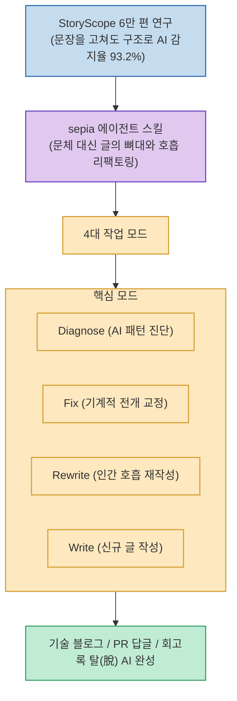

AI에게 글이나 기술 블로그 포스팅을 맡기면 문장을 아무리 패러프레이징하고 유의어로 바꿔도 특유의 'AI가 쓴 듯한 냄새(AI-slop)'가 지워지지 않습니다.

StoryScope 연구팀이 61,608편의 소설을 분석한 결과, 문체(단어/표현) 흔적을 완전히 지워도 **글의 구조(Structure) 패턴만으로 93.2%의 확률로 AI 글임이 분류**되었으며, 문장을 아무리 고쳐도 감지율은 93.9% 이하로 떨어지지 않았습니다.

**`sepia`**(`Nanako0129/sepia`)는 문체 수정을 넘어 **글의 뼈대와 문단 전개 호흡(Structure) 자체를 인간다운 리듬으로 뜯어고쳐 AI 티를 원천 제거하는 에이전트 스킬**입니다.

<!--more-->

## Sources

- [원문 Threads 게시물 (h2smusic)](https://www.threads.com/@h2smusic/post/DcpdSvYE0tR)
- [sepia GitHub 공식 저장소 (Nanako0129/sepia)](https://github.com/Nanako0129/sepia)

---

## 1. sepia 구조적 리팩토링 아키텍처

---

## 2. 주요 핵심 기능 및 차별점

1. **4가지 작업 모드 제공**:
   * **진단 (Diagnose)**: 글 전체에서 AI 특유의 정형화된 대칭 구조, 기계적 접속사, 뻔한 요약 결론 패턴을 감지합니다.
   * **수정 (Fix)**: 기존 내용을 유지하면서 문단의 호흡과 논리 흐름을 자연스럽게 교정합니다.
   * **재작성 (Rewrite)**: 인간다운 호흡과 비대칭적인 리듬감으로 뼈대를 전면 재구성합니다.
   * **쓰기 (Write)**: 처음부터 탈(脫) AI 아키텍처를 적용하여 초안을 작성합니다.
2. **모델별 특화 AI 패턴 교정**:
   * Claude 특유의 지나치게 공손하고 균형 잡힌 구조, GPT 특유의 3단 논법 및 정형화된 요약 어투를 핀포인트로 다듬습니다.
3. **실무 테크 문서 전용 프리셋 내장**:
   * 스토리 창작뿐만 아니라 **기술 블로그 포스팅, 릴리즈 노트, PR 리뷰 피드백 답글, 스프린트 회고록** 전용 모드를 지원합니다.
4. **폭넓은 에이전트 CLI 호환**:
   * Claude Code, Codex CLI, Grok Build, Antigravity 등 다양한 에이전트 환경에서 즉시 설치해 사용할 수 있습니다.

---

## 3. 시사점

단순히 *"자연스럽게 써줘"*라는 모호한 프롬프트 대신, **글의 구조와 문단 전개 패턴을 근본적으로 리팩토링하는 스킬**을 활용함으로써 진정한 의미의 고품질 휴먼라이크 텍스트를 완성할 수 있습니다.
