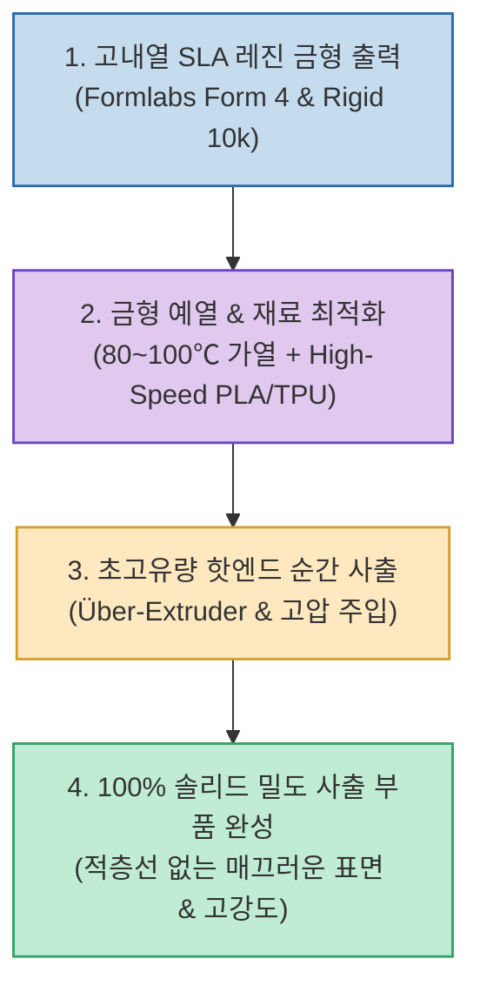

FDM 3D 프린터 출력물은 제작이 간편하지만 레이어 간 결합력(z축 강도)이 약하고 표면에 거친 적층선이 남습니다. 반면 플라스틱 사출 성형(Injection Molding)은 100% 솔리드 밀도와 매끄러운 표면을 보장하지만 금속 금형 가공비가 수백~수천만 원에 달해 소량 생산에 적합하지 않습니다.

하드웨어/3D 프린팅 엔지니어링 채널 CNC Kitchen(Stefan Hermann)이 공개한 **`3D 프린터를 이용한 DIY 사출 성형 실험`**은 **SLA 레진 프린터로 고강도·고내열 금형을 출력하고, FDM 3D 프린터의 고유량 핫엔드를 개조해 용융 플라스틱을 주입함으로써 FDM과 사출 성형의 장점을 결합한 혁신적인 하이브리드 제작 방식**을 증명했습니다.

<!--more-->

## Sources

- [원문 유튜브 영상: I tried Injection Molding using a 3D Printer! (CNC Kitchen)](https://youtu.be/4xXs9go-Ieg)
- [CNC Kitchen 공식 웹사이트 및 연구 자료](https://www.cnckitchen.com)

---

## 1. 3D 프린터 기반 DIY 사출 성형 파이프라인

---

## 2. 주요 핵심 엔지니어링 기술

1. **초정밀 고내열 레진 금형 제작**:
   * Formlabs Form 4와 유리 세라믹이 함유된 **Rigid 10k Resin**을 사용하여 고온 용융 플라스틱의 열과 사출 압력을 견디는 정밀 금형을 직접 출력합니다.
2. **미성형(Short Shot) 극복을 위한 금형 예열 (Mold Pre-Heating)**:
   * 차가운 금형에 얇은 플라스틱이 들어가면 캐비티를 채우기 전에 굳어버리므로, 금형을 80~100℃로 사전 가열하여 용융 수지의 유동 시간을 확보합니다.
3. **고유동성 재료(High-Speed PLA / TPU) 활용**:
   * 점도가 낮고 빠르게 흐르는 고속 PLA 및 탄성체 TPU 소재를 적용하여 복잡한 금형 형상까지 기포 없이 완벽하게 충진합니다.
4. **초고유량 압출 시스템 (Über-Extruder)**:
   * 일반 핫엔드 대신 대용량 멜팅존을 갖춘 고유량 핫엔드(Takoto He50, Volcano 어댑터)와 고토크 익스트루더를 구성해 강력한 순간 주입 압력을 생성합니다.

---

## 3. 시사점 및 장단점

* **장점**:
  * 비싼 금속 금형 없이 몇 시간 만에 금형을 재설계·출력하여 **소량 다품종 맞춤형 사출 부품을 하루 만에 제작 가능**.
  * FDM 특유의 적층선과 박리 현상 없이 **100% 밀도를 가진 고강도 부품** 획득.
* **적용 분야**:
  * 소량 프로토타입 기능 검증, 커스텀 방수 가스켓(TPU), 복잡한 기계 부품의 빠른 현장 양산.
