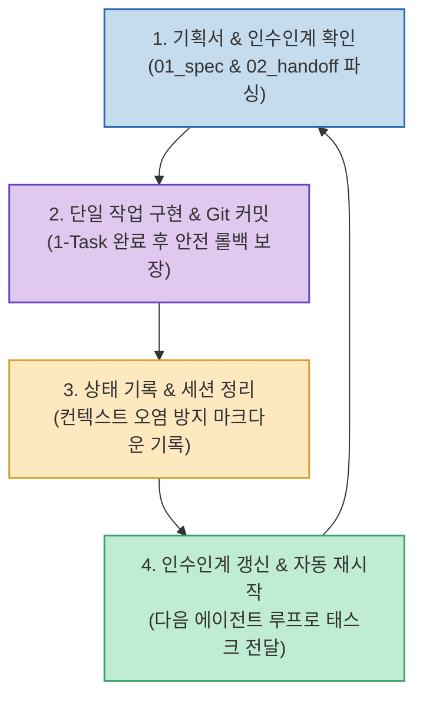

퇴근 후 하루 1시간만 쓸 수 있는 직장인이 AI 코딩을 할 때, 화면 앞에서 한 줄씩 코드를 프롬프트로 주고받는 방식(1:1 바이브코딩)은 극심한 피로감과 시간 낭비를 유발합니다.

인디 게임 개발자 '평범한 30대'가 공개한 **`AI 자율 루프(Auto-loop) 엔지니어링`**은 사람이 지켜보지 않아도 **AI가 스스로 기획서와 인수인계 문서를 읽고 [기능 구현 ➔ 단위 테스트 ➔ Git 커밋 ➔ 세션 정리 및 인수인계 갱신]의 4단계를 무한 반복하여 스스로 게임을 완성해 나가는 완전 자율화 시스템**입니다.

<!--more-->

## Sources

- [원문 유튜브 영상: AI가 혼자 게임을 만들고 수정하는 자율루프 세팅, 프롬프트 100% 공개합니다](https://youtu.be/-0Yrj3SpH-U)
- [루프 엔지니어링 기반 자율 개발 워크플로우 가이드]

---

## 1. 자율 루프(Auto-loop) 4단계 순환 메커니즘

---

## 2. 자율 루프를 지탱하는 3대 핵심 파일 시스템

1. **`01_game_spec.md` (기획 명세서)**:
   * 게임의 전체 규칙, 플레이어 조작법, 승리/패배 조건, 기술 아키텍처를 불변의 기준으로 정의합니다.
2. **`02_progress_handoff.md` (진행 현황 및 인수인계서)**:
   * 현재까지 구현 완료된 기능 목록, 발견된 버그 리스트, 다음 턴에 작업해야 할 최우선 과제를 기록하여 세션 간 컨텍스트를 완벽히 전달합니다.
3. **`03_instructions.md` (개발자 특별 지시문)**:
   * 개발자가 퇴근 후 중간에 개입해 우선순위를 바꾸거나 특정 기능을 추가/수정하고 싶을 때 지시문을 남겨두는 입력 창구입니다.

---

## 3. 실전 운영 안전장치

* **단일 태스크 단위 Git 커밋 강제**: 한 번의 루프에서 욕심부려 여러 기능을 건드리지 않고, 단 하나의 작업만 완수한 뒤 반드시 Git 커밋을 남겨 언제든 안전하게 롤백할 수 있는 안정성을 확보합니다.
* **초기 2~3회 수동 검증 후 자율화**: 처음부터 완전 무한 루프를 돌리지 않고 2~3바퀴는 사람이 지켜보며 인수인계 파일이 정확히 갱신되는지 확인한 뒤 백그라운드 자동 루프로 전환합니다.

---

## 4. 시사점

사람이 에이전트를 실시간으로 감시하는 '베이비시팅'을 벗어나, **명문화된 파일 시스템과 Git 롤백 안전망을 매개체로 AI가 밤새 혼자 개발을 이어가게 만드는 실전 에이전트 자율화의 모범 사례**입니다.
