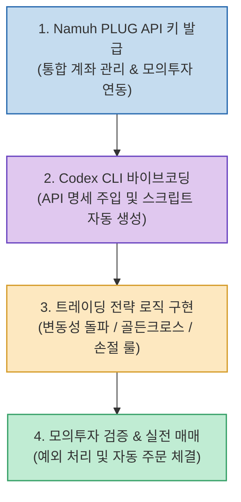

복잡한 HTS/MTS 조작이나 까다로운 증권사 개별 인증 절차 없이, 나만의 투자 전략을 파이썬 코드로 자동화하려는 개인 투자자들의 수요가 급증하고 있습니다.

유튜버 조코딩(JoCoding) 님이 공개한 **`Codex와 NH투자증권 Namuh PLUG API 기반 주식 자동매매 에이전트 튜토리얼`**은 **통합 계좌 관리와 모의투자를 지원하는 Namuh PLUG OpenAPI와 OpenAI Codex의 바이브코딩을 결합하여, 코딩 초보자도 몇 시간 만에 퀀트 트레이딩 봇을 구축하고 실전 배포하는 4단계 프로세스**를 제공합니다.

<!--more-->

## Sources

- [원문 유튜브 영상: AI에게 맡기는 주식 자동매매 - Codex와 NH투자증권 API로 투자 에이전트 만들기](https://youtu.be/CGDibbwGfvk)
- [GitHub 공식 저장소 (youtube-jocoding/nhplug-auto-trader)](https://github.com/youtube-jocoding/nhplug-auto-trader)
- [Namuh PLUG 공식 포털](https://nhplug.com)

---

## 1. AI 자동매매 에이전트 파이프라인

---

## 2. 자동매매 구축 4단계 실전 프로세스

1. **1단계: Namuh PLUG API 발급 및 모의투자 환경 설정**:
   * 나무증권 앱과 NH PLUG 포털에서 API Key/Secret을 발급받고 모의투자 계좌를 연결합니다. 여러 계좌를 하나의 인증 키로 제어할 수 있어 관리가 간편합니다.
2. **2단계: Codex CLI 기반 바이브코딩 연동**:
   * Namuh PLUG의 REST API 엔드포인트 명세서(잔고 조회, 시세 수집, 매수/매도 주문)를 Codex에 주입하여 기본 파이썬 연동 모듈을 생성합니다.
3. **3단계: 투자 전략 알고리즘 구현**:
   * 이동평균선 골든크로스, 변동성 돌파 전략(래리 윌리엄스), 익절 및 손절(Stop-loss) 규칙 등 원하는 투자 로직을 자연어로 설명하여 코드로 구현합니다.
4. **4단계: 모의투자 시뮬레이션 및 실전 전환**:
   * 정규장 시간 동안 모의투자 환경에서 주문 체결 속도, 미체결 취소, 네트워크 장애 예외 처리를 검증한 뒤 실전 계좌로 전환합니다.

---

## 3. Namuh PLUG의 주요 경쟁력

* **통합 계좌 제어**: 계좌별로 보안 인증서를 발급해야 했던 기존 환경과 달리 단일 키로 다계좌 제어 가능.
* **폭넓은 자산 거래**: 국내 주식뿐만 아니라 해외 주식, 채권, 파생상품까지 자동매매 지원.
* **최적화된 수수료**: 국내 0.01%, 해외 0.09%의 경쟁력 있는 수수료 구조.

---

## 4. 시사점

AI 코딩 에이전트와 모던 증권사 OpenAPI의 결합을 통해, **전문 퀀트 트레이더의 전유물이었던 알고리즘 자동매매를 개인 투자자도 손쉽게 구현하고 운영할 수 있는 대중화 시대**가 열렸습니다.
