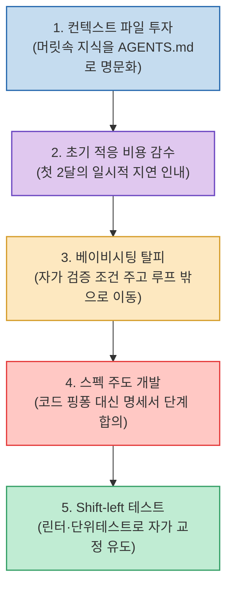

AI 코딩 도구를 도입했음에도 개인 차원에서는 10~20% 정도의 효율 향상에 그치는 경우가 많습니다. 하지만 조직 차원에서 일하는 방식을 완전히 전환한 팀들은 전혀 다른 결과를 보여주었습니다.

AWS 시니어 프린시펄 엔지니어 클레어 리구오리(Clare Liguori)가 공개한 **아마존 내부 50개 팀의 1년 파일럿 데이터**에 따르면, 동일한 AI 코딩 도구를 사용했음에도 상위 25개 팀은 **배포 속도가 중앙값 기준 4.5배, 많게는 10배 이상 폭발적으로 가속**되었습니다. 이들이 실천한 5대 핵심 습관과 새롭게 맞닥뜨린 3가지 병목을 정리합니다.

<!--more-->

## Sources

- [원문 유튜브 영상: AWS 엔지니어가 공개한 아마존 내부 데이터 — 4.5배 빨라진 25개 팀의 습관 5가지](https://youtu.be/O9iL08X9zMo)
- [원본 영어 발표: From AI-Assisted to AI-Native (Clare Liguori, AI Engineer World's Fair)](https://www.youtube.com/watch?v=pqlWNihgdjI)

---

## 1. 4.5배 생산성을 만드는 5대 핵심 습관

---

## 2. 상위 25개 팀의 5가지 실전 습관

1. **습관 1: 에이전트 컨텍스트에 투자 (Write down everything)**:
   * 시니어 개발자의 머릿속에만 존재하던 아키텍처 원칙, 레거시 제약, 배포 규칙을 `CLAUDE.md`, `AGENTS.md` 등 파일 형태로 명문화하여 에이전트에게 주입합니다.
2. **습관 2: 느려져야 빨라진다 (Slower first, faster later)**:
   * 도입 초기 1~2달은 컨텍스트 정비와 가드레일 세팅으로 일시적인 생산성 저하가 발생합니다. 이 적응 비용을 감수하고 체계화한 팀만이 수배의 도약을 달성했습니다.
3. **습관 3: 베이비시팅 말고 먹이 주기 (Feed, don't babysit)**:
   * 화면 앞에서 에이전트가 코딩하는 과정을 1:1로 지켜보지 않고, **"에이전트 스스로 성공 여부를 검증할 수 있는 테스트 기준"**을 부여한 뒤 사람은 다른 고부가가치 작업으로 이동합니다.
4. **습관 4: 의도를 문서로 (스펙 주도 개발 / Spec-driven Development)**:
   * 코드를 보며 사후에 핑퐁 수정하지 않고, **기능 명세서(Spec)와 아키텍처 설계 문서 단계에서 먼저 완벽히 합의**한 후 코드는 일괄 생성합니다.
5. **습관 5: 테스트를 앞으로 (Shift-left Testing)**:
   * 린터, 단위/통합 테스트, 보안 검사를 전면에 배치하여 에이전트가 테스트 실패 로그를 분석해 스스로 버그를 고치는 자가 교정 루프를 구축합니다.

---

## 3. 생산성 폭증 후 새로 생긴 3대 병목

* **리뷰 번아웃**: 코드를 작성하는 시간보다 AI가 쏟아내는 코드를 검토하는 인지적 부하가 급증.
* **조직의 성급한 조급함**: 일하는 방식의 시스템화 없이 도구 도입만으로 즉각적인 10배 속도를 요구하는 압박.
* **의사결정의 병목**: 코드가 극도로 저렴해지면서 **"되돌릴 수 있는 결정(Type 2)"과 "되돌릴 수 없는 중요한 결정(Type 1)"**을 신속히 구분해 내는 역량이 엔지니어의 핵심 가치가 됨.

---

## 4. 시사점

AI 코딩의 본질은 도구 자체가 아니라 **"컨텍스트 명문화 ➔ 자율 검증 루프 ➔ 스펙 주도 설계"로 이어지는 엔지니어링 패러다임의 혁신**에 있습니다.
