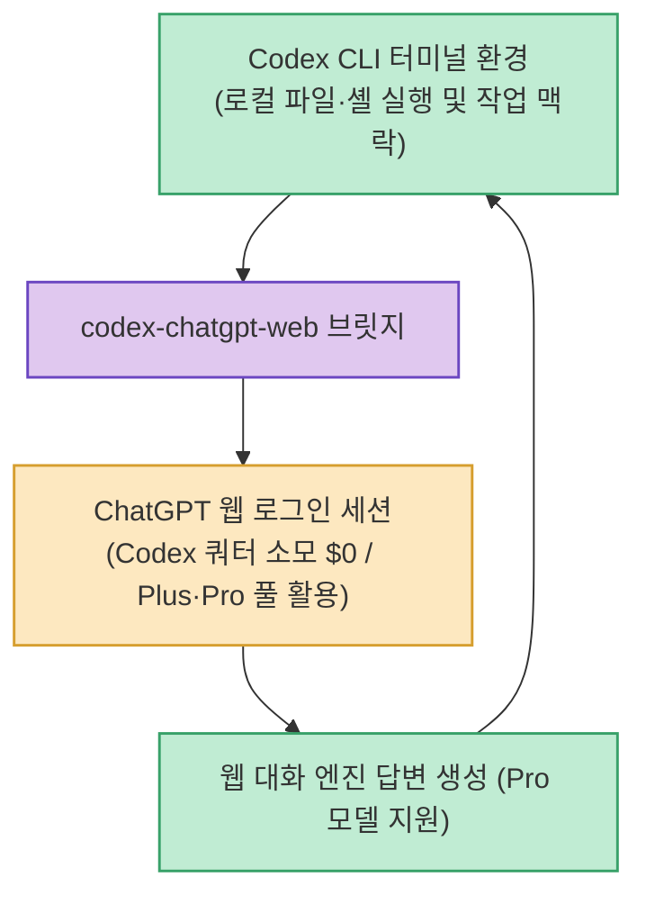

Codex CLI는 터미널에서 로컬 파일과 셸을 직접 제어할 수 있어 매우 편리하지만, 전용 사용량(API 쿼터)이 빠르게 차감되어 비용 부담이 큽니다. 반면 일반 ChatGPT 웹은 넉넉한 대화 쿼터를 제공하지만 로컬 파일과의 유기적인 연동이 어렵습니다.

**`codex-chatgpt-web`**(`miuuyy/codex-chatgpt-web`)은 Codex 터미널 작업 환경은 그대로 유지하면서, **답변 생성만 백그라운드 브라우저의 로그인된 ChatGPT 웹 세션으로 넘겨 처리함으로써 Codex 쿼터 차감 없이 무제한급으로 코딩을 수행하는 오픈소스 브릿지 도구**입니다. (공개 5주 만에 GitHub 2,700+ Stars)

<!--more-->

## Sources

- [원문 Threads 게시물 (ckdgus99)](https://www.threads.com/@ckdgus99/post/DcsSNCsCBWy)
- [codex-chatgpt-web GitHub 공식 저장소](https://github.com/miuuyy/codex-chatgpt-web)
- [유사 프로젝트 (XiaoDuoYa/codex-with-chatgpt)](https://github.com/XiaoDuoYa/codex-with-chatgpt)

---

## 1. codex-chatgpt-web 연동 아키텍처

---

## 2. 주요 핵심 기능 및 차별점

1. **Codex API 쿼터 소모 $0 (ChatGPT 웹 쿼터 활용)**:
   * OpenAI 정책상 Codex 사용량 풀과 일반 ChatGPT 웹 대화 사용량은 완전히 분리되어 있습니다.
   * 이미 결제 중인 ChatGPT Plus/Pro 구독 계정의 웹 대화 세션을 사용하므로 Codex 크레딧이 깎이지 않습니다. (Pro 구독 시 Pro 모델 선택 가능)
2. **컨텍스트 및 이미지 전달 완벽 유지**:
   * 현재 작업 중인 코드 맥락과 첨부된 이미지가 ChatGPT 웹으로 누락 없이 전달되며, 생성된 답변과 수정 코드는 다시 Codex CLI 화면으로 깔끔하게 반환됩니다.
3. **풀 모드(Full Mode)를 통한 로컬 자동화**:
   * 풀 모드를 켜면 ChatGPT가 터미널의 파일 읽기/쓰기, 셸 명령어 실행, 작업 승인까지 자율적으로 제어합니다.
4. **간단한 설치 및 크로스 플랫폼 지원**:
   * 유료 API 키나 복잡한 크롬 드라이버 설정 없이 스크립트 한 줄로 설치 가능하며, Mac, Windows, Linux를 모두 지원합니다. (MIT 라이선스)

---

## 3. 시사점

터미널 기반 코딩 도구의 높은 편의성과 ChatGPT 웹 구독의 넉넉한 쿼터 혜택을 결합하여, **추가 비용 부담 없이 로컬 AI 코딩 생산성을 극대화할 수 있는 실전 가성비 솔루션**입니다.
