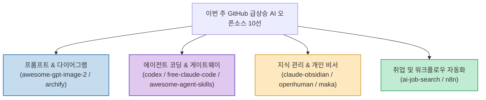

AI 기술이 빠르게 발전하면서 단순한 모델 릴리즈를 넘어, 실무 워크플로우에 결합해 생산성을 극대화하는 에이전트 스킬과 도구들이 오픈소스 생태계에서 주목받고 있습니다.

이번 주 GitHub에서 개발자들의 뜨거운 관심을 받으며 스타(Stars)가 급상승한 **10대 핵심 AI 도구 및 프레임워크**를 정리합니다.

<!--more-->

## Sources

- [원문 X 게시물: そう｜Claude Code의 X운영 (@so_ainsight)](https://x.com/so_ainsight/status/2094261406724198606)

---

## 1. 이번 주 급상승 AI 도구 카테고리 맵

---

## 2. TOP 10 AI 오픈소스 상세 정리

1. **`awesome-gpt-image-2`** ([freestylefly/awesome-gpt-image-2](https://github.com/freestylefly/awesome-gpt-image-2)):
   * 이미지 생성 AI를 위한 엄선된 프롬프트 견본집. 원하는 화풍이나 비주얼 스타일에 맞춰 즉시 복사해 활용 가능.
2. **`archify`** ([tt-a1i/archify](https://github.com/tt-a1i/archify)):
   * 시스템 아키텍처와 처리 흐름을 텍스트로 설명하면 고품질 다이어그램 차트로 자동 시각화해 주는 스킬.
3. **`codex`** ([openai/codex](https://github.com/openai/codex)):
   * OpenAI의 공식 터미널 코딩 에이전트. 프롬프트 지시를 통해 파일 수정과 빌드, 테스트를 자율 수행.
4. **`ai-job-search`** ([MadsLorentzen/ai-job-search](https://github.com/MadsLorentzen/ai-job-search)):
   * 채용 공고 스크랩부터 맞춤형 이력서/자소서 작성, AI 모의 면접 대비까지 전 과정을 보조하는 구직 프레임워크.
5. **`free-claude-code`** ([Alishahryar1/free-claude-code](https://github.com/Alishahryar1/free-claude-code)):
   * 여러 AI 코딩 툴을 무료 티어 제공처를 통해 단일 창구에서 중계·스위칭하여 사용할 수 있는 게이트웨이.
6. **`claude-obsidian`** ([AgriciDaniel/claude-obsidian](https://github.com/AgriciDaniel/claude-obsidian)):
   * 메모와 자료를 입력하면 AI가 상호 연관성을 분석해 지식 베이스(PKM)를 체계적으로 연결·정리해 주는 도구.
7. **`awesome-agent-skills`** ([VoltAgent/awesome-agent-skills](https://github.com/VoltAgent/awesome-agent-skills)):
   * Claude Code, Cursor 등 최신 에이전트 CLI에서 즉시 설치 가능한 스킬들의 종합 카탈로그.
8. **`openhuman`** ([tinyhumansai/openhuman](https://github.com/tinyhumansai/openhuman)):
   * 정보 리서치와 일상 스케줄/태스크 정리를 전담하는 온디바이스 개인 맞춤형 AI 비서 프레임워크.
9. **`maka`** ([apache/maka](https://github.com/apache/maka)):
   * 에이전트의 작업 공간을 로컬에 구축하고, 명령어 조작과 판단 이력을 투명하게 기록·추적하는 도구.
10. **`n8n`** ([n8n-io/n8n](https://github.com/n8n-io/n8n)):
    * 다양한 웹 서비스와 AI 에이전트 노드를 노코드로 연결해 비즈니스 자동화 파이프라인을 구축하는 오픈소스 엔진.

---

## 3. 시사점

코드 자동 완성을 넘어 **아키텍처 시각화(archify), 지식 관리 체계화(claude-obsidian), 에이전트 스킬 확장(awesome-agent-skills), 노코드 오케스트레이션(n8n)** 등 개발 및 업무 전 영역에 걸친 실전 생산성 도구들의 성장이 두드러집니다.
