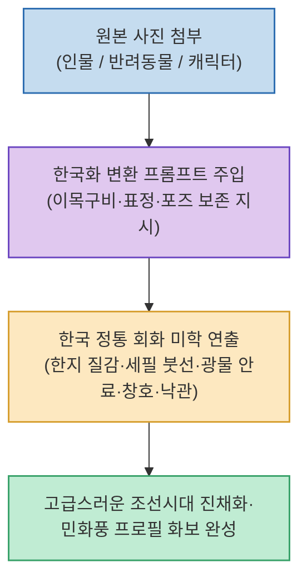

AI 이미지 생성 도구로 사진을 동양화나 예술 화보로 변환할 때 가장 큰 문제는 원본 인물의 얼굴이 완전히 다른 사람으로 바뀌거나(Identity Loss), 어색한 일본풍/중국풍 화풍이 섞여 나오는 점입니다.

프롬프트 엔지니어 neotypeska 님이 공개한 **`한국 전통 진채화 변환 프롬프트 기법`**은 원본 사진 속 인물이나 반려동물의 **이목구비와 표정, 시선, 포즈를 정밀하게 보존하면서, 한지(Hanji) 질감, 섬세한 세필 붓선, 천연 광물 안료의 색감, 한옥 창호와 붉은 낙관 인장을 더해 고급스러운 조선시대 정통 채색화 화보를 완성**해 줍니다.

<!--more-->

## Sources

- [원문 Threads 게시물 (neotypeska)](https://www.threads.com/@neotypeska/post/Dcs5PtjEoiq)
- [GPT Image 생성 프롬프트 엔지니어링 가이드]

---

## 1. 한국화 화보 변환 파이프라인

---

## 2. 주요 핵심 연출 요소

1. **원본 인물의 정체성 보존 (Identity & Pose Preservation)**:
   * 얼굴의 이목구비 비율, 미소나 눈빛, 고개의 각도와 손동작을 유지하도록 프롬프트 제약을 설정하여 '나만의 맞춤 화보'를 구현합니다.
2. **한국 정통 진채화(眞彩畵) 및 세필채색 미학**:
   * 거친 수묵화나 왜색 짙은 화풍 대신, 고운 붓으로 꼼꼼히 칠한 세필채색과 한지의 자연스러운 질감, 광물성 안료의 깊이 있는 색감을 표현합니다.
3. **전통 소품 및 배경 오브제 조화**:
   * 배경에 은은한 한옥 창호 격자문, 소나무, 들국화, 모란 등을 배치하고, 귀퉁이에 붉은 전통 낙관 인장(Red Seal)을 찍어 완성도를 높입니다.
4. **무료/Plus 모든 환경 지원**:
   * ChatGPT 무료 버전 및 Plus/Pro 환경의 DALL-E / GPT Image 모델 모두에서 간편하게 사진을 업로드하고 복사-붙여넣기만으로 생성할 수 있습니다.

---

## 3. 시사점

단순한 화풍 필터를 씌우는 수준을 넘어, **원본 피사체의 정체성을 유지하면서 국가/문화권 고유의 전통 회화 양식을 정밀하게 입히는 프롬프트 엔지니어링의 실전 활용법**을 보여줍니다.
