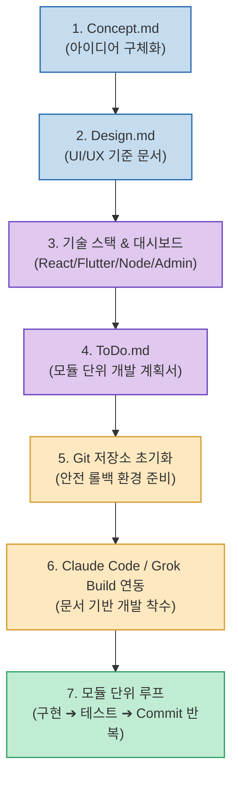

AI 코딩 에이전트에게 처음부터 무작정 *"이런 앱 만들어줘"*라고 요청하면, 맥락이 끊기거나 디자인이 매번 바뀌고 스파게티 코드가 생성되는 실패를 겪기 쉽습니다.

소프트웨어 엔지니어 Brandon Chung(@brandonchung75) 님이 공개한 **`바이브 코딩 가이드 v1.0`**은 코딩 무경험자, 기획자, 주니어 개발자도 안전하게 프로덕션 레벨의 웹/앱을 완성할 수 있도록 **"코드를 바로 짜게 하지 말고, 기획/디자인/할 일 문서(`Concept.md`, `Design.md`, `ToDo.md`)를 먼저 완성한 뒤 모듈 단위로 개발하는 7단계 프로세스"**를 제시합니다.

<!--more-->

## Sources

- [원문 X 게시물: head77x / Brandon Chung (@brandonchung75)](https://x.com/brandonchung75/status/2094410943644241956)

---

## 1. 7단계 문서 주도 바이브 코딩 파이프라인

---

## 2. 7단계 실전 실행 가이드

1. **`Concept.md` — 2~3줄 아이디어의 구조화**:
   * 만들고 싶은 아이디어를 자연어로 설명하고, AI에게 구현을 위한 전체 절차와 방법론을 `Concept.md`로 정리하도록 지시합니다.
2. **`Design.md` — UI/UX 기준 문서 고정**:
   * 마음에 드는 레퍼런스 사이트(Linear, Toss, Stripe 등)의 레이아웃, 컬러 팔레트(HEX), 타이포그래피, 여백, 다크모드 규칙을 분석하여 디자인 기준 문서로 확정합니다.
3. **기술 스택 결정 및 관리자(Admin) 대시보드 기획**:
   * 웹(React), 모바일(Flutter), CLI 도구(uv/npm) 등 환경에 맞는 스택을 확정하고, 서버 상태(Health check)와 에러 로그를 확인할 수 있는 관리자 대시보드를 계획에 포함합니다.
4. **`ToDo.md` — 모듈 단위 개발 계획서 수립**:
   * 전체 시스템을 캡슐화된 모듈 단위로 쪼개고, DB 스키마 설계 및 의존성 순서에 따른 **체크박스 구현 목록**을 작성합니다.
5. **개발 환경 준비 및 Git 저장소 생성**:
   * Git과 VS Code를 준비하고 GitHub 저장소를 생성하여 초기 커밋을 만듭니다.
6. **Claude Code / Grok Build 에이전트 개발 시작**:
   * 작성해 둔 `Design.md` + `ToDo.md` 문서를 에이전트에 전달하여 개발에 착수합니다.
7. **모듈 단위 [구현 ➔ 테스트 ➔ Git Commit] 반복**:
   * 한 번에 전체를 만들지 않고, 체크박스 목록에 따라 1모듈씩 구현하고 테스트 후 커밋하는 루프를 진행합니다.

---

## 3. 시사점

즉흥적인 대화에 의존하는 '감각적 바이브 코딩'의 한계를 벗어나, **명문화된 스펙 문서(SDD)와 Git 커밋 안전망을 결합해 비개발자도 견고한 소프트웨어를 빌드할 수 있는 최적의 워크플로우**입니다.
