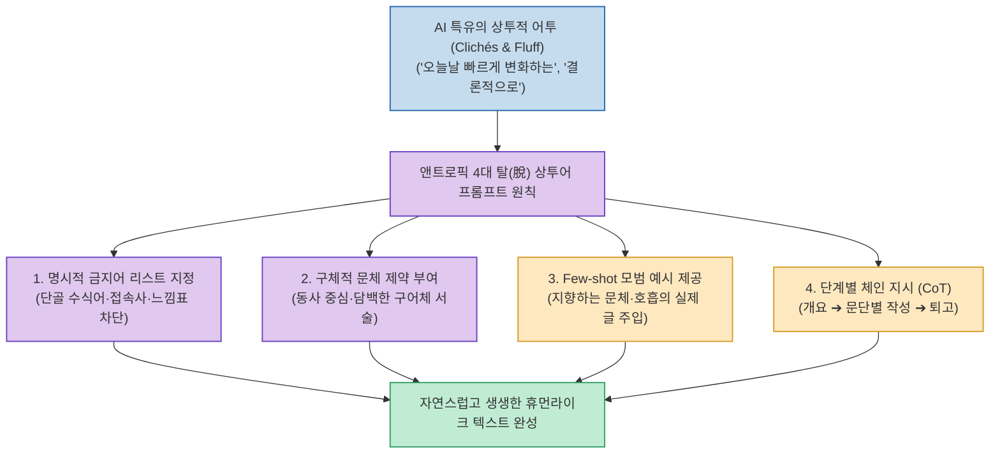

LLM에게 글 작성을 요청하면 *"오늘날 빠르게 변화하는 디지털 환경에서"*, *"결론적으로"*, *"~의 잠재력을 발휘하다(Unlock the power of)"* 같은 진부한 상투어(Clichés)와 천편일률적인 서론-본론-결론 3단 논법이 반복되어 글의 품질을 떨어뜨립니다.

Claude 개발사 앤트로픽(Anthropic)이 제시하는 **`탈(脫) 상투어 프롬프트 엔지니어링 가이드`**는 단순한 구두 지시를 넘어, **명시적 금지어 리스트, 구체적인 문체 제약, Few-shot 모범 예시, 단계별 체인 지시(CoT)의 4대 원칙을 통해 살아있는 인간다운 문장과 호흡을 이끌어내는 실전 방법론**을 제공합니다.

<!--more-->

## Sources

- [원문 Threads 게시물: aicoffeechat (@aicoffeechat)](https://www.threads.com/@aicoffeechat/post/Dcx4JEdk7jd)
- [Anthropic Prompt Engineering Official Documentation](https://docs.anthropic.com/en/docs/build-with-claude/prompt-engineering/overview)

---

## 1. 앤트로픽 4대 탈(脫) 상투어 프롬프트 아키텍처



---

## 2. 상투적 문장을 없애는 4대 핵심 원칙

1. **명시적인 금지어 목록(Negative Constraints) 지정**:
   * *"오늘날 빠르게 변화하는"*, *"주목할 점은"*, *"결론적으로"*, *"게임 체인저"*, *"빙산의 일각"* 등 AI가 습관적으로 쓰는 클리셰 단어와 느낌표/이모지 남발을 프롬프트에 직접 금지어로 명시합니다.
2. **구체적인 문체 제약(Style Constraints) 부여**:
   * 모호한 *"자연스럽게 써줘"* 대신 *"비즈니스 어투를 피하고 동료에게 설명하듯 구어체로"*, *"형용사·부사를 최소화하고 구체적인 행동 동사와 명사 위주로 서술"*하도록 구체화합니다.
3. **Few-shot 모범 예시 제공**:
   * 내가 지향하는 문장 길이와 리듬감을 담은 실제 예시 글 1~2개를 프롬프트에 직접 포함하여 모델이 문체를 모방하도록 유도합니다.
4. **단계별 체인 지시 (Chain-of-Thought)**:
   * 한 번에 긴 글을 완성하게 하지 않고 **"3가지 관점 아이디어 제안 ➔ 개요 승인 ➔ 문단별 작성 ➔ 마무리 퇴고"** 순서로 작업을 쪼개어 지시합니다.

---

## 3. 실전 적용 템플릿

```markdown
[역할] 너는 간결하고 위트 있는 테크 에세이스트야.
[주제] [글의 주제]에 대해 글을 작성해줘.

[제약 조건]
1. 절대 금지 표현: "오늘날 빠르게 변화하는", "결론적으로", "주목할 점은", 느낌표 남발.
2. 부사와 형용사를 최대한 빼고 담백한 단문 위주로 서술해줘.
3. 뻔한 비유 대신 독자가 머릿속에 바로 그릴 수 있는 생생한 장면으로 설명해줘.
```

---

## 4. 시사점

추상적인 지시 대신 **명확한 네거티브 제약(Negative Constraints)과 문체 가이드라인을 시스템 프롬프트에 고정**하는 것이 AI 특유의 진부함을 걷어내고 완성도 높은 콘텐츠를 얻는 가장 효과적인 접근법입니다.
