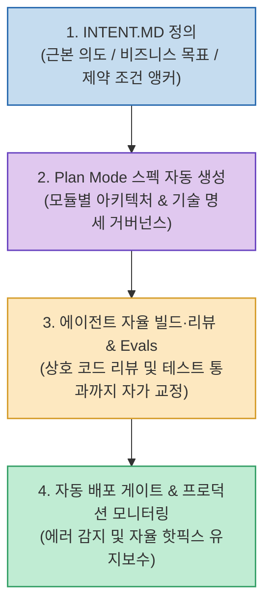

AI 코딩 도구가 발전하면서 코드를 작성하는 속도는 비약적으로 빨라졌지만, 정작 에이전트가 엉뚱한 기능을 구현하거나 아키텍처 제약을 깨뜨려 전체 딜리버리가 지연되는 새로운 병목이 발생하고 있습니다.

Anthropic이 공식 발표한 **`AI-Native SDLC Playbook`**은 **"이제 코딩은 더 이상 병목이 아니며, 소프트웨어 전달(Delivery) 프로세스 자체가 병목"**이라고 진단하며, 프로젝트 루트에서 최상위 목적과 제약을 고정하는 **`INTENT.MD`**와 Plan Mode, 에이전트 상호 코드 리뷰 및 자율 평가(Evals), 자동 배포 게이트로 이어지는 새로운 개발 라이프사이클을 제시합니다.

<!--more-->

## Sources

- [원문 유튜브 영상: Claude Codes New INTENT.MD, What is It?](https://youtu.be/LoMOPj-lO8U)
- [Anthropic 공식 블로그: The AI-Native SDLC Playbook](https://claude.com/blog/the-ai-native-sdlc-playbook)
- [Molten OS Core 오픈소스 저장소](https://github.com/switch-dimension/molten-os-core)

---

## 1. AI-Native SDLC 4단계 파이프라인

---

## 2. INTENT.MD의 역할과 AI-Native SDLC 핵심 요소

1. **기능 명세(Spec) 이전의 '근본 의도(Intent)' 앵커**:
   * 전통적인 스펙이 *"무엇을 어떻게 만들 것인가"*를 서술한다면, `INTENT.MD`는 **"이 프로젝트/기능이 왜 존재하는가, 사용자의 근본적인 의도와 성공 지표는 무엇인가, 절대 타협할 수 없는 보안/아키텍처 제약은 무엇인가"**를 정의합니다.
   * 에이전트가 복잡한 세부 구현에 매몰되어 방향성을 잃는 현상을 원천 방지합니다.
2. **Plan Mode 기반 스펙 자동 생성 & 거버넌스**:
   * 개발자가 모든 스펙을 수동으로 작성하지 않고, `INTENT.MD`를 입력하면 Claude Code가 Plan Mode에서 모듈 단위 기술 명세와 체크리스트를 자동 생성하고 사람은 이를 검토·승인합니다.
3. **에이전트 자율 빌드 & Evals (평가)**:
   * 코드가 작성된 후 단위/통합 테스트 및 에이전트 간 상호 코드 리뷰(Agent Review)와 정량적 평가(Evals)를 거쳐 모든 기준을 통과할 때까지 자가 수정을 반복합니다.
4. **자율 배포 게이트 & 프로덕션 모니터링**:
   * 검증된 코드는 자동화된 배포 게이트를 통해 프로덕션에 배포되며, 배포 후 로그 모니터링과 에러 발생 시 자율 핫픽스 PR 제안까지 연결됩니다.

---

## 3. 시사점

1:1 즉흥 대화 중심의 바이브코딩에서 벗어나, **`INTENT.MD`로 의도를 명확히 고정하고 Plan Mode와 Evals를 결합한 체계적인 AI-Native SDLC 프로세스**를 구축하는 것이 현대 엔지니어링 팀의 핵심 경쟁력입니다.
