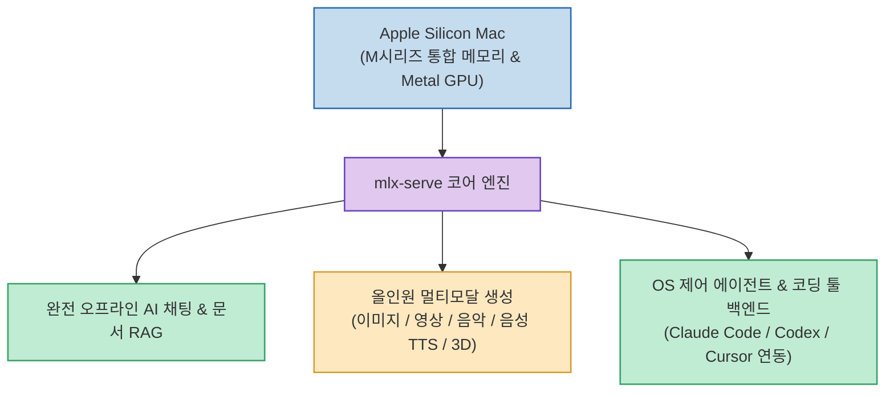

로컬 AI를 구축하기 위해 LLM 대화용(Ollama), 이미지 생성용(ComfyUI), 음성 변환용(Whisper/TTS) 도구를 각각 따로 설치해 관리하는 것은 많은 메모리와 설정 비용을 소모합니다.

**`mlx-serve`**(`ddalcu/mlx-serve`)는 Apple Silicon Mac의 통합 메모리(Unified Memory)와 Metal 가속을 극대화하는 MLX Core를 기반으로, **인터넷 연결 없이도 텍스트 채팅, 문서 Q&A, 이미지·영상·음악·음성·3D 생성, 로컬 OS 파일 제어 에이전트 기능까지 단일 로컬 서버로 통합 구동해 주는 오픈소스 프로젝트**입니다.

<!--more-->

## Sources

- [원문 Threads 게시물 (h2smusic)](https://www.threads.com/@h2smusic/post/Dcv3UD9E9J8)
- [mlx-serve GitHub 공식 저장소](https://github.com/ddalcu/mlx-serve)

---

## 1. mlx-serve 올인원 로컬 아키텍처

---

## 2. 주요 핵심 기능 및 차별점

1. **완전 오프라인 로컬 AI 질의응답**:
   * 외부 인터넷 연결이나 유료 API 키 없이도 Mac 로컬에서 텍스트 채팅, PDF 문서 분석, 프라이빗 RAG 질의응답을 완벽하게 수행합니다.
2. **올인원 멀티모달 생성 (All-in-One Multimodal Engine)**:
   * 텍스트 대화뿐만 아니라 **이미지 생성, 영상(Video), 배경음악(Music), 음성 합성(TTS), 3D 모델 생성**까지 Mac GPU(Metal) 가속으로 단일 런타임에서 처리합니다.
3. **OS 레벨 제어 에이전트(Agent) 모드**:
   * *"다운로드 폴더 정리해줘"*처럼 자연어로 요청하면 에이전트가 로컬 파일 시스템을 직접 탐색하고 조작하여 실제 작업을 완수합니다.
4. **Claude Code / Codex 로컬 백엔드 연동**:
   * OpenAI 규격의 API 엔드포인트를 제공하여 **Claude Code, Codex, Cursor** 등 다양한 AI 코딩 도구의 로컬 백엔드 서버로 즉시 연결할 수 있습니다.
5. **완벽한 데이터 프라이버시 & 비용 0원**:
   * 모든 데이터와 프롬프트가 내 Mac 로컬 안에서만 처리되어 사내 기밀 유출 위험이 없으며, 월 구독료 없이 무료로 운영됩니다.

---

## 3. 시사점

파편화되어 있던 로컬 AI 도구들을 하나로 통합하고, **Apple Silicon Mac을 나만의 완벽한 프라이빗 AI 클라우드 워크스테이션으로 탈바꿈시키는 차세대 MLX 생태계의 대표 주자**입니다.
