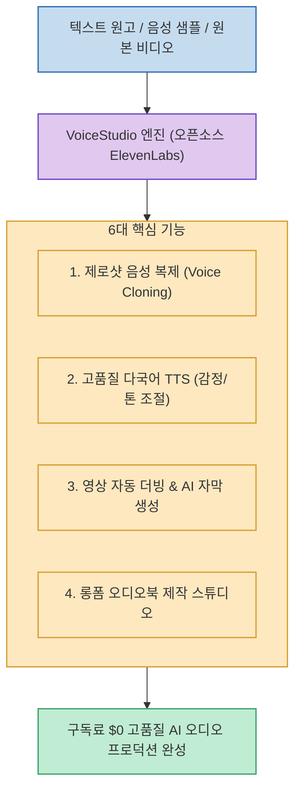

글로벌 AI 음성 생성 및 더빙 시장을 주도하는 ElevenLabs는 뛰어난 품질을 자랑하지만, 크레딧 기반의 과금 모델로 인해 영상 제작자나 오디오북 크리에이터에게 상당한 비용 부담을 줍니다.

**`VoiceStudio`**(`debpalash/VoiceStudio`)는 "오픈소스 ElevenLabs"를 목표로 개발된 **올인원 AI 오디오 프로덕션 워크스테이션으로, 짧은 샘플만으로 음성을 복제하는 제로샷 보이스 클로닝부터 고품질 다국어 TTS, 영상 자동 더빙, 자막 생성, 롱폼 오디오북 스튜디오 기능까지 완전 무료 오픈소스로 제공**합니다.

<!--more-->

## Sources

- [원문 Threads 게시물: artlive.coding (@artlive.coding)](https://www.threads.com/@artlive.coding/post/Dcw1iV4ky5r)
- [VoiceStudio GitHub 공식 저장소 (debpalash/VoiceStudio)](https://github.com/debpalash/VoiceStudio)

---

## 1. VoiceStudio 오디오 제작 파이프라인

---

## 2. 6대 주요 핵심 기능 및 차별점

1. **제로샷 음성 복제 (Zero-shot Voice Cloning)**:
   * 몇 초 분량의 짧은 음성 샘플만으로 화자의 고유한 음색, 억양, 호흡을 정밀하게 추출해 복제 음성을 생성합니다.
2. **감정 표현 및 속도 조절 다국어 TTS**:
   * 기계적인 낭독 톤을 탈피하여 분노, 기쁨, 속삭임 등 감정 상태와 템포를 세밀하게 조절할 수 있는 텍스트 음성 변환을 지원합니다.
3. **영상 자동 번역 & 다국어 더빙 (Video Dubbing)**:
   * 원본 영상의 BGM과 효과음을 분리 보존하면서, 화자의 목소리를 한국어, 영어, 일본어 등 목표 언어로 자연스럽게 번역·더빙합니다.
4. **AI 음성 인식 기반 자막 자동 생성**:
   * 타임스탬프와 완벽히 싱크되는 SRT/VTT 캡션 자막을 자동으로 추출합니다.
5. **롱폼 오디오북 제작 스튜디오 (Audiobook Suite)**:
   * 수백 페이지의 긴 원고를 챕터별로 자동 분할하고, 캐릭터별로 서로 다른 복제 성우를 매핑해 완성도 높은 오디오북을 일괄 제작합니다.

---

## 3. 시사점

유료 상용 SaaS에 종속되지 않고, **음성 복제부터 영상 현지화 더빙, 오디오북 출판까지 개인 크리에이터와 스튜디오가 자체 오디오 파이프라인을 구축**할 수 있는 실전 오픈소스 도구입니다.
