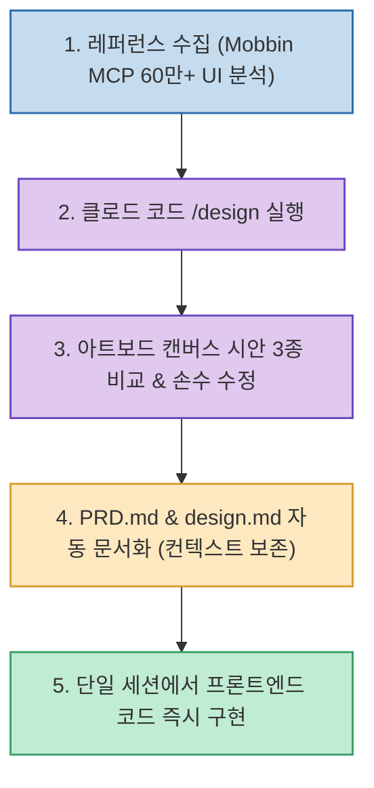

클로드 디자인(Claude Design)에서 UI 시안을 뽑고, 이를 클로드 코드(Claude Code)로 복사해 코딩하다가, 디자인을 고치기 위해 다시 클로드 디자인으로 돌아가는 번거로운 컨텍스트 스위칭은 AI 웹/앱 개발의 대표적인 병목이었습니다.

앤트로픽이 클로드 코드에 공식 탑재한 **`/design` 스킬**은 **클로드 디자인의 핵심이었던 '아트보드 캔버스(Artboard Canvas)'를 코드 세션 내부로 완전히 통합하여, 터미널에서 여러 컨셉 시안을 펼쳐놓고 시각적으로 비교·수정한 뒤 즉시 프론트엔드 개발로 직행하는 완벽한 일체형 워크플로우**를 완성했습니다.

<!--more-->

## Sources

- [원문 유튜브 영상: 클로드의 역대급 디자인 업데이트. 클로드 코드 ↔ 클로드 디자인 왕복, 이제 끝났습니다 (에릭)](https://youtu.be/zRGctvGgiZ8)
- [Mobbin MCP 공식 레퍼런스](https://mobbin.com)
- [Lucide Icons 오픈소스 저장소](https://github.com/lucide-icons/lucide)

---

## 1. /design 스킬 엔드투엔드 파이프라인

---

## 2. 클로드 코드 공식 `/design` 스킬의 2대 혁신

1. **코드 세션 내 즉각적인 시안 이터레이션 (Artboard Canvas)**:
   * HTML 시안을 브라우저에 따로 띄워보거나 다른 도구로 넘어갈 필요 없이, **코드 세션 내에서 아트보드 캔버스 위에 3가지 컨셉 시안을 나란히 펼쳐놓고 비교**하며 세부 요소를 다듬을 수 있습니다.
2. **완벽한 컨텍스트(Context) 보존**:
   * `CLAUDE.md`, 프로젝트 스킬, `PRD.md`, `design.md` 등 이미 학습된 프로젝트의 아키텍처 규칙과 비즈니스 요구사항을 **100% 읽어들인 상태에서 디자인을 생성**하므로 기획과 UI의 싱크가 어긋나지 않습니다.

---

## 3. 실전 5단계 워크플로우

1. **레퍼런스 수집 (Mobbin MCP)**:
   * 60만 개 이상의 상용 앱/웹 UI 패턴을 보유한 Mobbin MCP를 연동하여 기획에 맞는 벤치마크 보고서를 작성합니다.
2. **`/design` 실행 및 다중 컨셉 생성**:
   * 터미널에서 `/design`을 실행하고 3가지 다른 무드의 UI 컨셉을 요청하여 캔버스에서 비교합니다.
3. **컨셉 확정 및 기획 문서화**:
   * 최적의 시안을 선택하면 에이전트가 이를 바탕으로 `PRD.md` 및 `design.md`를 자동으로 최신화합니다.
4. **전체 화면 컴포넌트 코드 구현**:
   * 확정된 시안을 기반으로 React, Tailwind CSS 컴포넌트 코드를 그 자리에서 작성합니다.
5. **병렬 디자인 세션**:
   * 여러 개의 클로드 코드 세션을 동시에 띄워 서로 다른 서브 페이지들을 병렬로 디자인할 수 있습니다.

---

## 4. 시사점

기획 문서(PRD) ➔ 아트보드 캔버스(UI 시안) ➔ 프론트엔드 구현이 **단 하나의 클로드 코드 세션 안에서 분절 없이 이어지는 '디자인-엔지니어링 일체화'의 완성형 모델**입니다.
