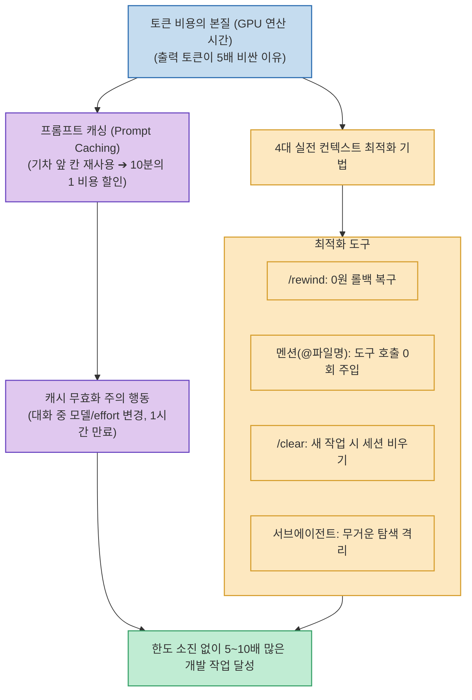

Claude Code를 사용하다 보면 동일한 작업을 수행했는데도 어떤 날은 사용 한도가 여유롭고, 어떤 날은 몇 번의 질문만으로 일일/시간당 한도가 바닥나는 현상을 겪게 됩니다.

Anthropic이 공식 기술 블로그([Maximizing the value of your Claude Code sessions](https://claude.com/blog/maximizing-the-value-of-your-claude-code-sessions))에 공개한 원리에 따르면, 이는 운이 아니라 **"토큰 청구의 본질(GPU 점유 시간), 입력 토큰 비용을 10분의 1(90% 할인)로 낮춰주는 프롬프트 캐싱(Prompt Caching), 그리고 세션과 컨텍스트를 다루는 사용자 습관의 차이"**에서 비롯됩니다.

<!--more-->

## Sources

- [원문 유튜브 영상: 클로드 코드 한도, 이거 모르면 계속 낭비하게됩니다 (Aiden의 친절한 AI)](https://youtu.be/cWd2Vy9OHV0)
- [Anthropic 공식 기술 블로그: Maximizing the value of your Claude Code sessions](https://claude.com/blog/maximizing-the-value-of-your-claude-code-sessions)

---

## 1. 클로드 코드 비용 최적화 파이프라인

---

## 2. 토큰 비용의 본질과 프롬프트 캐싱 원리

1. **청구는 토큰, 실제 비용은 GPU 점유 시간**:
   * **출력(Output) 토큰이 입력(Input) 토큰보다 5배 비싼 이유**: 입력(Prefill)은 GPU에서 수천 토큰을 병렬로 연산할 수 있지만, 출력(Decode)은 모델이 다음 단어를 순차적으로 한 글자씩 예측하며 GPU 메모리를 계속 점유하기 때문입니다.
   * **`effort`(Thinking 토큰) 설정 주의**: 사고 깊이를 조절하는 effort 설정값은 다음 세션까지 유지되므로, 단순 작업 시 낮추지 않으면 토큰이 빠르게 소모됩니다.
2. **프롬프트 캐싱 (Prompt Caching) — 10분의 1 비용의 핵심**:
   * 대화 히스토리의 앞부분(기차의 앞 칸)이 유지되면 캐시가 적중(Cache Hit)하여 **입력 토큰 비용이 10분의 1(90% 할인)**로 줄어듭니다.
   * **캐시를 깨뜨리는 행동들**:
     * 대화 도중 모델(Model) 변경 또는 effort 값 변경.
     * 대화 사이 1시간 경과 (TTL 만료).
     * 무분별한 `/compact` 남발 (히스토리가 재작성되며 기존 캐시 무효화).

---

## 3. 한도를 극대화하는 4대 실전 명령어 팁

1. **`/rewind` (비용 0원 롤백)**:
   * AI가 엉뚱한 답변을 하거나 잘못된 코드를 작성했을 때 새 대화로 설득하려 하지 말고, `/rewind`로 이전 체크포인트로 되돌리면 **토큰 낭비 0원으로 즉시 롤백**됩니다.
2. **멘션(`@파일명`) 활용**:
   * *"그 파일 읽어봐"*라고 지시하면 에이전트가 파일 검색 및 읽기 도구 호출 턴을 소비합니다. `@파일명`으로 직접 지정하면 도구 호출 0회로 컨텍스트에 즉시 주입됩니다.
3. **`/clear` vs `/compact`의 명확한 구분**:
   * **새로운 작업이나 다른 기능 개발**: 반드시 **`/clear`**로 이전 세션을 완전히 비워 백지상태로 시작해야 기존 파일 누적 전송을 막을 수 있습니다.
   * **동일한 작업을 길게 이어갈 때만**: **`/compact`**로 요약 압축을 진행합니다.
4. **서브에이전트(Subagents) 위임**:
   * 대규모 파일 탐색이나 방대한 로그 분석 등 무거운 조사 작업은 서브에이전트에게 맡겨 **최종 결론만 메인 컨텍스트로 수신**함으로써 메인 대화창의 컨텍스트 오염을 원천 차단합니다.

---

## 4. 시사점

*"대화창의 모든 컨텍스트는 매 턴마다 다시 전송된다"*는 구조를 이해하고, **[세션 비우기(`/clear`) + 파일 멘션(@) + 서브에이전트 탐색 + 캐시 유지]** 습관을 들이면 동일한 구독 요금제로 5~10배 많은 개발 작업을 수행할 수 있습니다.
