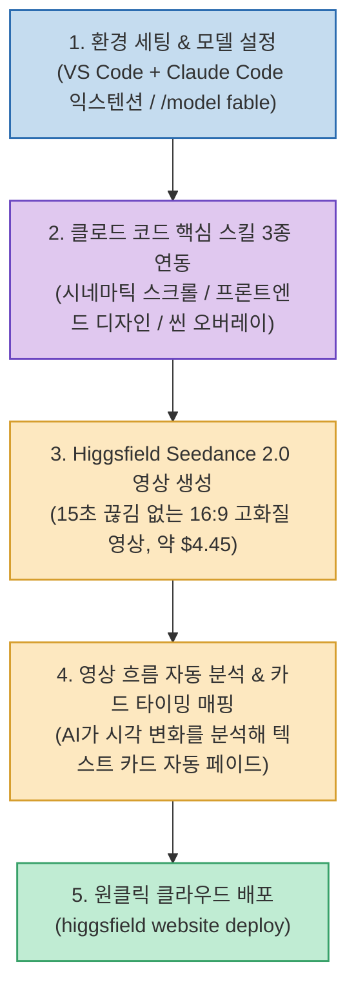

AI에게 웹사이트를 만들어 달라고 하면 코드는 곧잘 작성하지만, 결과물이 회색 네모와 글자만 가득한 밋밋한 템플릿에 머무르는 경우가 많습니다. 애플 홈페이지처럼 스크롤에 맞춰 고화질 영상이 전환되는 '외주 단가 1,000만 원 상당의 프로급 인터랙티브 웹사이트'와 일반 AI 사이트의 결정적 차이는 코드가 아니라 **"그 안을 채울 미디어(영상/이미지)가 실제로 존재하는가"**에 있습니다.

크리에이터 게으른빌더(@lazy_owen)가 공개한 **`클로드로 천만원 값 웹사이트 만드는 법`** 및 **`힉스필드 Seedance 2.0 세팅 가이드`**는 **Claude Code에 AI 미디어 생성 플랫폼인 힉스필드(Higgsfield) CLI와 Fable 5 모델, 그리고 자체 제작 3대 스킬(시네마틱 스크롤 엔진, 프론트엔드 디자인, 씬 오버레이 엔진)을 결합하여, 사이트 기획부터 15초 고화질 영상 생성, 영상 분석 기반 자동 카드 등장 타이밍 계산, 호스팅 배포까지 한 문단 프롬프트로 완결하는 통합 파이프라인**을 제시합니다.

<!--more-->

## Sources

- [원문 유튜브 쇼츠: 클로드로 천만원 값 웹사이트 만드는 법 (게으른빌더)](https://youtube.com/shorts/OiMKe3ruPcI)
- [관련 유튜브 영상: 비싼 외주비용 대신 이 3가지 스킬쓰면 미친 퀄리티 웹사이트 5분만에 만듭니다 (Seedance 2.0 + VS Code 스킬 3종)](https://youtu.be/szEpRsgeZOA)
- [게으른빌더 공식 상세 가이드: 스크롤할 때마다 영상이 움직이는 웹사이트, 한 줄로 만드는 세팅](https://lazyowen.com/guides/fable5-website)
- [Higgsfield CLI 공식 문서 및 저장소](https://github.com/higgsfield-ai/cli)

---

## 1. 힉스필드 + 스킬 3종 결합 아키텍처



---

## 2. 3대 핵심 스킬(Skills)의 역할

1. **시네마틱 스크롤 엔진 (Cinematic Scroll Engine)**:
   * 15초 분량의 고화질 비디오 재생 타임라인과 웹 브라우저의 스크롤 위치를 1:1로 부드럽게 매핑하여, 사용자가 스크롤할 때마다 영상이 정밀하게 동기화되도록 제어합니다.
2. **프론트엔드 디자인 (Frontend Design)**:
   * 촌스러운 보라색 그라디언트나 어색한 그림자 대신, 미니멀한 타이포그래피, 모던한 흑백 대비, 글래스모피즘 스타일의 세련된 UI 토큰을 주입합니다.
3. **씬 오버레이 엔진 (Scene Overlay Engine)**:
   * **사용자가 수동으로 타임스탬프를 코딩할 필요가 없습니다.** AI가 비디오의 장면 전환과 시각적 변화점을 스스로 분석하여, 가장 적절한 순간에 설명 카드와 CTA 버튼이 페이드인/아웃되도록 오버레이 타이밍을 자동 계산합니다.

---

## 3. 환경 세팅: VS Code 익스텐션과 힉스필드 연동

터미널이나 VS Code 마켓플레이스에서 클로드 코드 공식 확장 프로그램을 설치한 뒤, 힉스필드 도구를 전역 설치하고 계정을 인증합니다.

```bash
# 1. 힉스필드 CLI 글로벌 설치
npm install -g @higgsfield/cli

# 2. 클로드 코드 전용 스킬(사용법 설명서) 추가
npx skills add higgsfield-ai/skills

# 3. 브라우저 인증 로그인
higgsfield auth login

# 4. 연동 및 사용 가능 모델 확인
higgsfield model list
```

`seedance_2_0`, `kling3_0` 등의 비디오 생성 모델이 출력되면 연결이 완료된 것입니다.

---

## 4. Claude Code 설정: Fable 5와 추론 극대화

웹사이트 레이아웃 빌드부터 영상 생성, 스크롤 인터랙션 코딩까지 단일 세션에서 완결하기 위해 Fable 5 모델과 최대 추론 모드를 활성화합니다.

```text
/model fable
/effort max
```

* **Fable 5**: 장시간 소요되는 엔드투엔드 대규모 프로젝트를 혼자서 끝까지 밀고 나갈 수 있는 고성능 두뇌입니다.
* **Effort Max**: 답하기 전 영상 프레임과 스크롤 매핑 로직을 깊이 있게 검토하도록 추론을 최대화합니다.

---

## 5. 실전 한 문단 주문 프롬프트

스킬 3종이 등록된 작업 공간에서 아래 프롬프트를 한 줄로 입력합니다.

```text
<브랜드 이름> 인터랙티브 웹사이트를 만들어 줘.
색은 <색 1>, <색 2>, <색 3>을 쓰고 포인트 색은 <포인트 색> 하나만.
<보여 주고 싶은 스토리 흐름>을 챕터 <숫자> 개로 나눠서 스크롤에 맞춰 넘어가게 해 줘.
배경 영상은 Higgsfield Seedance 2.0으로 15초 분량을 생성하고, 시네마틱 스크롤 엔진과 씬 오버레이 엔진을 적용해서 영상 흐름에 맞춰 설명 카드가 자동으로 등장하게 해 줘.
모바일 반응형도 지원하고 다 만들었으면 배포까지 진행해서 주소를 알려 줘.
```

프롬프트가 입력되면 Claude Code가 **Seedance 2.0에서 약 4.45달러 비용으로 15초 고화질 시연 영상**을 뽑아내고, 스크롤 엔진과 씬 오버레이 엔진을 가동해 카드 등장 타이밍을 자동으로 동기화한 인터랙티브 사이트를 완성합니다.

---

## 6. 원클릭 클라우드 배포

완성된 코드는 힉스필드 호스팅 인프라를 통해 즉시 라이브 URL로 배포됩니다.

```bash
higgsfield website create --type website --category other --subdomain <사이트-서브도메인>
higgsfield website repo-access <website_id>
higgsfield website deploy <website_id>
```

---

## 7. 시사점

단순히 코드를 짜는 챗봇의 수준을 넘어, **[Seedance 2.0(고화질 영상) + 스킬 3종(스크롤/오버레이 자동 타이밍 동기화) + Fable 5]**의 결합을 통해 1인 크리에이터도 1,000만 원 상당의 상용 인터랙티브 웹사이트를 5~10분 만에 양산할 수 있는 차세대 웹 프로덕션 파이프라인입니다.
