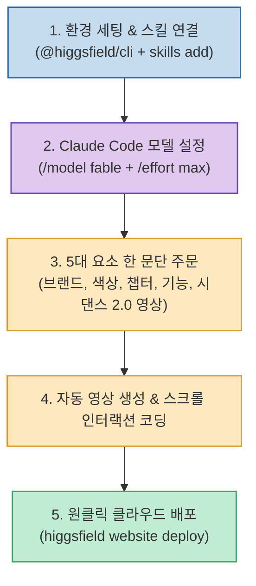

AI에게 웹사이트를 만들어 달라고 하면 코드는 곧잘 작성하지만, 결과물이 회색 네모와 글자만 가득한 밋밋한 템플릿에 머무르는 경우가 많습니다. 애플 홈페이지처럼 스크롤에 맞춰 고화질 영상이 전환되는 '외주 단가 1,000만 원 상당의 프로급 인터랙티브 웹사이트'와 일반 AI 사이트의 결정적 차이는 코드가 아니라 **"그 안을 채울 미디어(영상/이미지)가 실제로 존재하는가"**에 있습니다.

크리에이터 게으른빌더(@lazy_owen)가 공개한 **`클로드로 천만원 값 웹사이트 만드는 법 & 힉스필드 세팅 가이드`**는 **Claude Code에 AI 미디어 생성 플랫폼인 힉스필드(Higgsfield) CLI 및 스킬을 연동하고 Fable 5 모델을 적용하여, 사이트 기획부터 시댄스 2.0 영상 자동 생성, 스크롤 인터랙션 구현, 호스팅 배포까지 한 문단 프롬프트로 완결하는 통합 워크플로우**를 제시합니다.

<!--more-->

## Sources

- [원문 유튜브 쇼츠: 클로드로 천만원 값 웹사이트 만드는 법 (게으른빌더)](https://youtube.com/shorts/OiMKe3ruPcI)
- [게으른빌더 공식 상세 가이드: 스크롤할 때마다 영상이 움직이는 웹사이트, 한 줄로 만드는 세팅](https://lazyowen.com/guides/fable5-website)
- [Higgsfield CLI 공식 문서 및 저장소](https://github.com/higgsfield-ai/cli)

---

## 1. 힉스필드 + Fable 5 웹사이트 생성 파이프라인



---

## 2. 3줄로 끝내는 터미널 환경 세팅

터미널에서 힉스필드 CLI 도구를 설치하고, Claude Code가 도구를 호출할 수 있도록 스킬 설명서를 추가한 뒤 로그인합니다.

```bash
# 1. 힉스필드 CLI 글로벌 설치
npm install -g @higgsfield/cli

# 2. 클로드 코드 전용 스킬(사용법 설명서) 추가
npx skills add higgsfield-ai/skills

# 3. 브라우저 인증 로그인
higgsfield auth login

# 4. 연동 및 사용 가능 모델 확인
higgsfield model list
```

`seedance_2_0`, `kling3_0`, `nano_banana_2` 등의 비디오/이미지 모델 목록이 정상 출력되면 연결이 완료된 것입니다.

---

## 3. Claude Code 설정: Fable 5와 추론 극대화

웹사이트 전체와 비디오 생성을 하나의 세션에서 끝까지 끌고 가기 위해 모델과 생각하는 깊이를 최대로 설정합니다.

```text
/model fable
/effort max
```

* **Fable 5**: 클로드 모델 중 장시간 소요되는 대규모 엔드투엔드 프로젝트를 중단 없이 혼자 완성하도록 설계된 두뇌입니다.
* **Effort Max**: 답하기 전 아키텍처와 인터랙션을 더 깊이 검토하도록 추론 토큰을 최대로 확장합니다.

---

## 4. 실전 한 문단 주문 프롬프트

브랜드명, 3가지 컬러, 챕터 수, 필수 기능, 그리고 사용할 영상 모델을 명시하여 주문합니다.

```text
<브랜드 이름> 웹사이트를 만들어 줘.
색은 <색 1>, <색 2>, <색 3>을 쓰고 포인트 색은 <포인트 색> 하나만.
<보여 주고 싶은 스토리 흐름>을 챕터 <숫자> 개로 나눠서 스크롤에 맞춰 넘어가게 해 줘.
<필요한 기능: 문의 폼, 장바구니 등>을 넣고 모바일 반응형 화면도 지원해 줘.
사이트에 들어갈 영상과 이미지는 시댄스 2.0(SeeDance 2.0)으로 전부 생성해서 넣어 줘.
다 만들었으면 배포까지 하고 열리는 주소를 알려 줘.
```

프롬프트가 전달되면 Claude Code가 웹사이트 레이아웃을 구성함과 동시에, 각 챕터에 필요한 배경 영상을 시댄스 2.0으로 자동 생성하여 스크롤 트랙에 바인딩합니다.

---

## 5. 원클릭 클라우드 배포

에이전트가 코딩 완료 후 자체적으로 실행하거나 직접 입력할 수 있는 배포 명령어입니다.

```bash
higgsfield website create --type website --category other --subdomain <사이트-서브도메인>
higgsfield website repo-access <website_id>
higgsfield website deploy <website_id>
```

배포가 완료되면 공개된 서브도메인 URL을 통해 누구나 접속할 수 있는 완성된 인터랙티브 웹사이트가 즉시 서비스됩니다.

---

## 6. 시사점

AI 웹 개발의 패러다임이 **"단순 텍스트/UI 코드 생성"에서 "고품질 미디어 생성(SeeDance 2.0)과 인터랙션이 결합된 풀스택 자동화"**로 진화했음을 보여주는 가장 실용적인 프로덕션 가이드입니다.
