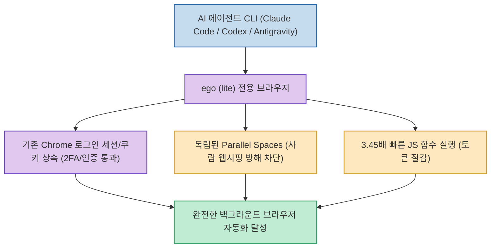

Playwright, Puppeteer, Selenium 같은 전통적인 브라우저 자동화 도구는 매 실행마다 새로운 브라우저 인스턴스를 띄우기 때문에, 2단계 인증(2FA)이나 캡차, 사내 어드민/CRM, 소셜 미디어의 강력한 로그인 장벽을 뚫지 못해 자동화가 번번이 실패합니다. 또한 에이전트가 브라우저를 조작하는 동안 사용자의 마우스와 화면이 점유되어 작업을 방해받는 문제도 컸습니다.

코드팩토리(CodeFactory)가 소개한 **`ego (lite)`**(`citrolabs/ego-lite`)는 **AI 에이전트 전용으로 설계된 무료 macOS용 Chromium 브라우저로, 사람이 평소 쓰던 Chrome의 로그인 세션·쿠키·북마크를 그대로 상속하고, 독립된 격리 공간(Parallel Spaces)에서 사용자의 웹 서핑을 방해하지 않으면서 3.45배 빠른 속도로 백그라운드 웹 작업을 완수하는 혁신적인 자동화 브라우저**입니다.

<!--more-->

## Sources

- [원문 유튜브 영상: 드디어 모든 브라우저 자동화 고민을 해결해줄 구세주가 탄생했습니다 (코드팩토리)](https://youtu.be/uy5XmijKOUA)
- [ego 공식 웹사이트 (link.ego.app/codefactory)](https://link.ego.app/codefactory)
- [ego-lite GitHub 공식 저장소](https://github.com/citrolabs/ego-lite)

---

## 1. ego (lite) 에이전트 브라우저 아키텍처

---

## 2. 4대 주요 핵심 혁신 기능

1. **공유 브라우저 상태 (Shared Browser State)**:
   * 첫 실행 시 사용자의 Chrome 프로필에서 **로그인 쿠키, 세션, 확장 프로그램, 북마크**를 그대로 안전하게 마이그레이션합니다.
   * 복잡한 OTP/2FA 인증, 슬랙/노션/깃허브/어드민 콘솔 등 인증이 필요한 모든 웹 서비스에 로그인된 상태로 즉시 진입하여 작업을 수행합니다.
2. **독립된 격리 작업 공간 (Parallel Spaces)**:
   * 에이전트가 백그라운드 전용 스페이스에서 브라우징 작업을 실행하는 동안, **사용자는 내 탭에서 방해받지 않고 평소처럼 유튜브를 보거나 업무 서핑**을 계속할 수 있습니다.
   * 여러 에이전트가 서로 다른 웹 작업을 동시에 병렬로 수행할 수도 있습니다.
3. **3.45배 빠른 JavaScript 함수 기반 실행 (`ego-browser` 스킬)**:
   * 마우스 좌표 클릭과 화면 캡처 이미지를 매번 LLM과 주고받는 느린 비전 방식 대신, 내장된 고속 JS 함수 실행 인터페이스를 통해 최대 3.45배 빠른 처리 속도와 막대한 토큰 절감을 실현했습니다.
4. **다양한 코딩 에이전트 CLI 즉시 연동**:
   * **Claude Code, Codex, Cursor, Antigravity** 등 주요 CLI 에이전트에서 `/ego-browser` 명령어를 통해 손쉽게 브라우저 제어 작업을 지시할 수 있습니다.

---

## 3. 시사점

로그인 세션 만료와 화면 점유라는 브라우저 자동화의 근본적인 페인 포인트를 완벽히 해결하여, **진정한 의미의 '사람과 나란히 일하는 백그라운드 AI 웹 에이전트'를 가능하게 만든 필수 도구**입니다.
