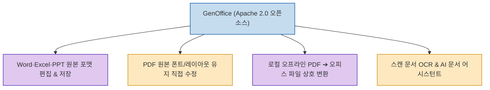

매달 지출되는 Microsoft 365 구독료와 Adobe Acrobat Pro의 PDF 편집 라이선스 비용은 개인과 스타트업에게 큰 부담이 됩니다.

Genspark AI 팀이 공개한 **`GenOffice`**(`genspark-ai/genoffice`)는 **Word(DOCX), Excel(XLSX), PowerPoint(PPTX) 파일을 원본 포맷 그대로 열고 저장하며, PDF 내의 글자를 원래 폰트 스타일과 레이아웃을 보존한 채 직접 수정하고 오피스 파일로 상호 변환하는 작업까지 내 PC 로컬에서 완결하는 무료 오픈소스 오피스 스위트**입니다. (GitHub 4,000+ Stars / Apache 2.0)

<!--more-->

## Sources

- [원문 Threads 게시물: h2smusic (@h2smusic)](https://www.threads.com/@h2smusic/post/DcxbR8oEy8H)
- [GenOffice GitHub 공식 저장소 (genspark-ai/genoffice)](https://github.com/genspark-ai/genoffice)

---

## 1. GenOffice 핵심 기능 아키텍처

---

## 2. 주요 핵심 기능 및 차별점

1. **MS Office 포맷 완벽 호환 (Word·Excel·PPT)**:
   * 마이크로소프트 오피스의 표준 포맷(DOCX, XLSX, PPTX)을 서식 깨짐 없이 원본 형식 그대로 열고, 수정하며, 저장합니다.
2. **PDF 원본 폰트 유지 직접 편집**:
   * 일반적인 PDF 뷰어와 달리, PDF 내 텍스트를 클릭하여 **원본 문서에 쓰인 폰트와 자간, 정렬을 그대로 유지한 채 오타를 수정하거나 문장을 추가**할 수 있습니다.
3. **오프라인 로컬 PDF ➔ 오피스 파일 변환**:
   * 사내 기밀 문서를 외부 웹사이트(변환 툴)에 업로드할 필요 없이, 내 컴퓨터 안에서 안전하게 PDF를 Word, Excel, PPT 파일로 상호 변환합니다.
4. **스캔 문서 OCR 및 AI 어시스턴트 내장**:
   * 이미지나 스캔된 종이 문서의 글자를 광학 문자 인식(OCR)으로 자동 추출하며, AI를 통한 문서 요약 및 교정 기능을 지원합니다.

---

## 3. 시사점

MS Office와 고가의 PDF 편집기 라이선스 비용을 절감하면서, **데이터 보안을 보장하는 로컬 환경에서 문서 작업과 PDF 편집·변환을 원스톱으로 처리**할 수 있는 실용적인 오픈소스 대안입니다.
