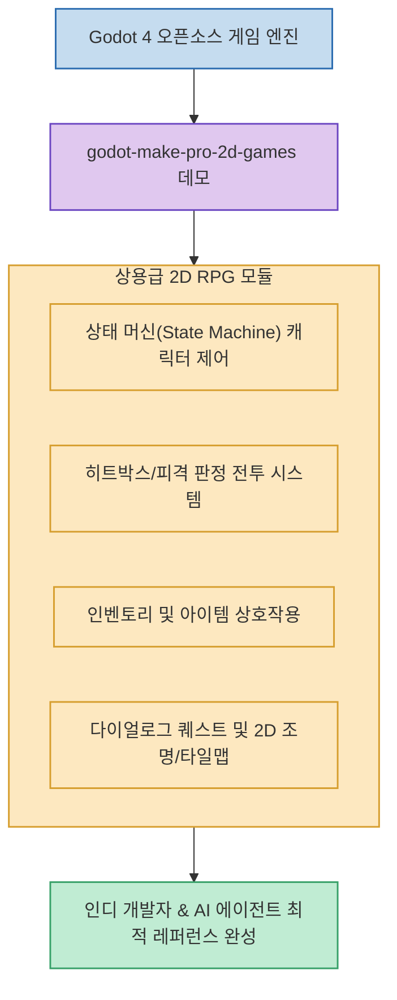

인디 게임 개발자가 Godot 엔진으로 2D 게임을 개발할 때 가장 큰 장벽은 기초 튜토리얼을 넘어 **"실제 출시 가능한 수준의 확장성 높고 유지보수하기 쉬운 아키텍처를 어떻게 설계하는가"**입니다.

유명 게임 엔진 교육 팀 GDQuest가 공개한 **`godot-make-pro-2d-games`**(`gdquest-demos/godot-make-pro-2d-games`)는 **Godot 4의 최신 타일맵, 2D 조명, 물리 엔진을 기반으로 상태 머신(State Machine) 캐릭터 제어, 피격 판정 전투, 인벤토리, 다이얼로그 퀘스트 시스템을 프로급 모듈로 구현한 오픈소스 2D 액션 RPG 레퍼런스 프로젝트**입니다. (GitHub 1,300+ Stars)

<!--more-->

## Sources

- [원문 Threads 게시물: gitrepos_ (@gitrepos_)](https://www.threads.com/@gitrepos_/post/DczC-Qoj6vb)
- [godot-make-pro-2d-games GitHub 공식 저장소](https://github.com/gdquest-demos/godot-make-pro-2d-games/)

---

## 1. 상용급 2D RPG 모듈 아키텍처

---

## 2. 주요 핵심 시스템 및 학습 포인트

1. **계층적 상태 머신 (Hierarchical State Machine)**:
   * 캐릭터의 이동, 대기(Idle), 공격, 피격, 구르기 등 복잡한 애니메이션과 상태 전환을 스파게티 코드 없이 모듈식 노드로 분리 제어합니다.
2. **정밀 히트박스/허트박스 (Hitbox & Hurtbox) 전투 메커니즘**:
   * 무기 타격 범위와 몬스터 피격 판정, 넉백(Knockback) 효과, 무적 시간(I-frame)을 표준화된 컴포넌트 패턴으로 설계했습니다.
3. **인벤토리 및 아이템 상호작용 시스템**:
   * 리소스(Resource) 기반 데이터 구조를 활용해 아이템 정의, 획득, 사용, 버리기 로직을 데이터 중심(Data-driven)으로 구축했습니다.
4. **Godot 4 렌더링 & 타일맵 최적화**:
   * Godot 4의 새로운 TileMap 시스템, 2D 동적 조명(Dynamic Lighting), Y-Sort 깊이 정렬을 모범 사례(Best Practices)에 맞춰 구현했습니다.

---

## 3. 시사점

초보 개발자뿐만 아니라 **Claude Code나 Codex 등 AI 코딩 에이전트에게 게임 아키텍처를 지시할 때 표준 청사진(Blueprint)으로 활용하기에 최적화된 고품질 오픈소스 코드베이스**입니다.
