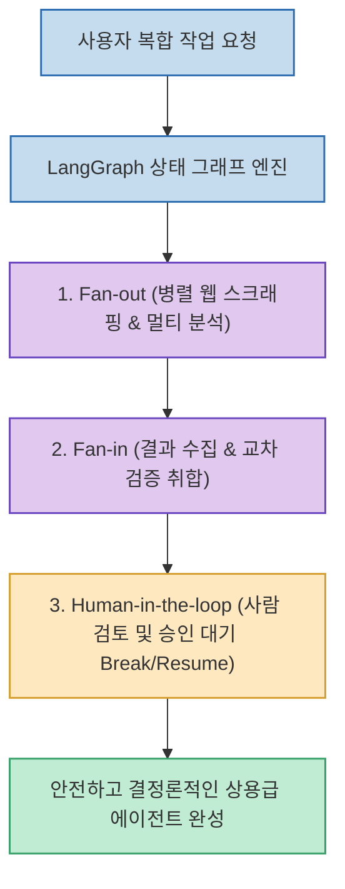

단순히 질문을 던지고 답변을 받는 1:1 대화나 단계별로 차례대로 실행하는 선형 체인(Linear Chain) 방식은 복잡한 다단계 비즈니스 로직을 처리하다가 중간에 예외가 발생하거나 루프에 빠질 경우 전체 파이프라인이 붕괴되는 치명적인 한계가 있습니다.

개발 유튜브 채널 코드팩토리(CodeFactory)가 공개한 **`Graph Engineering 실습 20분만에 마스터하기`**는 **LangGraph를 활용하여 에이전트의 상태를 노드(Node)와 엣지(Edge)로 구조화하고, Fan-out/Fan-in 병렬 웹 스크래핑 및 멀티 에이전트 교차 검증, 그리고 사람의 승인 없이는 실행되지 않는 Human-in-the-loop 안전 제어 장치를 구현하는 실전 엔지니어링 튜토리얼**입니다.

<!--more-->

## Sources

- [원문 유튜브 영상: Graph Engineering 실습 20분만에 마스터하기 (코드팩토리)](https://youtu.be/RVEjyNyMchU)
- [코드팩토리 공식 링크 모음](https://links.codefactory.ai)

---

## 1. 그래프 엔지니어링(Graph Engineering) 아키텍처

---

## 2. 그래프 엔지니어링 3대 핵심 아키텍처

1. **상태 그래프 (State Graph: Node & Edge)**:
   * 에이전트의 전체 메모리와 실행 컨텍스트를 상태(State) 객체로 관리하며, 작업 단위인 노드(Node)와 조건부 분기인 엣지(Conditional Edge)를 통해 에러 처리와 예외 복구를 결정론적으로 통제합니다.
2. **Fan-out & Fan-in 병렬 오케스트레이션**:
   * 대량의 웹 스크래핑(Oxylabs 연동)이나 멀티 에이전트 리서치 작업을 처리할 때, 작업을 여러 하위 노드로 한 번에 분산(Fan-out)시켜 동시 실행한 뒤 결과를 하나로 집계(Fan-in)하여 처리 속도를 극대화합니다.
3. **휴먼 인 더 루프 (Human-in-the-loop: 사람 개입 제어)**:
   * AI 에이전트가 독단적으로 최종 배포, 외부 이메일 발송, 결제 API 호출 등을 실행하지 않도록, **핵심 결정 단계에서 그래프 실행을 일시 중단(Break/Interrupt)하고 사람의 검토와 승인을 받아 재개(Resume)**하는 엔터프라이즈 안전망을 내장합니다.

---

## 3. 시사점

장난감 수준의 챗봇을 벗어나 **결정론적인 제어력과 병렬 처리 성능, 그리고 사람의 승인 거버넌스를 갖춘 상용급 프로덕션 AI 에이전트를 빌드하기 위한 핵심 엔지니어링 패턴**입니다.
