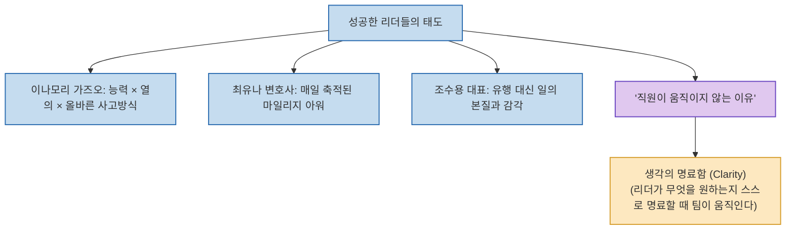

화려한 스펙과 뛰어난 능력을 가진 인재들이 모인 팀이 번번이 표류하는 반면, 평범해 보이는 사람들이 모인 조직이 이상할 정도로 강력한 성과를 내는 이유는 무엇일까요?

조직 개발 및 리더십 전문가 최익성 대표(플랜비디자인)가 운영하는 유튜브 채널 **<익성이형 뭐 읽어?>**는 **이나모리 가즈오, 최유나 변호사, 조수용 대표의 실전 사례를 통해 "직원이 내 말대로 움직이지 않는 진짜 이유는 리더 자신조차 자기 생각이 무엇인지 명료하게 정리되어 있지 않기 때문"이라는 본질을 짚으며, 리더의 태도와 생각의 명료함(Clarity)**을 역설합니다.

<!--more-->

## Sources

- [원문 유튜브 영상: “어디서나 인정받을 수 있다”…조직의 운명을 좌지우지하는 리더의 태도](https://youtu.be/I75py5kwKcc)
- [플랜비디자인 최익성 대표 공식 채널 (익성이형 뭐 읽어?)](https://www.youtube.com/@50Courage)

---

## 1. 리더의 태도와 생각의 명료함 파이프라인

---

## 2. 각기 다른 분야에서 증명된 리더의 태도

1. **이나모리 가즈오 (교세라 창업자 / JAL 회생)**:
   * 자본금 3천만 원으로 시작해 16조 원 기업을 일군 원동력은 화려한 경영 테크닉이 아닌 *"인생과 일의 결과 = 능력 × 열의 × 사고방식(태도)"*이라는 철학이었습니다. 올바른 태도가 곱해지지 않은 능력은 방향을 잃기 쉽습니다.
2. **최유나 변호사 (로펌 대표 & 드라마 '굿파트너' 작가)**:
   * 로스쿨 시절 하위권 성적이었음에도 매일 작은 시간을 성실히 쌓아 올린 **'마일리지 아워(Mileage Hour)'**의 꾸준한 태도가 대형 로펌 경영과 3,000페이지 드라마 대본 집필이라는 놀라운 결실을 만들었습니다.
3. **조수용 대표 (네이버 초록창 기획 / 전 카카오 공동대표)**:
   * 32년 동안 빠르게 지나가는 트렌드를 무작정 좇지 않고, **'일의 본질과 감각'**에 깊이 파고들어 대중의 뇌리에 각인되는 독창적인 브랜드를 완성했습니다.

---

## 3. 직원이 움직이지 않는 진짜 원인과 해결책

* **문제의 본질**:
  * 많은 리더들이 "직원들의 역량이 부족하다"거나 "말을 듣지 않는다"고 탓하지만, 실제 조직 진단 결과의 상당수는 **리더 본인조차 무엇을 달성하고자 하는지 명확히 정리하지 못한 채 모호하게 지시**하는 데서 기인합니다.
* **명료함(Clarity)의 힘**:
  * 리더가 문제의 핵심을 꿰뚫고 *"우리가 지금 해결해야 할 단 하나의 본질이 무엇인가"*를 명료하고 구체적인 언어로 정의할 때, 팀원들은 비로소 방황하지 않고 자발적인 몰입을 시작합니다.

---

## 4. 시사점

리더십은 거창한 권한이 아니라 **"자신의 생각을 명료하게 가다듬는 성찰과 일의 본질을 지키는 태도"**에서 시작되며, 이것이 조직의 성패를 가르는 가장 강력한 결정 요인입니다.
