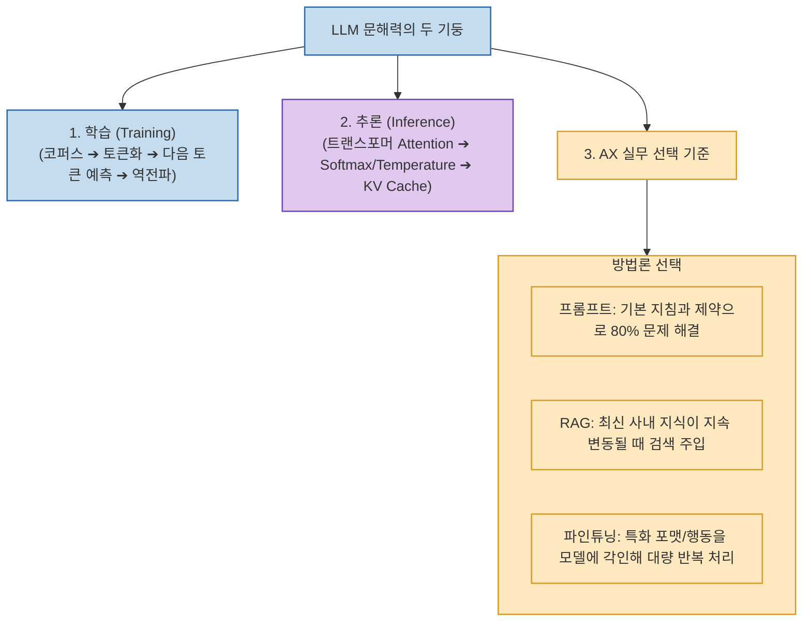

AI를 실무에 도입하려는 기업(AX, AI Transformation)에서 가장 흔히 겪는 혼란은 *"이 문제를 해결하려면 모델을 파인튜닝해야 하는가, RAG를 붙여야 하는가, 아니면 프롬프트만 잘 쓰면 되는가?"*라는 의사결정의 부재입니다.

비개발자 15명을 대상으로 진행된 **`AX를 위한 LLM 문해력 특강`**은 **인터넷 코퍼스가 토큰으로 변환되어 다음 토큰을 예측하는 신경망 학습 원리부터, Attention과 KV Cache로 이어지는 실시간 추론 메커니즘, 그리고 현업에서 프롬프트·RAG·파인튜닝을 선택하는 실전 판단 기준**을 명쾌하게 제시합니다.

<!--more-->

## Sources

- [원문 유튜브 영상: LLM 신경망 학습부터 추론 원리 전체를 비개발자 15명에게 설명하는 강의](https://youtu.be/geY4UO23QA8)

---

## 1. LLM 학습·추론 및 AX 의사결정 아키텍처

---

## 2. LLM의 두 가지 핵심 축: 학습과 추론

1. **학습 (Training: 세상을 배우는 과정)**:
   * **코퍼스 ➔ 토큰화 (Tokenization)**: 문자를 UTF-8 숫자로 인코딩하고 자주 등장하는 문자열 덩어리를 묶어 단어 사전(Vocabulary)과 토큰을 구축합니다.
   * **다음 토큰 예측 (Next Token Prediction)**: 모델은 문맥을 보고 다음에 올 가장 확률이 높은 단어를 예측하며, 틀린 오차를 **역전파(Backpropagation)**하여 수백억 개의 파라미터 가중치를 조정합니다.
2. **추론 (Inference: 질문에 답하는 과정)**:
   * **Attention (맥락 계산)**: 문장 내 모든 단어 간의 연관 점수를 계산해 다차원적 맥락을 파악합니다.
   * **Logit ➔ Softmax ➔ Temperature**: 단어 후보 점수를 확률(0~1)로 바꾸고, Temperature 값으로 정답 지향적(낮음) 또는 창의적(높음) 답변을 제어합니다.
   * **KV Cache**: 첫 단어 생성(Prefill) 이후에는 계산된 키-값 벡터를 캐시에 보관하여 빠른 속도로 1토큰씩 순차 출력(Decode)합니다.

---

## 3. 현업 AX 의사결정: 프롬프트 vs RAG vs 파인튜닝

* **프롬프트 엔지니어링 (Prompting)**:
  * 실무 문제의 70~80%는 시스템 지침과 Few-shot 예시, 에이전트 도구 연동만으로도 완벽히 해결됩니다.
* **RAG (검색 증강 생성)**:
  * **선택 기준**: **"참조해야 할 사내 문서나 외부 지식이 계속 갱신될 때"**
  * 모델을 다시 학습시키지 않고, 질문 시점에 필요한 최신 문서를 검색해 컨텍스트 윈도우에 주입합니다.
* **파인튜닝 (Fine-tuning)**:
  * **선택 기준**: **"지식을 넣는 게 아니라, 특화된 출력 포맷이나 고유한 행동 방식을 모델 자체에 각인해 대규모 반복 처리할 때"**
  * 매번 긴 프롬프트 예시를 보낼 필요가 없어 토큰 비용을 극적으로 절감하고 일관된 형식을 유지합니다.

---

## 4. 시사점

기술 용어에 휘둘리지 않고, **"이 문제의 본질이 지식 갱신(RAG)인가, 형식 체화(파인튜닝)인가, 지침 구체화(프롬프트)인가?"**를 분별해 가장 비용 효율적인 엔지니어링 경로를 선택하는 통찰이 중요합니다.
