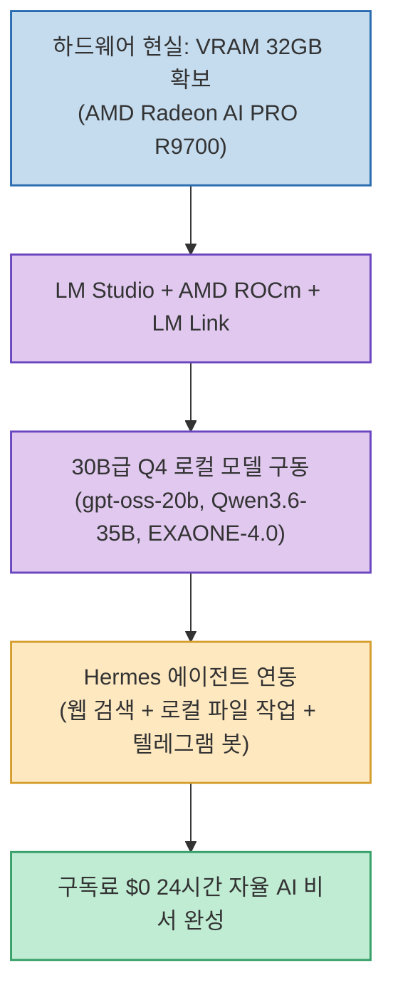

클라우드 AI API 비용과 월 구독료, 데이터 유출 걱정 없이 나만의 워크스테이션 PC에서 24시간 자율 AI 에이전트를 돌리려는 시도가 늘고 있습니다. 하지만 노트북이나 미니 PC로는 7B~8B급 맛보기만 가능할 뿐, 실무 수준의 복합 작업을 해결하기엔 지능이 부족합니다.

AI 테크 채널 단테랩스(Dante Labs)가 공개한 **`로컬 LLM 현실 + 구축 가이드`**는 **30B급 최신 모델(Qwen, gpt-oss, EXAONE 등)을 여유롭게 올리기 위한 필수 하드웨어 기준(32GB VRAM 포지션)과 AMD Radeon AI PRO R9700 기반 실측 데이터, 그리고 Hermes 자율 에이전트 구축 프로세스**를 정직하게 정리했습니다.

<!--more-->

## Sources

- [원문 유튜브 영상: 이거 모르고 장비 사면 돈 날립니다 | 로컬 LLM 현실 + 구축 가이드 (단테랩스)](https://youtu.be/Rb0OVBaKYdQ)
- [AMD AI PC Launcher 오픈소스 저장소](https://github.com/iamchobosalsal/ai_agent)
- [Hermes Agent 공식 문서 (Nous Research)](https://hermes-agent.nousresearch.com)

---

## 1. 로컬 LLM 워크스테이션 아키텍처

---

## 2. 하드웨어 선택의 현실: "결국 VRAM이 전부다"

1. **미니PC와 일반 노트북의 한계**:
   * 7B~8B 소형 모델은 간단한 질의응답은 가능하지만, 파일 조작과 추론이 얽힌 에이전트 태스크를 완주하지 못합니다.
   * 실무에서 쓸 만한 20B~35B급 모델(Q4 양자화 기준)과 컨텍스트(KV 캐시)를 감당하려면 **최소 24GB~32GB VRAM이 필수적**입니다.
2. **AMD Radeon AI PRO R9700 32GB의 가성비 포지션**:
   * 고가의 RTX 5090과 VRAM(16GB)이 부족한 RTX 5080 사이에서, 30B급 모델을 여유롭게 올릴 수 있는 가장 현실적인 32GB VRAM 워크스테이션 대안입니다.
3. **Q4 필요 VRAM 계산 공식**:
   * 모델 파라미터(B) × 약 0.6~0.7 GB = Q4 가중치 크기 + 기본 KV 캐시 공간. (30B급 모델 구동 시 20GB~24GB 이상 소요)

---

## 3. 실측 추천 모델 8종 (전부 Q4 기준)

* **`gpt-oss-20b` (OpenAI · MoE 20B)**: 속도와 에이전트 완주 능력 균형 1위 (실전 주력 추천).
* **`Qwen3-30B-A3B` / `Qwen3.6-35B-A3B` (Alibaba · MoE)**: 32GB VRAM 환경에서 가장 빠르고 똑똑한 오픈소스 MoE.
* **`Qwen3.6-27B` (Alibaba · Dense 27B)**: 탄탄한 추론력을 가진 최신 Dense 플래그십.
* **`EXAONE-4.0-32B` (LG AI · Dense 32B)**: 한국어 문맥 이해 및 자연스러운 표현 품질 실측 1위.
* **`kanana-2-30b-a3b` (카카오 · MoE 30B)**: 가벼운 구동성의 국산 에이전트 모델.
* **`GLM-4.7-Flash` (z.ai · MoE 30B)**: MIT 라이선스 기반의 고성능 화제작.
* **`Gemma 4 31B` (Google · Dense 31B)**: 구글 최신 범용 플래그십.

---

## 4. Hermes 에이전트와 소프트웨어 스택

* **LM Studio + AMD ROCm + LM Link**:
  * AMD GPU 가속을 통해 로컬 추론 서버를 구축하고, LM Link를 이용해 외부 노트북과 모바일에서도 원격으로 워크스테이션 연산력을 활용합니다.
* **Hermes Agent (Nous Research)**:
  * 웹 검색, 로컬 파일 작성 및 수정, 텔레그램 봇 연동을 자율 수행하는 로컬 전용 비서 시스템을 구축합니다.
* **AMD AI PC Launcher**:
  * 복잡한 설정 없이 원클릭으로 모델 다운로드부터 Hermes 에이전트, 텔레그램 연동까지 자동화해 주는 도구 제공.

---

## 5. 시사점

토큰 비용과 보안 우려 없이 **32GB VRAM 하드웨어와 Hermes 에이전트를 결합해 나만의 24시간 무중단 로컬 AI 인프라를 구축**하는 최적의 엔지니어링 청사진을 제시합니다.
