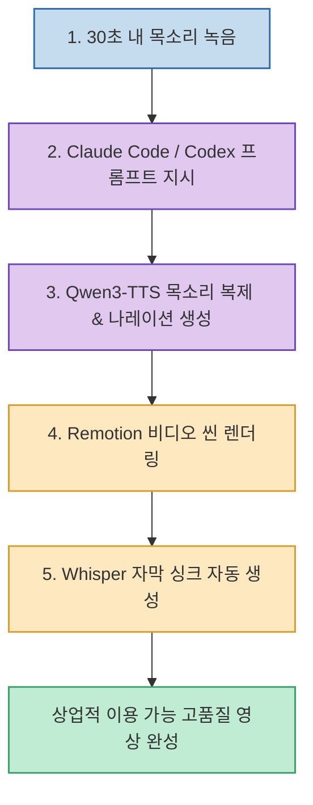

유튜브 쇼츠, 릴스, 틱톡 등 숏폼 콘텐츠를 제작할 때 고품질 AI 음성을 사용하려면 ElevenLabs 같은 유료 서비스에 매월 적지 않은 구독료를 지불해야 합니다.

크리에이터 simon.dsgn 님이 공개한 **`Qwen3-TTS 기반 무료 목소리 복제 & 영상 제작 워크플로우`**는 **상업적 이용이 가능한 고품질 오픈소스 모델 Qwen3-TTS와 코딩 에이전트(Claude Code / Codex), 리액트 기반 비디오 생성 도구 Remotion, 음성인식 Whisper를 연동하여 단 10분 만에 내 목소리 나레이션 영상과 싱크 자막을 완성하는 실전 파이프라인**을 제공합니다.

<!--more-->

## Sources

- [원문 Threads 게시물: simon.dsgn (@simon.dsgn)](https://www.threads.com/@simon.dsgn/post/DcyUM9VDlDd)

---

## 1. Qwen3-TTS + Remotion 영상 제작 파이프라인

---

## 2. 10분 완성 4단계 실전 프로세스

1. **30초 목소리 샘플 녹음**:
   * 조용한 공간에서 마이크나 스마트폰으로 자연스럽게 30초가량 목소리를 녹음하여 오디오 파일(`sample.wav`)로 준비합니다.
2. **Claude Code / Codex 에이전트 프롬프트 지시**:
   * CLI 에이전트에게 다음과 같이 지시하여 전체 파이프라인을 구동합니다:
     > *"Qwen3-TTS 모델 활용해서 sample.wav 내 목소리 복제하고 대본 나레이션 음성 파일로 생성해줘."*
3. **Remotion 기반 코드 비디오 렌더링**:
   * React 컴포넌트 기반 비디오 제작 프레임워크인 **Remotion**을 통해 타이포그래피, 배경 전환, 그래픽 요소를 코드로 즉시 비디오 씬으로 조립합니다.
4. **Whisper 자막 싱크 자동화**:
   * OpenAI의 **Whisper** 모델을 연동하여 생성된 음성의 단어별 시작/종료 타임스탬프를 추출하고, Remotion 비디오 씬에 정밀한 자막을 자동으로 입힙니다.

---

## 3. 시사점

고액의 상용 SaaS 구독 없이, **Qwen3-TTS(음성 복제) + Remotion(비디오 렌더링) + Whisper(자막 추출)를 에이전트 CLI로 오케스트레이션하여 100% 무료이면서도 상업적 이용이 가능한 콘텐츠 자동화 스튜디오를 구축**할 수 있습니다.
