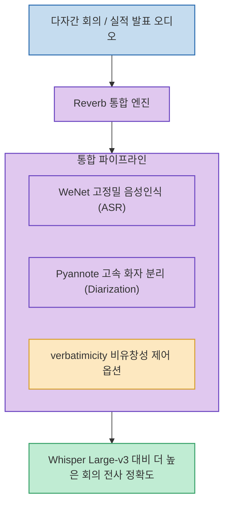

회의록이나 인터뷰 음성을 텍스트로 변환할 때 가장 까다로운 문제는 단순 음성 인식이 아니라 **"여러 참석자 중 누가 무슨 말을 했는가(Speaker Diarization, 화자 분리)"**를 정확하게 판별하는 것입니다.

미국 대표 전사 서비스 기업 Rev가 공개한 **`Reverb`**(`revdotcom/reverb`)는 **WeNet 기반 고정밀 ASR 모델과 Pyannote 기반 화자 분리 모델을 단일 파이프라인으로 통합하여, 실제 다자간 비즈니스 회의 및 실적 발표 녹음 벤치마크에서 Whisper Large-v3 및 Canary-1B보다 우수한 전사 정확도를 기록한 오픈소스 프로젝트**입니다.

<!--more-->

## Sources

- [원문 Threads 게시물: aiwire_kr (@aiwire_kr)](https://www.threads.com/@aiwire_kr/post/DczGvGbk7W8)
- [Reverb GitHub 공식 저장소 (revdotcom/reverb)](https://github.com/revdotcom/reverb)

---

## 1. Reverb 음성인식 & 화자 분리 파이프라인

---

## 2. 주요 핵심 기능 및 차별점

1. **ASR + Diarization 단일 리포지토리 통합**:
   * 음성 인식 모델(WeNet)과 화자 분리 모델(Pyannote)을 별도로 세팅하고 파이프라인을 연결해야 했던 번거로움을 없애고, 단일 패키지에서 화자별 발화 구간과 텍스트를 즉시 반환합니다.
2. **실제 비즈니스 환경에서의 압도적 벤치마크**:
   * 기업 실적 발표 및 다자간 회의 데이터셋(Earnings21, Earnings22, Rev16) 벤치마크에서 OpenAI의 **Whisper Large-v3 및 Nvidia Canary-1B 대비 더 낮은 단어 에러율(WER)**을 달성했습니다.
3. **`verbatimicity` (비유창성 표현 제어) 옵션**:
   * 회의 중 발생하는 *"음..."*, *"어..."* 같은 간투사(Filler words)나 말더듬을 전사 결과에 포함할지 여부를 조절하여, 정제된 문어체 요약본이나 사실 그대로의 녹취록 중 선택 생성할 수 있습니다.
4. **유연한 배포 지원 (CLI / Python / Docker)**:
   * CLI 명령어, 파이썬 라이브러리 API, 도커 컨테이너를 모두 지원하여 로컬 PC 및 온프레미스 서버 환경에 쉽게 배포할 수 있습니다. (추론 코드 Apache 2.0 라이선스)

---

## 3. 시사점

단순 텍스트 전사를 넘어 **다자간 회의록 자동화, 콜센터 통화 분석, 법률/의료 녹취 등 화자 식별이 필수적인 엔터프라이즈 오디오 인텔리전스 구축**에 최적화된 오픈소스 솔루션입니다.
