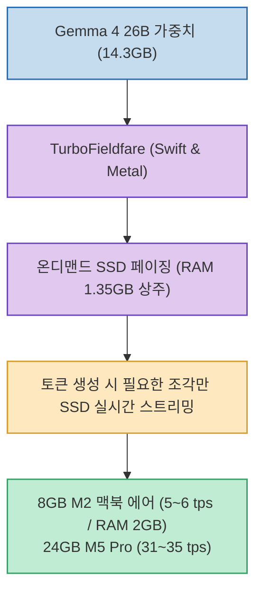

20B 이상의 대형 언어 모델(LLM)을 로컬 Mac에서 구동하려면 최소 16GB~24GB 이상의 통합 메모리가 필요하여, 8GB RAM을 탑재한 기본형 맥북 사용자는 대형 모델 구동을 포기해야 했습니다.

**`TurboFieldfare`**(`drumih/turbo-fieldfare`)는 파일 크기만 14.3GB에 달하는 Google Gemma 4 26B 모델을 **RAM에 통째로 로드하지 않고, 필수 컨텍스트 1.35GB만 상주시킨 뒤 토큰을 생성할 때마다 필요한 가중치 조각만 고속 SSD에서 실시간으로 읽어와 단 2GB RAM으로 구동하는 혁신적인 Swift/Metal 기반 오픈소스**입니다. (GitHub 6,500+ Stars / Apache 2.0)

<!--more-->

## Sources

- [원문 Threads 게시물: k1utch_ai (@k1utch_ai)](https://www.threads.com/@k1utch_ai/post/Dcx-dOjkd6O)
- [TurboFieldfare GitHub 공식 저장소](https://github.com/drumih/turbo-fieldfare)

---

## 1. TurboFieldfare 온디맨드 SSD 스트리밍 아키텍처

---

## 2. 주요 핵심 기술 및 실측 벤치마크

1. **온디맨드 가중치 스트리밍 (SSD Paging)**:
   * 14.3GB 가중치 전체를 RAM에 올리는 전통적 방식 대신, 핵심 런타임 약 1.35GB만 유지하고 다음 토큰 생성 연산에 필요한 블록만 SSD에서 순간적으로 페이징합니다.
2. **8GB M2 맥북 에어 실측 성능**:
   * **생성 속도**: 초당 5.1 ~ 6.3 토큰 (tps)
   * **실사용 메모리 점유**: **1.9 ~ 2.1 GB**
   * 기본형 M2 맥북 에어에서도 메모리 스왑 압박 없이 대형 26B 모델을 오프라인에서 구동할 수 있습니다.
3. **24GB M5 Pro 비교 성능**:
   * TurboFieldfare는 초당 31 ~ 35 토큰을 기록하며 메모리를 단 2GB만 소모합니다. (참고: `mlx-lm`은 초당 76~82 토큰으로 더 빠르지만 8.3GB 이상의 RAM을 상시 점유)
4. **Swift & Metal 순수 최적화**:
   * 외부 프레임워크 의존성 없이 Swift와 Metal로 Apple Silicon GPU/NPU 구조에 최적화되어 있습니다. (macOS 26 이상 요구)

---

## 3. 시사점

속도를 일부 타협하는 대신 **극단적인 메모리 절감(RAM 2GB)**을 달성하여, 보급형 저사양 Mac에서도 멀티태스킹 부담 없이 고지능 오픈소스 LLM을 상시 띄워둘 수 있는 획기적인 온디바이스 아키텍처입니다.
