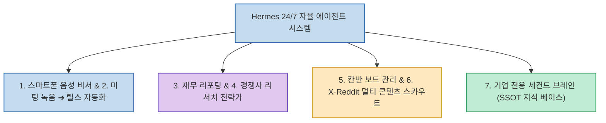

대다수의 사용자는 오픈소스 자율 에이전트인 Hermes Agent를 서버에 설치하고 텔레그램에 연동한 뒤, 단순한 질문 몇 개만 던져보고 끝내는 실수를 범합니다.

AI 오토메이션 전문가 Tom Crawshaw(The AI Architects)가 공개한 **`7 INSANE Use Cases For Hermes Agent`**는 **Hermes가 회사의 맥락(Context)을 이해하고, 실무 도구들과 직접 연결되어, 단순 명령 수신부터 최종 결과물 전달까지 전 과정을 자율 완결하는 7가지 고부가가치 비즈니스 자동화 시스템과 구축 로드맵**을 제시합니다.

<!--more-->

## Sources

- [원문 유튜브 영상: 7 INSANE Use Cases For Hermes Agent (Tom Crawshaw)](https://youtu.be/FO5RVzgbgnw)
- [The AI Architects 공식 리소스](http://theaiarchitects.com)
- [Hermes Agent 공식 문서 (Nous Research)](https://hermes-agent.nousresearch.com)

---

## 1. Hermes 24/7 비즈니스 자율 에이전트 시스템

---

## 2. 실전 비즈니스 활용 사례 7선

1. **스마트폰 음성 명령 비서 (Voice Commands)**:
   * 이동 중에 텔레그램 음성 메시지로 지시나 아이디어를 녹음해 전송하면, Hermes가 음성을 인식하고 즉시 이메일 초안 작성, 캘린더 일정 등록, 로컬 파일 정리 등을 백그라운드에서 실행합니다.
2. **미팅 녹음의 숏폼/릴스 자동 제작 파이프라인 (Call to Reels)**:
   * 줌(Zoom) 회의나 통화 녹음 오디오/비디오를 주입하면 AI가 바이럴 가능성이 높은 핵심 하이라이트를 추출하고, 숏폼 스크립트 작성 및 비디오 컷 클립 생성까지 파이프라인화합니다.
3. **재무 관리 및 자동 리포팅 시스템 (Finance Admin & Reporting)**:
   * 인보이스, 결제 영수증, 은행 거래 내역을 수집 및 분류하고, 주간/월간 단위의 재무 요약 보고서와 이상 지출 알림을 자동으로 작성합니다.
4. **경쟁사 자동 리서치 & 비즈니스 전략가 (Competitor Research)**:
   * 경쟁사의 공식 홈페이지, 신규 제품 릴리즈, 가격 정책 변경, 소셜 미디어 피드백을 정기적으로 크롤링하여 시사점과 대응 전략을 요약 보고합니다.
5. **데스크톱 앱 & 칸반 보드 연동 관리 (Kanban Board Ops)**:
   * Notion, Trello, GitHub Projects 등 팀 칸반 보드와 연동하여 자연어 대화만으로 태스크 티켓을 생성하고, 작업 진행 상태를 업데이트하며 팀 워크플로우를 조율합니다.
6. **X · Reddit · YouTube 멀티 플랫폼 콘텐츠 스카우트 (Content Scout)**:
   * 타겟 산업군과 관련된 서브레딧, 트위터 트렌드 키워드, 유튜브 인기 영상을 24시간 모니터링하여 바이럴 가능성이 높은 아이디어와 콘텐츠 기획안을 선별 제공합니다.
7. **기업 전용 세컨드 브레인 구축 (Company Second Brain)**:
   * 사내 노션 문서, 구글 드라이브 가이드, 슬랙 아카이브 등 흩어진 전사 지식을 Hermes의 영구 메모리(Vector DB)로 통합하여 회사의 단일 진실 공급원(SSOT)으로 작동하게 만듭니다.

---

## 3. 구축 전략: "한 번에 다 만들지 마라"

* **1개 반복 업무부터 시작**: 시간을 가장 많이 빼앗기는 반복 업무 1개부터 자동화 시스템을 구축합니다.
* **사람의 승인 지점(Approval Point) 내장**: 초기에는 중요 실행 단계마다 사람의 검토와 승인을 거치도록 설계하여 신뢰성을 확보합니다.
* **스킬(Skill) 패키징 후 확장**: 안정화된 프로세스를 독립적인 에이전트 스킬로 패키징하여 보관하고, 다음 단계의 시스템으로 점진 확장해 나가는 것이 핵심입니다.

---

## 4. 시사점

Hermes Agent는 단순한 대화 상대가 아니라, **사람의 개입 지점과 도구 연동을 바탕으로 실제 회사의 비즈니스 파이프라인을 24시간 가동하는 자율 가상 직원(Autonomous AI Worker)**으로 설계될 때 진정한 파괴력을 발휘합니다.
