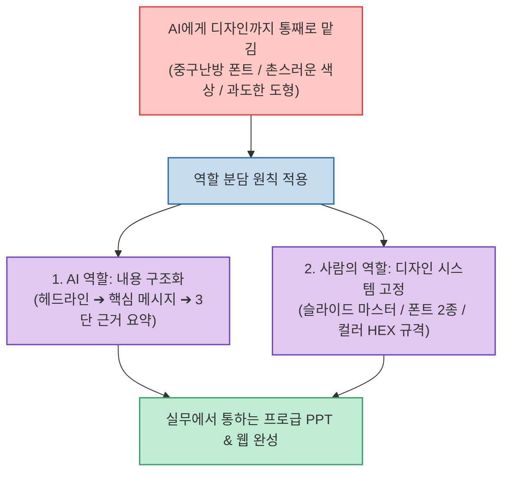

ChatGPT나 Claude에게 "발표용 PPT 슬라이드를 만들어줘"라고 요청하면, 텍스트는 그럴듯하게 나오지만 정작 슬라이드 디자인은 페이지마다 폰트와 여백이 중구난방이고 촌스러운 입체 도형이나 불필요한 장식이 가득해 실무 회의에서 그대로 쓰기 어려운 경우가 많습니다.

오피스 엑셀/생산성 전문 채널 오빠두엑셀이 공개한 **`AI PPT가 촌스러운 진짜 이유`**는 **"문제는 프롬프트가 아니라 디자인 시스템 가이드의 부재"**라고 진단하며, AI는 내용 요약과 구조화에만 집중시키고 폰트·컬러·여백 규격은 사전에 고정된 슬라이드 마스터로 제어하는 실무 리디자인 3단계 원칙을 제시합니다.

<!--more-->

## Sources

- [원문 유튜브 쇼츠: AI PPT가 촌스러운 진짜 이유 (프롬프트 아닙니다) #shorts - 오빠두엑셀](https://youtube.com/shorts/Yi6e4MgHcvE)
- [오빠두엑셀 공식 웹사이트](https://www.oppadu.com)

---

## 1. AI PPT 리디자인 및 역할 분담 아키텍처

---

## 2. AI PPT가 촌스러워지는 3대 원인

1. **디자인 일관성(Consistency)의 붕괴**:
   * AI는 전체 슬라이드의 맥락을 시각적으로 조율하지 못하므로, 장마다 폰트 크기, 줄 간격, 버튼/박스 여백이 제각각 적용됩니다.
2. **불필요한 시각적 노이즈 난사**:
   * 비즈니스 보고서에는 전혀 어울리지 않는 과도한 3D 그림자, 네온 그라디언트, 불필요한 장식용 아이콘을 배치해 가독성을 떨어뜨립니다.
3. **텍스트 밀도 조절 실패**:
   * 데이터의 중요도나 강조점 없이 단순히 텍스트를 슬라이드 상자에 꽉 채워 넣어 청중의 집중을 방해합니다.

---

## 3. 실무 리디자인 3단계 실천법

1. **1단계: 기초 환경 설정 (슬라이드 마스터 고정)**
   * 새 문서를 열기 전 회사/개인 브랜드의 **표준 폰트 2종(제목용/본문용), 메인 및 포인트 컬러(HEX 코드), 기본 안내선(상하좌우 여백)**을 슬라이드 마스터에 먼저 박아둡니다.
2. **2단계: AI에게 내용 구조화만 전담시키기**
   * AI에게는 디자인을 요구하지 말고, 긴 줄글 보고서를 **[헤드라인 ➔ 1줄 핵심 메시지 ➔ 3가지 정량적 근거]** 형태의 계층형 텍스트로 요약·정리하도록 지시합니다.
3. **3단계: 미리 정한 디자인 시스템 입히기**
   * AI가 정리한 구조화된 텍스트를 슬라이드 마스터 템플릿에 옮겨 담고, 불필요한 장식은 과감히 삭제하여 여백의 미를 살립니다.

---

## 4. 시사점

PPT뿐만 아니라 **AI로 웹사이트나 랜딩페이지를 제작할 때도 사전에 `Design.md`나 디자인 시스템 토큰을 고정해 두고 내용을 주입해야만 AI 특유의 촌티를 완벽히 제거**할 수 있습니다.
