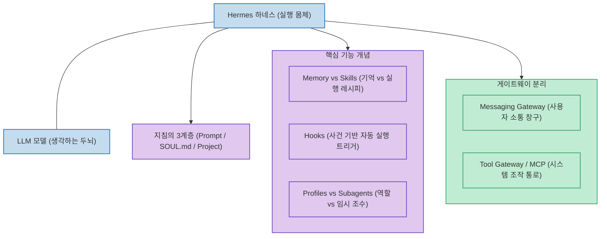

오픈소스 자율 에이전트인 Hermes Agent는 코딩을 모르는 비개발자도 '가장 현실적인 AI 직원'을 고용할 수 있는 강력한 도구입니다. 하지만 좋은 프롬프트만으로는 부족하며, 에이전트가 무엇을 보고, 무엇을 기억하며, 어떤 권한을 가지고 움직이는지 구조를 이해해야 안전하게 통제할 수 있습니다.

AI 오토메이션 전문가 Tom Crawshaw(The AI Architects)가 공개한 **`Every Hermes Agent Concept Explained for Normal People`**은 **이름이 비슷해 가장 혼란을 주는 7대 핵심 개념 쌍(Pairs)을 명쾌한 일상 언어로 풀어서 설명하며, 문제 발생 시 어느 레이어를 수정해야 하는지 명확한 가이드라인**을 제시합니다.

<!--more-->

## Sources

- [원문 유튜브 영상: Every Hermes Agent Concept Explained for Normal People (Tom Crawshaw)](https://youtu.be/lGtBPrSrnjY)
- [The AI Architects 공식 리소스](http://theaiarchitects.com)
- [Hermes Agent 공식 문서 (Nous Research)](https://hermes-agent.nousresearch.com)

---

## 1. Hermes Agent 핵심 구조 아키텍처

---

## 2. 가장 헷갈리는 7대 핵심 개념 쌍 비교

1. **HERMES vs THE MODEL (하네스와 두뇌)**:
   * **Model**: Claude, GPT, Qwen처럼 추론하고 답을 생각하는 '두뇌'.
   * **Hermes**: 도구를 실행하고 파일/세션을 유지하며 작업을 끝까지 완수하는 '실행 프레임워크(하네스)'. 두뇌를 바꿔 끼워도 Hermes라는 일꾼의 기본 구조는 변하지 않습니다.
2. **PROMPT vs SOUL.md vs PROJECT INSTRUCTIONS (지침의 3계층)**:
   * **Prompt**: 이번 대화 턴의 일회성 요청.
   * **SOUL.md**: 에이전트의 성격, 어조, 핵심 원칙을 규정하는 **영구적인 자아(영혼)**.
   * **Project Instructions**: 특정 프로젝트 디렉토리에만 국한된 작업 규칙.
3. **MEMORY vs SKILLS ("기억해" vs "이렇게 일해")**:
   * **Memory**: 과거 대화, 사내 문서 히스토리, 사용자 취향을 보관하는 기록 보관소.
   * **Skills**: 특정 태스크(웹 스크래핑, 릴스 영상 편집, 재무 리포팅 등)를 처리하는 **재사용 가능한 도구와 행동 레시피 팩**.
4. **HOOKS (사건 기반 자동 트리거)**:
   * 사용자가 지시하기를 기다리지 않고, **"특정 이벤트(새 이메일 도착, 에러 로그 감지 등)가 발생하면 자동으로 이 작업을 실행하라"**고 걸어두는 능동적 방아쇠.
5. **PROFILES vs SUBAGENTS vs KANBAN**:
   * **Profile**: 마케터, 개발자, 회계사 등 에이전트에게 지속적으로 부여되는 직무 역할.
   * **Subagents**: 대규모 탐색이나 무거운 연산을 위해 일시적으로 소환하는 하위 도우미.
   * **Kanban**: 이들의 작업 진행 상태를 시각적으로 추적하는 보드.
6. **MESSAGING GATEWAY vs TOOL GATEWAY**:
   * **Messaging Gateway**: 텔레그램, 슬랙, 디스코드 등 사용자와 소통하는 **대화 통로**.
   * **Tool Gateway**: 터미널 명령, 파일 수정, MCP 등 에이전트가 현실 환경을 조작하는 **도구 실행 통로**.
7. **LOCAL vs VPS vs CLOUD (배포 환경과 프라이버시)**:
   * 로컬 PC vs 24시간 상시 가동 VPS vs 완전 클라우드. 내 PC에서 구동하더라도 외부 클라우드 모델(API)을 쓴다면 데이터가 전송되므로 프라이버시 경계를 명확히 분별해야 합니다.

---

## 3. 시사점

Hermes뿐만 아니라 **Claude Code, Codex, Antigravity 등 최신 에이전트 도구들이 공통으로 채택하고 있는 내부 아키텍처**를 일상 언어로 완벽히 이해함으로써, AI 직원이 오작동하거나 맥락을 잊어버렸을 때 어느 레이어를 교정해야 하는지 진단할 수 있는 필수 나침반입니다.
