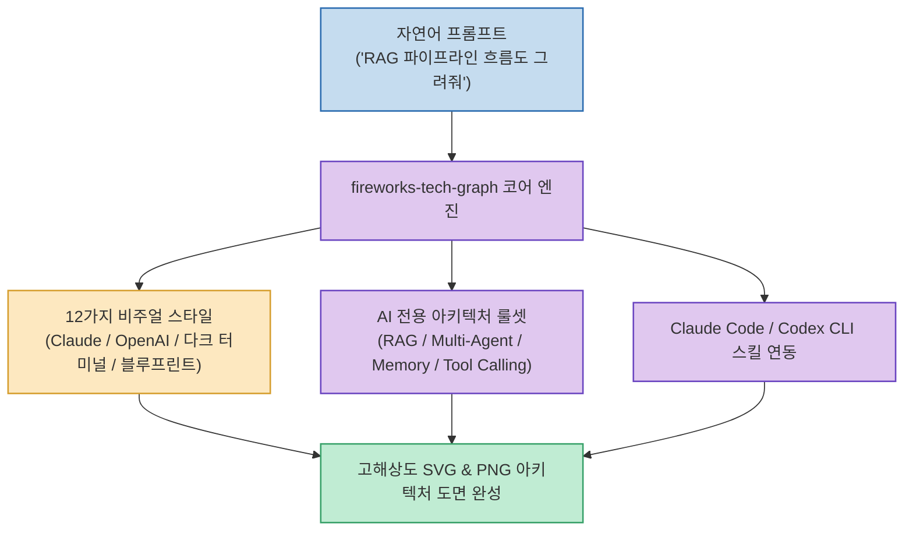

기술 블로그 포스팅, 개발 문서(PRD), 아키텍처 기획서를 작성할 때 가장 많은 시간이 소모되는 작업 중 하나는 바로 기술 구조도를 그리는 일입니다. Mermaid 문법을 공부하거나 Draw.io에서 상자와 화살표를 일일이 드래그하며 여백을 맞추는 일은 상당한 피로감을 줍니다.

중국 테크 크리에이터 苏乐(@ai_suxiaole) 님이 소개한 **`fireworks-tech-graph`**(`yizhiyanhua-ai/fireworks-tech-graph`)는 **"RAG 흐름도 그려줘" 같은 자연어 한 줄 설명만으로 고해상도 SVG 및 PNG 아키텍처 다이어그램을 자동 렌더링하고, 12가지 비주얼 테마와 AI 특화 룰셋, Claude Code / Codex 스킬 연동을 지원하는 오픈소스 도구**입니다.

<!--more-->

## Sources

- [원문 X(트위터) 게시물: 苏乐 (@ai_suxiaole)](https://x.com/ai_suxiaole/status/2095064938515743089)
- [fireworks-tech-graph GitHub 공식 저장소](https://github.com/yizhiyanhua-ai/fireworks-tech-graph)

---

## 1. fireworks-tech-graph 다이어그램 파이프라인

---

## 2. 4대 주요 핵심 기능 및 차별점

1. **자연어 프롬프트 기반 자동 시각화**:
   * 복잡한 그래프 좌표나 노드 정의 문법 없이, 자연어로 아키텍처를 설명하기만 하면 레이아웃과 화살표를 최적의 정렬로 자동 배치하여 SVG와 고화질 PNG를 출력합니다.
2. **12종의 감각적인 비주얼 테마**:
   * 기본 클린 화이트(White), 사이버펑크 감성의 다크 터미널(Dark Terminal), 클래식 블루프린트(청사진), 글래스모피즘, **Claude 스타일, OpenAI 스타일** 등 전문 디자이너가 작업한 듯한 12가지 스타일 프리셋을 제공합니다.
3. **14종 UML 및 최신 AI 아키텍처 룰셋 내장**:
   * 클래스, 시퀀스, 상태 다이어그램 등 14가지 표준 UML을 포괄합니다.
   * 특히 **RAG 파이프라인, 멀티 에이전트(Multi-Agent) 협업망, 메모리(Memory) 구조, 도구 호출(Tool Call)** 등 최신 AI 엔지니어링 패턴에 특화된 전용 아이콘과 레이아웃 규칙을 탑재했습니다.
4. **Claude Code & Codex 스킬(Skill) 연동**:
   * 별도 웹 툴을 켤 필요 없이, 터미널 코딩 세션에서 에이전트 스킬로 등록하여 프로젝트 문서 작성 중 바로 다이어그램 이미지를 생성하고 마크다운에 첨부할 수 있습니다.

---

## 3. 시사점

다이어그램의 선 맞추기와 박스 정렬 노가다를 없애고, **개발자가 시스템 구조의 본질적인 로직 설계에만 집중할 수 있도록 돕는 실전 엔지니어링 시각화 생산성 도구**입니다.
