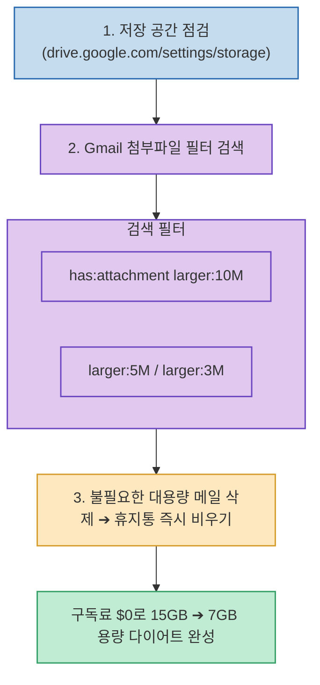

Google 계정을 오래 사용하다 보면 "저장용량이 거의 가득 찼습니다. 새 이메일을 주고받으려면 스토리지를 업그레이드하세요"라는 경고와 함께 Google One 유료 결제 유도 창을 마주하게 됩니다.

크리에이터 human__bro 님이 공유한 **`Gmail 용량 다이어트 실전 꿀팁`**은 **비싼 유료 요금제에 결제하기 전, 저장 공간 사용 현황을 확인하고 대용량 첨부파일 필터 검색을 통해 하루 만에 용량을 15GB에서 7GB로 절반 이상 줄이는 가장 빠르고 확실한 방법**을 소개합니다.

<!--more-->

## Sources

- [원문 Threads 게시물: human__bro (@human__bro)](https://www.threads.com/@human__bro/post/Dc00NVeEpVi)

---

## 1. Gmail 용량 정리 3단계 프로세스

---

## 2. 3단계 실천 가이드

1. **저장공간 주범 확인하기**:
   * 브라우저에서 `drive.google.com/settings/storage` 로 이동합니다.
   * Google 드라이브 기본 15GB 중에서 **Gmail, Google Drive, Google Photos** 중 어느 서비스가 공간을 가장 많이 차지하고 있는지 확인합니다.
2. **대용량 첨부파일 메일 필터 검색 & 일괄 삭제**:
   * 용량 부족의 90% 이상은 수만 개의 텍스트 메일이 아니라 고용량 파일이 첨부된 소수의 메일들 때문입니다.
   * Gmail 검색창에 아래 명령어를 차례대로 입력합니다:
     * `has:attachment larger:10M` (10MB 이상의 대용량 첨부파일 메일 조회)
     * `larger:5M` (5MB 이상 메일 조회)
     * `larger:3M` (3MB 이상 메일 조회)
   * 이미 다운로드했거나 불필요한 지난 프로젝트/홍보 메일들을 선택하여 삭제합니다.
3. **휴지통 비우기 (필수)**:
   * 삭제한 메일은 '휴지통'으로 이동하며, 30일 동안 계속 저장 공간을 점유합니다.
   * 반드시 **Gmail [휴지통] ➔ [지금 휴지통 비우기]**를 클릭해야 실제 디스크 공간이 즉시 환불됩니다.

---

## 3. 시사점

수만 개의 일반 텍스트 이메일을 지우느라 고생할 필요 없이, **첨부파일 필터 검색어(`has:attachment larger:10M`) 하나만으로 매달 나가는 클라우드 구독료를 영구적으로 절약**할 수 있는 실용적인 디지털 정리 팁입니다.
