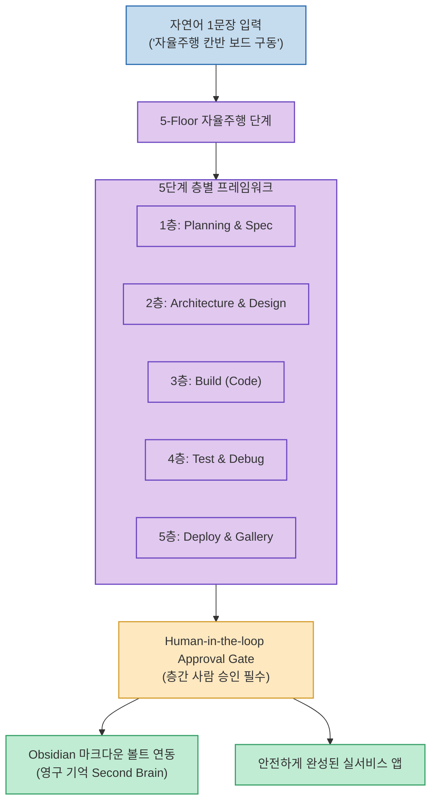

단순히 프롬프트를 주고받는 대화형 AI 코딩 도구는 개발 과정이 복잡해질수록 이전 맥락을 잊어버리거나 엉뚱한 코드를 수정해 전체 프로젝트를 망치는 고질적인 한계가 있습니다.

Julian Goldie가 소개한 **`New Hermes Kanban Agent System`**은 **"한 문장 입력으로 완전한 앱을 빌드하는 자율주행 칸반 보드(Self-Driving Board)"를 중심으로, 기획부터 배포까지 5단계 층(5-Floor)으로 나누고 각 층 사이에 사람이 검토·승인하는 휴먼 인 더 루프 게이트(Approval Gate)와 옵시디언(Obsidian) 세컨드 브레인을 결합한 차세대 에이전트 운영체제(Agent OS)**입니다.

<!--more-->

## Sources

- [원문 유튜브 영상: New Hermes Kanban Agent Is ABSURD! (Julian Goldie)](https://youtu.be/X3O-DVh7_UE)
- [Hermes Agent 공식 문서](https://hermes-agent.nousresearch.com)

---

## 1. 5-Floor 자율주행 칸반 아키텍처

---

## 2. 3대 핵심 메커니즘

1. **5-Floor(5개 층) 자율주행 프레임워크**:
   * **1층 (Planning & Spec)**: 자연어 지시를 기술 명세와 세부 태스크로 자동 분해.
   * **2층 (Architecture & Design)**: 시스템 구조와 UI/UX 레이아웃 설계.
   * **3층 (Build)**: 실제 프론트엔드 및 백엔드 코드 작성.
   * **4층 (Test & Debug)**: 자동 린트, 유닛 테스트, 오류 자가 수정.
   * **5층 (Deploy & Gallery)**: 완성된 웹/앱 배포 및 결과물 시각 갤러리 렌더링.
2. **휴먼 인 더 루프 승인 게이트 (Approval Gate)**:
   * 기존 자율 에이전트들이 겪던 '제어 불가능한 폭주와 무한 루프'를 해결하기 위해, 각 층을 통과할 때마다 **사람의 명시적인 검토 및 승인(Approve / Reject)**을 거치도록 설계했습니다.
3. **옵시디언(Obsidian) AI 세컨드 브레인 연동**:
   * 프로젝트 규칙, 성공 및 실패 기록, 디자인 토큰을 로컬 마크다운 파일(Obsidian Vault)로 영구 보관하여 세션이 초기화되어도 지식을 잃지 않습니다.

---

## 3. 시사점

채팅창에서 매번 프롬프트를 쳐서 확인하는 수동 노동을 벗어나, **칸반 보드 UI와 엄격한 승인 거버넌스를 통해 사람이 자는 동안에도 신뢰할 수 있는 개발 파이프라인을 가동하는 실전 에이전트 OS**입니다.
