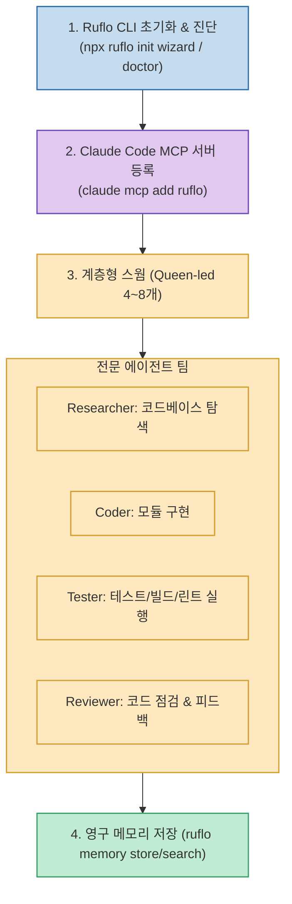

Claude Code는 단일 에이전트로서도 강력하지만, 복잡한 대형 기능을 개발할 때는 코드 분석, 신규 구현, 단위 테스트, 코드 리뷰가 한 세션에서 뒤섞이면서 컨텍스트가 오염되거나 작업 범위를 벗어나는 문제가 발생합니다.

크리에이터 게으른빌더(@lazy_owen)가 공개한 **`Claude Code에 에이전트 팀 붙이는 Ruflo 입문 가이드`**는 **Claude Code 바깥에 에이전트 오케스트레이션(조정), 영구 메모리(Memory), 계층형 스웜(Swarm) 라우팅을 붙여, 코디네이터(Queen)를 중심으로 리서처·코더·테스터·리뷰어 전문 팀을 구성하고 성공한 노하우를 메모리에 영구 보관하는 오픈소스 프레임워크 `Ruflo`**의 실전 세팅법을 제시합니다.

<!--more-->

## Sources

- [원문 가이드: Claude Code에 에이전트 팀 붙이는 Ruflo 입문 가이드 (게으른빌더)](https://lazyowen.com/guides/ruflo)
- [Ruflo GitHub 공식 저장소 (ruvnet/ruflo)](https://github.com/ruvnet/ruflo)
- [Ruflo npm 공식 패키지](https://www.npmjs.com/package/ruflo)

---

## 1. Ruflo 계층형 스웜 아키텍처



---

## 2. 3단계 빠른 시작 워크플로우

1. **프로젝트 초기화 및 상태 진단**:
   ```bash
   npx ruflo@latest init wizard
   npx ruflo@latest doctor
   ```
2. **Claude Code에 MCP 서버 연결**:
   ```bash
   claude mcp add ruflo -- npx -y ruflo@latest mcp start
   claude mcp list
   ```
3. **계층형 스웜(Queen-led) 초기화 (4~8개 권장)**:
   ```bash
   npx ruflo@latest swarm init \
     --topology hierarchical \
     --max-agents 8 \
     --strategy specialized

   npx ruflo@latest swarm status
   npx ruflo@latest agent list
   ```

---

## 3. 실전 지시 프롬프트 템플릿

Claude Code 세션을 열고 아래와 같이 **역할별 책임과 완료 기준**을 명확히 주입합니다.

```text
역할: Ruflo 계층형 스웜의 코디네이터로서 researcher, coder, tester, reviewer 역할을 조정해 주세요.
프로젝트 상황: [현재 프로젝트 상태]
만들 기능: [구현할 기능 설명]

진행 방식:
1. 먼저 관련 코드와 기존 테스트를 조사합니다 (researcher).
2. 변경 범위와 검증 기준을 짧게 공유한 뒤 구현합니다 (coder).
3. 실제 테스트와 빌드, 린트를 실행해 검증합니다 (tester).
4. 리뷰 역할이 코드를 점검하고 실패 시 자가 교정합니다 (reviewer).
5. 바뀐 파일 목록과 실행된 테스트 로그만 최종 보고해 주세요.
```

---

## 4. 성공 패턴을 메모리에 저장하고 재활용하기

Ruflo는 작업이 성공했을 때의 팀 규칙과 엔지니어링 노하우를 영구 메모리에 저장해 다음 세션에서도 기억하도록 지원합니다.

```bash
# 팀 규칙 영구 저장
npx ruflo@latest memory store \
  --key "project/test-rule" \
  --value "기능 변경 뒤 단위 테스트와 린트를 반드시 실행한다" \
  --namespace "project"

# 규칙 검색
npx ruflo@latest memory search \
  --query "기능 변경 뒤 검증" \
  --namespace "project"
```

---

## 5. '100명 에이전트'의 진실과 주의점

* **실행 규모**: 100개 프로세스가 동시에 뜨는 것이 아니라 약 24~89개의 역할 카탈로그 풀을 제공한다는 의미입니다. 처음에는 **4~8개 규모(Queen 코디네이터 중심 계층형)**로 시작해야 토큰 낭비 없이 안정적인 작업이 가능합니다.
* **비용**: Ruflo 도구 자체는 무료 오픈소스이지만, 호출되는 Claude Code 모델 토큰 비용은 동일하게 청구되므로 명확한 완료 기준을 두고 루프를 통제하는 것이 핵심입니다.

---

## 6. 시사점

1인 개발자라도 **[Claude Code + Ruflo 계층형 스웜 + MCP + 영구 메모리]**를 결합하여, 조사부터 코딩, 테스트, 리뷰까지 철저히 분업화된 소프트웨어 엔지니어링 조직을 터미널 안에 구축할 수 있습니다.
