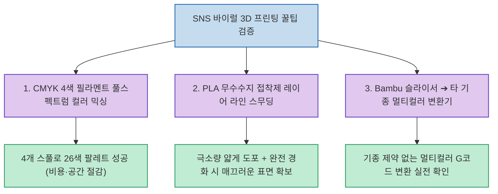

SNS와 유튜브에는 3D 프린팅 품질을 극적으로 올려주거나 비용을 아껴준다는 이른바 '바이럴 해킹 팁'들이 넘쳐나지만, 실제로 따라 해보면 출력물이 녹아내리거나 실패하여 시간과 필라멘트를 날리는 경우가 허다합니다.

3D 프린팅 전문 크리에이터 Battle Brother Sam이 공개한 **`I Tested Viral 3D Printing Hacks So You Don’t Have To`**는 **수십 개의 컬러 스풀 없이 CMYK 4색 필라멘트만으로 26색 팔레트를 조합하는 풀스펙트럼 믹싱 기법과, PLA 적층선을 없애기 위한 화학적 스무딩 제재의 실제 효과, 그리고 뱀부랩 슬라이서 멀티컬러 변환기**를 직접 출력하고 정직하게 검증했습니다.

<!--more-->

## Sources

- [원문 유튜브 영상: I Tested Viral 3D Printing Hacks So You Don’t Have To (Battle Brother Sam)](https://youtu.be/Pmf96HuPdkQ)
- [Bambu to Snapmaker Multi-color Converter Tool](https://bl2u1.nbn.cat/)

---

## 1. 바이럴 3D 프린팅 팁 실측 검증 아키텍처

---

## 2. 3대 핵심 바이럴 해킹 팁 실측 결과

1. **CMYK 4색 필라멘트 풀스펙트럼 컬러 믹싱 (Full Spectrum 3D Printing)**:
   * **원리**: 컬러 잉크젯 프린터처럼 시안(Cyan), 마젠타(Magenta), 옐로우(Yellow), 블랙(Key) 4개 필라멘트만으로 색을 배합해 수천 가지 색상을 표현하는 방식.
   * **실측 검증**: 26색 컬러 팔레트 출력을 성공적으로 검증했습니다. 수십 개의 단색 필라멘트 스풀을 별도 구매해 보관할 필요 없이, 기본 4색 스풀만으로 다채로운 멀티컬러 피규어와 미니어처 출력이 가능합니다.
2. **PLA 레이어 라인 화학적 스무딩 (Layer Lines Smoothing)**:
   * **원리**: 사포질 대신 프라모델용 무수수지 접착제(Mr. Hobby Mr. Cement Deluxe 등)를 PLA 표면에 도포해 미세 적층선을 화학적으로 녹여 결합하는 기법.
   * **주의점 & 팁**: 접착제를 두껍게 바르면 세부 몰드와 디테일이 녹아 뭉개집니다. **브러시로 아주 얇게 펴 바른 뒤 최소 수 시간 이상 완전 경화(Curing)**시켜야 매끄러운 플라스틱 표면을 얻을 수 있습니다.
3. **Bambu 멀티컬러 슬라이싱 변환기 (Bambu to Snapmaker Converter)**:
   * 뱀부랩의 다색 슬라이서 프로파일을 Snapmaker U1 등 다른 멀티헤드/멀티컬러 기종으로 변환해 주는 툴(`bl2u1.nbn.cat`)을 테스트하여 실제 하드웨어 간 변환 호환성을 확인했습니다.

---

## 3. 시사점

3D 프린팅의 가장 큰 골칫거리인 **필라멘트 보관 공간 문제와 후가공 사포질 노가다를 해결할 수 있는 실전 노하우(CMYK 4색 컬러 믹싱과 얇은 접착제 스무딩)**를 확인하여, 불필요한 시행착오 없이 출력 퀄리티를 한 단계 끌어올릴 수 있습니다.
