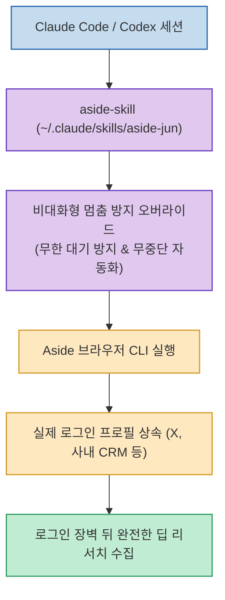

브라우저 기반 AI 에이전트를 터미널 환경에서 백그라운드로 구동할 때 가장 자주 발생하는 문제는 사용자 확인 프롬프트가 떴을 때 CLI가 무한 대기(Hang) 상태에 빠지거나 강제 종료되어 진행 중이던 작업이 통째로 날아가는 현상입니다.

`ocx` 제작자로 유명한 '클로드범(lidge-jun)' 님이 공개한 **`aside-skill`**(`lidge-jun/aside-skill`)은 **실제 사용자 로그인 세션을 유지하는 크로미움 포크 브라우저인 Aside CLI를 Codex와 Claude Code에서 구동할 때, 작업 중단 없이 100% 무인 자동화를 실현하고 로그인 장벽(Login Wall) 뒤의 웹 데이터를 안전하게 수집하는 전용 에이전트 스킬**입니다.

<!--more-->

## Sources

- [원문 Threads 게시물: ai_younggle_man (@ai_younggle_man)](https://www.threads.com/@ai_younggle_man/post/Dc2oh93o-Ti)
- [aside-skill GitHub 공식 저장소 (lidge-jun/aside-skill)](https://github.com/lidge-jun/aside-skill)
- [Aside 브라우저 공식 사이트](https://asidehq.com)

---

## 1. aside-skill 아키텍처 및 무중단 실행 흐름



---

## 2. 해결한 2대 핵심 병목과 차별점

1. **비대화형 CLI 무한 대기 및 작업 유실 방지**:
   * 비대화형 `aside exec` 호출 환경에서는 권한 요청이나 사용자 확인 질문에 응답할 수 없습니다. 과거 버전은 무한정 멈춰 있었고 최신 버전은 즉시 거부(Exit 0)해버리는 문제가 있었습니다.
   * `aside-skill`은 Aside 공식 가이드라인 77개 규칙을 정밀 대조하고, CLI를 중단시키는 *"ASK USER AS THE LAST RESORT"* 같은 비실용적인 지침을 안전하게 오버라이드하여 **완전 자동화된 무중단 실행 규칙**을 주입했습니다.
2. **로그인 장벽(Login Wall) 뒤의 딥 리서치(Deep Research)**:
   * X(트위터), 링크드인, 사내 어드민처럼 로그인 없이는 `curl`로 289KB 수준의 로그인 유도 페이지만 반환되는 사이트에서도, **실제 브라우저의 로그인 프로필과 쿠키를 그대로 활용하여 완전한 데이터 트리**를 긁어옵니다.

---

## 3. 간편한 설치 및 즉시 사용법

Claude Code와 Codex 모두 별도 변환 작업 없이 디렉토리 복사만으로 즉시 설치됩니다.

```bash
# 저장소 복제
git clone https://github.com/lidge-jun/aside-skill.git

# Claude Code 전용 스킬 디렉토리로 복사
cp -R aside-skill/aside-jun ~/.claude/skills/aside-jun
```

* 설치 즉시 폴더 이름이 슬래시 명령어 `/aside-jun`으로 등록되며, 터미널에서 웹 리서치나 브라우징을 요청하면 Claude Code가 자동으로 스킬을 감지하여 실행합니다.

---

## 4. 시사점

로그인 세션이 필수적인 최신 웹 환경에서 **AI 코딩 에이전트가 사람의 개입 없이도 백그라운드에서 브라우저를 끝까지 제어하고 유의미한 리서치 데이터를 가져올 수 있도록 만드는 실전 필수 스킬**입니다.
