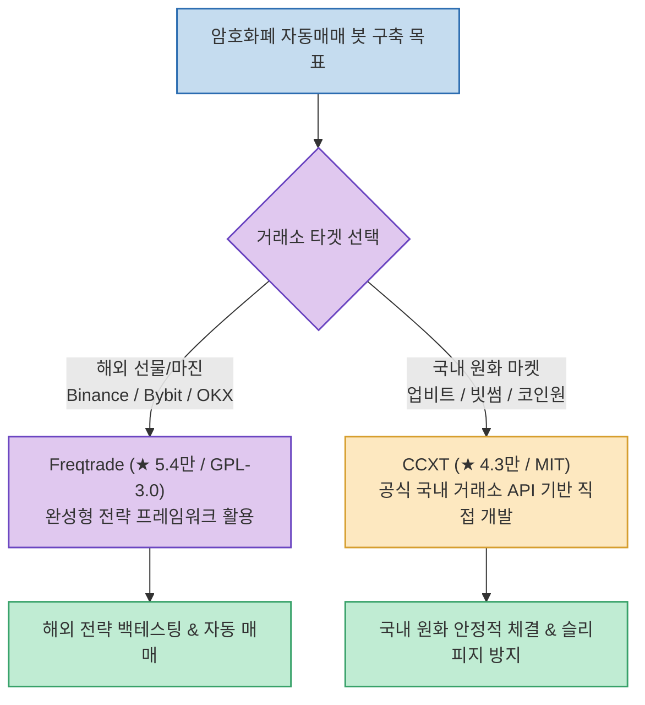

비트코인 및 알트코인 자동매매(Trading Bot)를 시작하려는 개발자나 트레이더가 오픈소스를 검색하면 가장 먼저 접하는 도구가 GitHub Star 54,000개에 달하는 **Freqtrade**입니다. 백테스팅, 전략 최적화, 머신러닝 연동까지 갖춘 사실상 암호화폐 트레이딩 봇의 글로벌 표준입니다.

하지만 크리에이터 weekly100month 님이 지적한 것처럼, **업비트, 빗썸, 코인원 등 국내 원화 마켓 거래소를 주력으로 사용하는 한국 트레이더에게는 치명적인 호환성 문제**가 발생합니다. Freqtrade와 CCXT의 아키텍처 차이를 분석하고, 국내 환경에서 안정적인 자동매매를 구축하는 최적의 경로를 살펴봅니다.

<!--more-->

## Sources

- [원문 Threads 게시물: weekly100month (@weekly100month)](https://www.threads.com/@weekly100month/post/Dc28NmEnyOi)
- [Freqtrade GitHub 공식 저장소](https://github.com/freqtrade/freqtrade)
- [CCXT GitHub 공식 저장소](https://github.com/ccxt/ccxt)

---

## 1. Freqtrade vs CCXT 선택 아키텍처

---

## 2. Freqtrade와 국내 거래소의 결정적 괴리

1. **공식 지원 거래소의 해외 편중**:
   * Freqtrade의 공식 지원 거래소는 바이낸스(Binance), 바이비트(Bybit), OKX, 게이트아이오(Gate.io), 크라켄(Kraken) 등 글로벌 거래소 위주입니다.
   * 공식 문서 및 README에 한국(Korea) 거래소 언급이 전무하며, *"ccxt에 지원되는 다른 거래소도 쓸 수는 있지만 동작을 보장하지 않는다"*고 명시되어 있습니다.
2. **원화(KRW) 마켓과 특화 주문 로직 부재**:
   * 업비트와 빗썸의 독자적인 호가 단위 규격, 원화 마켓 제한, 주문 취소/정정 메커니즘을 Freqtrade 기본 코어에서 보장해주지 않아 체결 누락이나 런타임 크래시 위험이 상존합니다.

---

## 3. CCXT가 국내 자동매매의 정답인 이유

1. **국내 주요 거래소 공식 및 1급 지원**:
   * **`CCXT`**(CryptoCurrency eXchange Trading Library, ★ 43,000+ / MIT)는 업비트(`upbit`), 빗썸(`bithumb`), 코인원(`coinone`)의 REST 및 WebSocket API를 표준화된 인터페이스로 공식 지원합니다.
2. **가볍고 유연한 커스텀 파이프라인**:
   * Freqtrade의 방대한 프레임워크 제약에 얽매이지 않고, 원하는 지표(TA-Lib, Pandas-TA)와 주문 로직, 슬랙/텔레그램 알림을 몇십 줄의 파이썬 코드로 깔끔하게 직접 작성할 수 있습니다.
3. **상업적 자유도 (MIT 라이선스)**:
   * Freqtrade는 엄격한 GPL-3.0 라이선스라 코드 공개 의무가 따르지만, CCXT는 MIT 라이선스로 독자 전략의 기밀성을 완벽히 보호할 수 있습니다.

---

## 4. 실전 가이드라인

* **바이낸스/바이비트 등 해외 선물 마진 전략**: 검증된 오픈소스 백테스팅과 포트폴리오 관리가 지원되는 **`Freqtrade`** 활용 권장.
* **업비트/빗썸 원화 현물 자동매매**: Freqtrade에 무리하게 어댑터를 붙이지 말고, **`CCXT`** 라이브러리를 기반으로 자체 파이썬 봇을 작성하는 것이 유지보수와 안정성 측면에서 가장 확실한 선택입니다.
