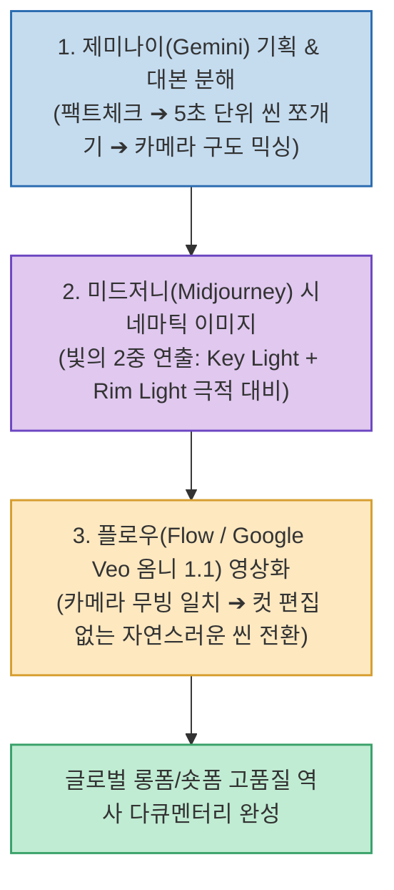

글로벌 유튜브와 틱톡, 릴스 등에서 수백만 조회수를 기록하며 급성장하고 있는 콘텐츠 분야 중 하나는 바로 **AI 역사 스토리텔링 채널(예: 칭기즈칸, 로마 제국, 알렉산더 대왕 일대기 등)**입니다. 과거에는 방대한 그래픽과 영상 편집 리소스가 필요했지만, 최신 AI 툴체인을 활용하면 1인 크리에이터도 고화질 다큐멘터리를 빠르게 양산할 수 있습니다.

테크 크리에이터 원카AI가 공개한 **`해외에서 잘나가는 AI 역사 채널 만드는 법 (ft. 구글 옴니 1.1 / Veo)`**은 **제미나이를 활용한 대본 기획 및 5초 단위 씬 쪼개기, 미드저니의 빛 연출 프롬프트, 그리고 구글의 최신 옴니 1.1(Veo) 엔진을 통한 컷 편집 없는 무빙 연출 노하우**를 상세히 공개했습니다.

<!--more-->

## Sources

- [원문 유튜브 영상: 해외에서 잘나가는 AI 역사 채널, 만드는 법 전부 공개합니다 (ft.프롬프트 공개) | 구글 옴니 1.1 (원카AI)](https://youtu.be/wLKg1t5UMxE)
- [Google 공식 발표: Build with Gemini Omni 1.1 Flash](https://blog.google/innovation-and-ai/technology/developers-tools/build-with-gemini-omni-1-1-flash/)

---

## 1. AI 역사 콘텐츠 3단계 제작 아키텍처

---

## 2. 3단계 실전 파이프라인

1. **1단계: 제미나이(Gemini)로 기획 & 씬 단위 쪼개기**
   * 역사적 사실(팩트체크)을 검증하고 흡입력 있는 내러티브 대본을 작성합니다.
   * 대본을 통으로 생성하지 않고, **5~8초 단위의 장면(Scene)별로 분해하며 [와이드 샷 ➔ 클로즈업 ➔ 오버더숄더(어깨 너머) 샷] 등 카메라 구도를 다채롭게 교차 배치**하도록 지시합니다.
2. **2단계: 미드저니(Midjourney)로 시네마틱 이미지 생성**
   * 역사적 복식과 배경 고증을 담은 프롬프트를 구성합니다.
   * **핵심 연출 꿀팁 (빛의 2중 연출)**: 평면적인 AI 그림 느낌을 벗어나기 위해 *"주 광원(Key Light)과 역광 림 라이트(Rim Light)"* 등 **2가지 방향의 빛을 프롬프트에 명시**하여 인물의 입체감과 극적인 시네마틱 무드를 연출합니다.
3. **3단계: 플로우(Flow / Google Veo 옴니 1.1)로 영상화**
   * 구글의 최신 **Gemini Omni 1.1 Flash / Veo** 비디오 엔진을 통해 정지 이미지에 바람, 연기, 인물 표정, 카메라 워크를 부여합니다.
   * **핵심 연출 꿀팁 (컷 편집 줄이는 연속 무빙)**: 이전 컷과 다음 컷의 카메라 이동 방향(예: 좌에서 우로 패닝)을 일치시켜, 프리미어나 캡컷에서 복잡한 트랜지션을 주지 않아도 한 편의 영화처럼 자연스럽게 이어지도록 설계합니다.

---

## 3. 제작비 및 모델 활용 전략

* **제작비 최적화**: 미드저니 월 구독료와 플로우(구글 Veo) 비디오 크레딧 감안 시 롱폼/숏폼 1편당 수천 원대의 극히 가성비 높은 비용으로 제작이 가능합니다.
* **비디오 모델 교차 활용**: 구글 옴니 1.1 외에도 MiniMax(Hailuo AI) 등을 교차 활용하면 인물의 격렬한 액션이나 움직임의 역동성을 최적화할 수 있습니다.

---

## 4. 시사점

단순한 정적 슬라이드쇼를 넘어 **[구도 믹싱 + 2중 조명 연출 + 연속 카메라 워크]**를 결합하여, 1인 제작자도 글로벌 OTT나 다큐멘터리 수준의 시네마틱 영상을 고속으로 양산할 수 있는 강력한 미디어 파이프라인입니다.
