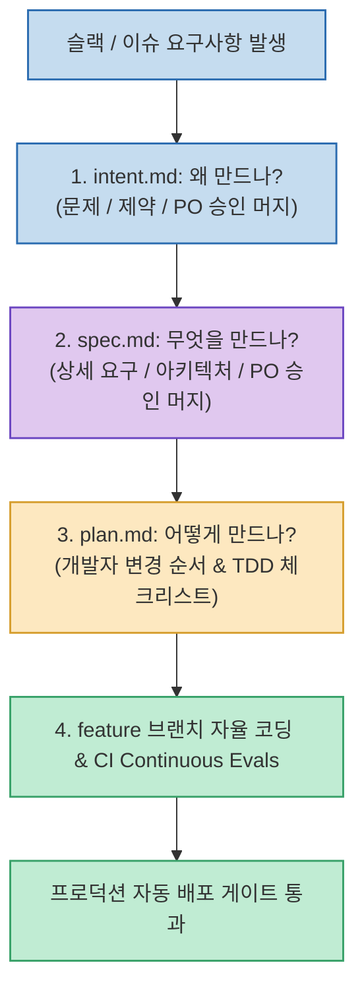

Claude Code나 AI 코딩 에이전트의 등장으로 코드 자체를 생성하는 속도는 극적으로 빨라졌지만, 정작 실무 프로젝트에서는 엉뚱한 요구사항을 구현하거나 아키텍처 제약을 깨뜨려 전체 딜리버리가 지연되는 새로운 병목이 발생하고 있습니다. Anthropic은 이를 두고 **"이제 코드는 더 이상 병목이 아니며, 소프트웨어 전달(SDLC) 프로세스 자체가 병목"**이라고 진단했습니다.

유튜브 채널 데브브라더스가 해설한 **`Anthropic이 제안한 코드 짜기 전에 무조건 쓰라는 파일 | AI 네이티브 SDLC 도입 정리`**는 **Anthropic의 기업 도입 지원 팀(Applied AI)이 실제로 고객사와 실행하고 있는 'AI 네이티브 SDLC 플레이북'의 핵심 문서 체계(`intent.md` ➔ `spec.md` ➔ `plan.md`)와 권장 폴더 구조, PR 머지 승인 규칙, Continuous Evals 연동법**을 실전 가이드로 정리했습니다.

<!--more-->

## Sources

- [원문 유튜브 영상: Anthropic 제안한 코드 짜기 전에 무조건 쓰라는 파일 | AI 네이티브 SDLC 도입 정리](https://youtu.be/4kXsF2S5MNY)
- [Anthropic 공식 블로그: The AI-Native SDLC Playbook](https://claude.com/blog/the-ai-native-sdlc-playbook)
- [Claude Academy: AI-Native SDLC Playbook 무료 코스](https://academy.claude.com/courses/ai-native-sdlc-playbook/capture-intent)

---

## 1. AI 네이티브 SDLC 3문서 흐름과 PR 거버넌스



---

## 2. 핵심 3문서 체계: intent ➔ spec ➔ plan

1. **`intent.md` (왜 만드는가? - PO/기획자 승인)**:
   * **역할**: 기능 개발의 근본적인 '의도(Intent)'와 비즈니스 목표를 고정합니다.
   * **필수 5개 필드**:
     * `Problem`: 현재 누가 어떤 문제를 겪고 있는가? 근거는 무엇인가?
     * `Proposed outcome`: 이 기능이 완성되면 무엇이 달라지는가?
     * `Affected users and systems`: 영향을 받는 사용자와 내부 시스템은 무엇인가?
     * `Constraints`: 반드시 지켜야 할 기술/비즈니스 제약과 명확한 범위 밖(Out of scope) 항목.
     * `Open questions`: 아직 확정되지 않은 열린 질문들.
2. **`spec.md` (무엇을 설계하는가? - PO/설계자 승인)**:
   * 의도를 실현하기 위한 구체적인 사용자 스토리, UI/UX 인터랙션 요구사항, API 명세, 데이터 모델 스키마를 정의합니다.
3. **`plan.md` (어떻게 구현하고 검증할 것인가? - 엔지니어 작성)**:
   * 실제 코드를 수정할 파일 목록과 작업 순서, 사전 작성할 단위 테스트(TDD), 빌드/린트 검증 체크리스트를 포함합니다.

> **CLAUDE.md와의 차이점**: `CLAUDE.md`가 저장소 전체의 변하지 않는 '헌법(기술 스택, 빌드 명령어, 코딩 컨벤션)'이라면, `intent.md` 세트는 개별 기능 변경 건에 대한 '목적과 구현 로드맵'입니다.

---

## 3. 실전 권장 폴더 구조와 '골든 룰 2가지'

```text
intent/
  README.md                # 폴더 규칙 및 전체 기능 Source of Truth 테이블
  기능-슬러그/              # 변경 하나당 독립 폴더 (예: ship-tracking)
    intent.md              # 왜 만드나 (초안 AI ➔ PO 승인)
    spec.md                # 무엇을 만드나 (초안 AI ➔ PO 승인)
    plan.md                # 어떻게 만드나 (개발자 검토)
```

* **골든 룰 1: 폴더당 1세트 규칙**
  * 폴더 하나당 `intent` · `spec` · `plan`이 딱 하나씩만 존재해야 합니다. 만약 하나의 기능에서 `spec`이 2개로 갈라진다면, `intent` 자체가 2개로 쪼개져야 하는 신호입니다.
* **골든 룰 2: PR 하나에 산출물 하나 (머지가 곧 승인)**
  * `intent/슬러그` 브랜치 PR ➔ PO 리뷰 및 머지 (기획 승인)
  * `spec/슬러그` 브랜치 PR ➔ 설계 리뷰 및 머지 (설계 승인)
  * `feature/슬러그` 브랜치 PR ➔ 자동화 테스트 통과 후 최종 코드 머지

---

## 4. 완성형 루프: 초안은 AI, 승인은 사람

* **자동화 루프**: 슬랙(Slack)에서 고객 피드백이나 기능 요구사항이 태그되면, Claude Code가 이를 읽고 `intent.md` 초안을 작성하여 PR을 올립니다.
* **인간의 거버넌스**: 사람은 모호한 요구사항과 제약 조건을 리뷰하고 승인(Merge)만 합니다. 승인된 문서를 바탕으로 에이전트가 `spec` ➔ `plan` ➔ `feature` 코딩까지 순차적으로 진행합니다.
* **CI Continuous Evals**: 코드가 작성되면 GitHub Actions에서 단위 테스트뿐만 아니라 에이전트의 변경 의도를 정량 평가하는 Evals(`agent-evals.yml`)를 통과해야만 최종 배포됩니다.

---

## 5. 시사점

화려한 프롬프트 기교나 무작정 코드를 치게 만드는 바이브코딩을 넘어, **"초안은 AI가 작성하고, 승인은 사람이 하며, 의도(Intent)부터 단계적으로 머지하는 엔지니어링 거버넌스"**가 대규모 AI 협업 개발의 표준이 될 것입니다.
