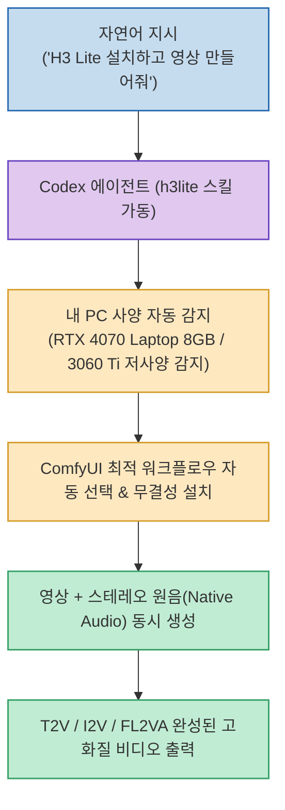

최신 비디오 생성 AI 모델인 MiniMax H3를 개인 PC 로컬 환경(ComfyUI)에서 직접 구동하려는 시도가 늘고 있지만, 수십 기가바이트에 달하는 모델 체크포인트 다운로드, 복잡한 커스텀 노드 의존성 충돌, 그리고 8GB 수준의 게이밍 노트북 VRAM 한계로 인해 시작 단계에서 포기하는 사용자가 많습니다.

크리에이터 h2smusic 님이 소개한 오픈소스 에이전트 스킬 **`H3 Lite`**(`Rimagination/h3lite`, MIT 라이선스)는 **"영상 AI 설치와 설정 자체를 AI에게 외주 주는 방식"을 도입하여, Codex 에이전트에게 자연어로 말 한마디만 하면 내 PC의 GPU 사양을 스스로 감지하고 최적의 ComfyUI 워크플로우를 자동 구성하여 영상과 스테레오 원음(Native Audio)까지 한 번에 뽑아내는 혁신적인 도구**입니다.

<!--more-->

## Sources

- [원문 Threads 게시물: h2smusic (@h2smusic)](https://www.threads.com/@h2smusic/post/Dc5R71Ik-iv)
- [H3 Lite GitHub 공식 저장소 (Rimagination/h3lite)](https://github.com/Rimagination/h3lite)
- [MiniMax 공식 사이트](https://www.minimax.io)

---

## 1. H3 Lite 에이전트 오케스트레이션 파이프라인

---

## 2. 주요 핵심 기능과 차별점

1. **하드웨어 인식형 무인 자동 설치 (Hardware-Aware Deployment)**:
   * 사용자가 복잡한 ComfyUI 노드, 디퓨전 체크포인트, LoRA, VAE를 수동으로 배치할 필요가 없습니다.
   * Codex 에이전트가 시스템 환경을 스캔하여 RTX 4070 Laptop(8GB), RTX 3060 Ti 등 저사양 VRAM 환경에 최적화된 경량 경로를 자동 선택하고, 파일 무결성(SHA-256)을 검증하며 안정적으로 설치를 완결합니다.
2. **비디오 + 네이티브 오디오 동시 생성 (Video & Audio)**:
   * 단순 무음 비디오 생성을 넘어, 영상의 시각적 타이밍과 동기화된 **스테레오 원본 사운드(Native Audio)**를 함께 렌더링합니다.
3. **다채로운 4대 비디오 생성 모드 지원**:
   * **T2V (Text-to-Video)**: 텍스트 프롬프트 기반 씬 생성
   * **I2V (Image-to-Video)**: 정지 이미지를 기반으로 한 자연스러운 모션 부여
   * **FL2VA (First/Last-frame to Video & Audio)**: 시작과 끝 키프레임을 지정하여 중간 트랜지션 영상과 오디오 생성
   * **Ref2VA (Reference to Video & Audio)**: 레퍼런스 스타일을 반영한 비디오/오디오 생성

---

## 3. 시사점

ComfyUI의 진입 장벽이었던 **"복잡한 노드 연결과 VRAM 튜닝 노가다"를 AI 에이전트 스킬로 추상화**함으로써, 고성능 AI 워크스테이션이 없는 일반 개발자나 1인 크리에이터도 8GB 노트북 환경에서 최신 MiniMax H3 영상 파이프라인을 자유롭게 운영할 수 있는 실전 솔루션입니다.
