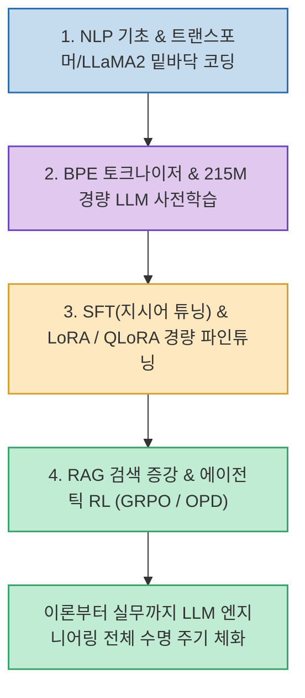

대부분의 개발자들이 OpenAI나 Anthropic의 API를 호출해 RAG나 에이전트를 조립하는 수준에 머물러 있지만, 프로덕션 환경에서 모델을 최적화하고 경량화하려면 **"신경망 내부에서 토큰이 어떻게 예측되고 가중치가 어떻게 업데이트되는가"**에 대한 밑바닥 이해가 필수적입니다.

중국 최대 AI 오픈소스 교육 커뮤니티 Datawhale이 공개한 **`Happy-LLM`**(`datawhalechina/happy-llm`)은 **NLP 기초부터 트랜스포머 및 LLaMA2 아키텍처 직접 구현, 토크나이저 학습, 215M 경량 LLM 사전학습(Pre-training), SFT, LoRA/QLoRA, RAG, 그리고 최신 에이전틱 강화학습(GRPO/OPD)까지 전 과정을 완벽히 다룬 무료 오픈소스 교재**입니다.

<!--more-->

## Sources

- [원문 Threads 게시물: aiwire_kr (@aiwire_kr)](https://www.threads.com/@aiwire_kr/post/Dc9adYQE2X1)
- [Happy-LLM GitHub 공식 저장소](https://github.com/datawhalechina/happy-llm)
- [Happy-LLM 온라인 오픈 교재](https://datawhalechina.github.io/happy-llm/)

---

## 1. Happy-LLM 엔드투엔드 학습 파이프라인

---

## 2. 4단계 핵심 실습 커리큘럼

1. **Transformer & LLaMA2 밑바닥 구현 (PyTorch)**:
   * 어텐션 메커니즘 수식을 PyTorch 코드로 직접 구현하며, LLaMA2 디코더-온리(Decoder-only) 아키텍처의 세부 텐서 연산을 손으로 익힙니다.
2. **토크나이저 및 사전학습 (Pre-training)**:
   * 원시 텍스트 코퍼스를 수집하고 바이트 페어 인코딩(BPE) 토크나이저를 직접 학습시킨 뒤, **215M 파라미터 소형 LLM을 밑바닥부터 사전학습**시키는 전 과정을 실습합니다.
3. **지시어 튜닝(SFT) & 파라미터 효율적 튜닝(PEFT)**:
   * 대화형 모델로 만들기 위한 Instruction Tuning(SFT)과 실무에서 GPU 메모리를 절약하는 핵심 기법인 **LoRA 및 QLoRA** 미세조정을 코드로 다룹니다.
4. **RAG, AI 에이전트 및 에이전틱 강화학습(Agentic RL)**:
   * 외부 지식을 결합하는 RAG 및 도구 호출 에이전트를 구축하고, DeepSeek-R1 등으로 화제가 된 **GRPO(Group Relative Policy Optimization)** 및 온폴리시 증류(OPD) 등 최신 추론 강화학습 챕터까지 포함되어 있습니다.

---

## 3. 무료 오픈소스 리소스

* **교재 및 강의자료**: 마크다운 웹 문서뿐만 아니라 챕터별 PDF 교재와 강의용 PPT 슬라이드가 모두 무료로 공개되어 있습니다.
* **실습용 가중치**: 개인 PC나 코랩(Colab) 환경에서도 부담 없이 실습할 수 있도록 215M 파라미터의 실습용 체크포인트 모델을 함께 제공합니다.

---

## 4. 시사점

API 레퍼런스를 복사해 붙여넣는 단계에서 벗어나, **모델의 토크나이징부터 사전학습, 파인튜닝, 에이전틱 강화학습까지 전체 LLM 엔지니어링 라이프사이클을 체계적으로 마스터할 수 있는 최고의 오픈소스 로드맵**입니다.
