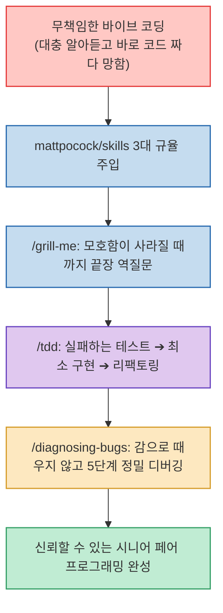

Claude Code나 AI 에이전트를 이용한 바이브 코딩(Vibe Coding)을 시도하다가 프로젝트를 망치는 가장 흔한 이유는 AI의 코딩 실력이 모자라서가 아닙니다. **"사용자의 지시를 대충 지레짐작으로 알아듣고, 모호한 상태에서 무작정 코드부터 작성하기 시작하기 때문"**입니다.

TypeScript 생태계의 대표적인 엔지니어링 인플루언서 Matt Pocock이 공개하여 GitHub Trending 1위를 차지한 **`mattpocock/skills`**는 **코드 작성 전 모호함을 끝까지 인터뷰하는 `/grill-me`, 엄격한 테스트 주도 개발을 강제하는 `/tdd`, 그리고 감으로 때우지 않는 5단계 정밀 디버깅 `/diagnosing-bugs`로 AI에게 프로 개발자의 작업 규율을 주입하는 스킬팩**입니다.

<!--more-->

## Sources

- [원문 Threads 게시물: h2smusic (@h2smusic)](https://www.threads.com/@h2smusic/post/Dc8aapmE_iE)
- [mattpocock/skills GitHub 공식 저장소](https://github.com/mattpocock/skills)

---

## 1. mattpocock/skills 엔지니어링 거버넌스 루프



---

## 2. 3대 핵심 스킬 상세 분석

1. **`/grill-me` (코드 짜기 전 끝장 인터뷰)**:
   * 코드를 단 한 줄도 작성하지 못하게 막고, 사용자의 아이디어를 '디자인 트리(Design Tree)'로 구조화하여 **모든 엣지 케이스와 잠재적 모호함이 해소될 때까지 사용자에게 집요하게 역질문**을 던집니다.
   * 기획과 요구사항의 싱크를 100% 맞춘 뒤에야 구현 단계로 진입하도록 통제합니다.
2. **`/tdd` (엄격한 테스트 주도 개발)**:
   * 감으로 구현 코드를 작성하는 것을 원천 차단하고, **[실패하는 단위 테스트 작성(Red) ➔ 이를 통과시키는 최소한의 코드 구현(Green) ➔ 리팩토링(Refactor)]**의 정석 TDD 사이클을 에이전트에게 강제합니다.
3. **`/diagnosing-bugs` (체계적 원인 추적 디버깅)**:
   * 에러가 났을 때 AI가 대충 짐작으로 코드를 누더기처럼 고치는 땜질을 금지합니다.
   * **[버그 재현 ➔ 최소 테스트 케이스 격리 ➔ 가설 순위화 ➔ 로깅 계측 ➔ 버그 수정 ➔ 회귀 테스트 검증]**의 다단계 정밀 디버깅 루프를 거치도록 설계되었습니다.

---

## 3. 설치 및 사용법

Claude Code와 범용 에이전트 CLI 모두 간편하게 설치할 수 있습니다.

```bash
# Claude Code 플러그인 설치
/plugin install mattpocock-skills

# 범용 에이전트 스킬 추가
npx skills@latest add mattpocock/skills
```

---

## 4. 시사점

AI 코딩 에이전트에게 무조건적인 자율성을 주는 것이 아니라, **의도적인 마찰(Friction)과 질문, 엄격한 테스트 및 디버깅 규율을 부여할 때 비로소 신뢰할 수 있는 시니어 엔지니어 페어 프로그래머로 기능**할 수 있음을 보여주는 모범 사례입니다.
