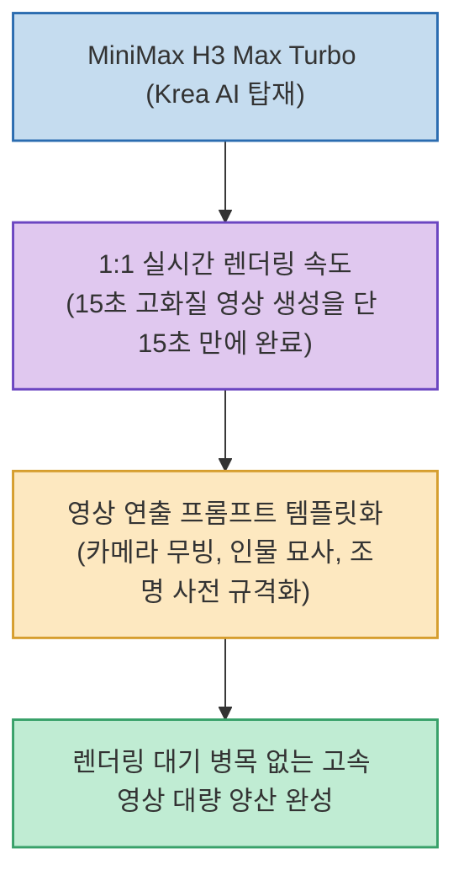

생성형 AI를 활용한 비디오 제작에서 가장 큰 병목은 단연 '렌더링 대기 시간'이었습니다. 5초에서 10초 분량의 짧은 영상 클립 하나를 생성하는 데도 몇 분씩 소요되어 실시간 프리뷰나 반복적인 시안 테스트(이터레이션)가 사실상 불가능했습니다.

AI 크리에이터 openerai_lab 님이 공개한 **`MiniMax H3 Max Turbo 실측 체감 후기`**에 따르면, Krea AI 플랫폼에서 구동되는 최신 비디오 모델 MiniMax H3 Max Turbo는 **15초 분량의 영상을 거의 15초 만에 렌더링해 내는 실시간 1:1 생성 속도**를 달성하여 비디오 제작 워크플로우의 패러다임을 바꾸고 있습니다.

<!--more-->

## Sources

- [원문 Threads 게시물: openerai_lab (@openerai_lab)](https://www.threads.com/@openerai_lab/post/Dc8ICKsD3Kd)
- [Krea AI 공식 플랫폼](https://www.krea.ai)
- [MiniMax 공식 사이트](https://www.minimax.io)

---

## 1. MiniMax H3 Max Turbo 초고속 비디오 파이프라인

---

## 2. 2대 핵심 혁신 포인트

1. **1:1 실시간 생성 속도 돌파**:
   * 영상 재생 시간과 렌더링 생성 시간이 거의 1:1로 일치하여, **15초 길이의 고화질 비디오 클립이 약 15초 만에 완성**됩니다.
   * 작업자가 대기 시간 없이 프롬프트와 카메라 앵글을 즉각 수정하며 결과물을 확인하는 '실시간 인터랙티브 비디오 디렉팅'이 가능해졌습니다.
2. **프롬프트 템플릿화를 통한 양산 효율화**:
   * 인물 묘사, 조명(Lighting), 카메라 움직임(Pan/Zoom/Tilt), 색감 필터를 규격화된 **변수형 템플릿**으로 구축해 둠으로써, 원하는 테마의 숏폼 및 광고 영상을 연속해서 대량 생산할 수 있습니다.

---

## 3. 시사점

AI 비디오 모델의 품질이 상향 평준화되는 가운데, **'실시간에 가까운 압도적인 렌더링 속도'**가 새로운 경쟁력으로 부상하고 있습니다. 유튜브 쇼츠, 틱톡, 릴스 등 대량의 숏폼 콘텐츠를 제작하는 1인 크리에이터와 마케터에게 작업 효율을 극대화해 주는 핵심 도구입니다.
