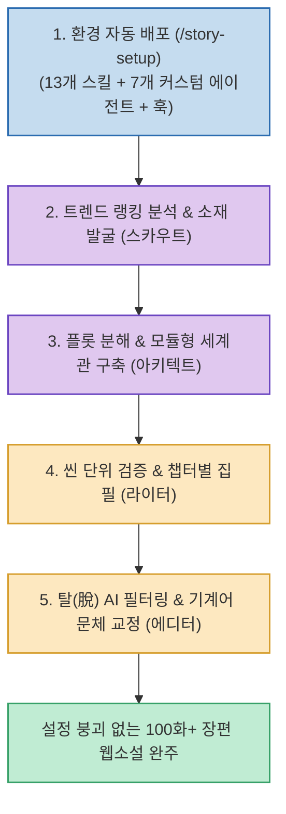

AI에게 "장편 소설 한 편 써줘" 또는 "복잡한 대형 시스템 만들어줘"처럼 일을 큰 덩어리로 한 번에 맡기면, 초반에는 그럴듯하게 진행되다가 중반 이후부터 앞 장에서 정한 설정이나 아키텍처 규칙이 뒤죽박죽 무너지는 '컨텍스트 드리프트(Context Drift)' 현상이 반드시 발생합니다.

크리에이터 junyoung.ai 님이 주목한 오픈소스 **`oh-story-claudecode`**(`zenstory-ai/oh-story-claudecode`, ★ 6,400+)는 **AI 한 명에게 모든 것을 맡기는 대신, Claude Code 및 Antigravity 환경에서 7개의 전문 에이전트와 13개의 스킬로 역할을 철저히 분업화하여 100화 이상의 장편 웹소설도 설정 붕괴 없이 완주해 내는 멀티에이전트 분업화 프레임워크**입니다.

<!--more-->

## Sources

- [원문 Threads 게시물: junyoung.ai (@junyoung.ai)](https://www.threads.com/@junyoung.ai/post/Dc8byCciGJd)
- [oh-story-claudecode GitHub 공식 저장소](https://github.com/zenstory-ai/oh-story-claudecode)

---

## 1. oh-story-claudecode 멀티에이전트 파이프라인

---

## 2. 7개 전문 에이전트 팀의 4단계 협업 구조

1. **원클릭 환경 배포 (`/story-setup`)**:
   * 명령어 한 줄로 13개 스킬과 7개 커스텀 에이전트, 훅(Hooks), 상시 규칙(Always-On Rule)을 프로젝트의 `.agents/` 디렉토리에 자동 구성합니다.
2. **트렌드 랭킹 분석 및 소재 발굴 (스카우트 에이전트)**:
   * 인기 플랫폼의 랭킹과 시장 트렌드를 역분석하여 독자가 원하는 감정적 보상(카타르시스, 클리셰 변주)과 핵심 인물 설정을 도출합니다.
3. **플롯 해체 및 모듈화 (아키텍트 에이전트)**:
   * 성공작의 기승전결 템포를 분해하여 캐릭터 설정집, 복선, 세계관 규칙을 독립된 마크다운 문서로 분리 관리(Single Source of Truth)합니다.
4. **씬(Scene) 단위 집필 및 탈(脫) AI 정제 (라이터 & 에디터 에이전트)**:
   * 챕터 집필 전 앞뒤 설정 충돌을 검사하는 참조 게이트(Reference Gate)를 통과한 뒤 작성에 들어갑니다.
   * 집필 완료 후에는 기계 번역투나 AI 특유의 클리셰 문체를 걷어내는 전용 '탈(脫) AI 필터'를 거쳐 자연스러운 사람의 문장으로 탈고합니다.

---

## 3. 시사점: 개발 및 비즈니스 자동화로의 확장

이 프레임워크의 핵심 가치는 소설 쓰기에만 머무르지 않습니다. 복잡한 소프트웨어 아키텍처나 비즈니스 자동화에서도 **"단일 AI에게 '전부 알아서 구현해줘'라고 요구하면 무조건 파탄 난다"**는 사실을 상기시키며, **[기획(스카우트) ➔ 설계(아키텍트) ➔ 구현(라이터) ➔ 검증/리뷰(에디터)]로 역할을 쪼개고 중간 게이트를 두는 분업화 설계**가 AI 에이전트 엔지니어링의 정답임을 명확히 보여줍니다.
